<div align="center">

# ⚡ EduPulse LMS — Full-Stack Next.js 15 Learning Management System

An industrial-grade, full-stack Learning Management System built with **Next.js 15 (App Router)**, **MongoDB Mongoose**, **Secure HTTP-Only JWT Cookie Authentication**, **Vercel Blob Video Streaming**, and **Stripe Payments**. Built incrementally in structured parts.

[](https://nextjs.org/)
[](https://www.typescriptlang.org/)
[](https://mongoosejs.com/)
[](https://tailwindcss.com/)
[](https://opensource.org/licenses/MIT)

</div>

---

## 🗺️ Project Roadmap & Progress

| Part | Phase | Status | Key Deliverables |
| :--- | :--- | :---: | :--- |
| 1 | Foundation & Auth Engine | ✅ Completed | Next.js 15 setup, 5 Mongoose schemas, JWT cookie auth, protected dashboard |
| 2 | Course Catalog & Admin CRUD | ✅ Completed | Public catalog, filter/search, course detail, category & course admin studio |
| 3 | Lessons & Video Streaming | ✅ Completed | Vercel Blob video upload, admin curriculum studio, gated player, HTTP streaming |
| 4 | Payments & Checkout | ✅ Completed | Stripe Checkout Sessions, success/cancel pages, free-course bypass, checkout API |
| 5 | Enrollment Engine | ✅ Completed | Webhook completes purchase, purchase guard on lessons, "My Courses" |
| 6 | Progress & Certificates | ⏳ Upcoming | Lesson completion tracking, progress bar, printable certificate |
| 7 | Reviews & Ratings | ⏳ Upcoming | Star ratings, average rating, admin reply |
| 8 | Q&A / Discussions | ⏳ Upcoming | Per-lesson questions, threaded replies |
| 9 | Notifications | ⏳ Upcoming | In-app notification center, cron cleanup |
| 10 | Admin User Management | ✅ Completed | Search/paginate users, role promote/demote, suspend |
| 11 | Admin Analytics | ⏳ Upcoming | Revenue/enrollment/signup charts, top courses |
| 12 | Search, Filters & Wishlist | ⏳ Upcoming | Sort/paginate catalog, wishlist |
| 13 | Student Dashboard | ⏳ Upcoming | My Learning overview, purchase history, certificates list |
| 14 | Transactional Email | ⏳ Upcoming | Order confirmation, welcome email |
| 15 | Password Reset & Security | ⏳ Upcoming | Forgot/reset password flow |
| 16 | Automated Testing | ⏳ Upcoming | Playwright e2e suite |
| 17 | SEO, Performance & A11y | ⏳ Upcoming | Metadata, sitemap, Lighthouse pass |
| 18 | Security Hardening | ⏳ Upcoming | Input validation, rate limiting, headers, secret rotation |
| 19 | Deployment | ✅ Completed | Vercel prod deploy, live Stripe webhook, vercel.json config |
| 20 | Final QA & Submission | ⏳ Upcoming | Regression checklist, README polish, submission packaging |

---


---

## 🏛️ Part 1: Foundation Overview

In **Part 1**, we built the core architecture and full-stack authentication system:

- **Database Model Layer (`src/models/`):** Initialized all 5 core Mongoose schemas with validation, compound indexing, and hot-reload safe exports (`User`, `Category`, `Course`, `Lesson`, `Enrollment`).
- **Stateless JWT Auth Engine (`src/lib/`):** Cached MongoDB connection handler (`src/lib/db.ts`), JWT signing & verification (`src/lib/jwt.ts`), HTTP-Only cookie auth (`lms_token`), and session extractors (`src/lib/auth.ts`).
- **RESTful Auth Endpoints (`src/app/api/auth/`):** Registration, login, logout, and `/api/auth/me`.
- **Client Session Context & Protection:** `AuthContext.tsx` with role-aware header navigation and `/dashboard` client/server redirection.

---

## 📚 Part 2: Course Catalog & Admin CRUD

In **Part 2**, we built the course taxonomy, public catalog, detail views, and dedicated admin management portal:

- **Shared Admin Auth Guard (`src/lib/adminGuard.ts`):** Centralized `requireAdmin(req: NextRequest)` checking authentication and `user.role === 'admin'`, returning 401/403 or typed `IUser`.
- **Category API (`/api/categories` & `/api/categories/[id]`):**
  - `GET /api/categories`: Public list of categories sorted by name.
  - `POST /api/categories`: Admin-only category creation with auto-generated unique slug and duplicate rejection (400).
  - `DELETE /api/categories/[id]`: Admin-only deletion with **Orphan Protection Guard** — blocks deletion if any courses reference the category and returns a clear descriptive message.
- **Course API (`/api/courses`, `/api/courses/[id]`, `/api/admin/courses`):**
  - `GET /api/courses`: Public course catalog with `?keyword=`, `?category=`, and `?level=` filtering. Automatically restricts results to `isPublished: true` for non-admins.
  - `POST /api/courses`: Admin-only course creation defaulting to draft mode (`isPublished: false`) with auto-incrementing unique slug generation.
  - `GET /api/courses/[id]`: Public detail endpoint. Returns 404 for unpublished courses when accessed by non-admins (preventing information disclosure).
  - `PUT /api/courses/[id]`: Admin-only partial updates with validation and one-click publish toggle.
  - `DELETE /api/courses/[id]`: Admin-only course deletion.
  - `GET /api/admin/courses`: Admin-only repository returning all courses (both published and drafts) with category population.
- **Public Frontend:**
  - **Live Course Catalog (`src/app/page.tsx`):** Real-time search by keyword, category filter chips, difficulty selector, responsive course card grid, price formatting, and empty states.
  - **Course Detail Page (`src/app/courses/[id]/page.tsx`):** Comprehensive course overview, curriculum placeholder ("Lessons coming in Part 3"), and visibly disabled enroll button ("Payments & enrollment coming in Part 4").
- **Admin Portal (`src/app/admin/`):**
  - `admin/layout.tsx`: Role guard redirecting non-admins/students away from `/admin` immediately, with dedicated sidebar navigation.
  - `admin/page.tsx`: Management dashboard with KPI metrics (Total Courses, Published, Drafts, Categories) and recent courses table.
  - `admin/categories/page.tsx`: Category management table, creation form, and deletion confirmation modal with backend error alerts.
  - `admin/courses/page.tsx`: Course studio with creation/edit modal, category dropdown, price/level configuration, and instant Publish/Unpublish toggle.

---

## 🎥 Part 3: Lessons & Video Streaming

In **Part 3**, we built complete lesson CRUD, Vercel Blob video integration, curriculum rendering, and gated video player access:

- **Vercel Blob Video Upload (`src/lib/videoUpload.ts`):**
  - Robust file validation rejecting unsupported formats (supports `video/mp4`, `video/webm`, `video/quicktime`) and oversized files (>200MB).
  - Clear error messaging with custom `VideoUploadError` and configuration validation (`BLOB_READ_WRITE_TOKEN`).
  - Seamless HTTP Range request streaming supported natively by Vercel Blob URLs for instant seeking and scrubbable playback.
- **RESTful Lesson API Routes:**
  - `GET /api/courses/[id]/lessons`: Public course curriculum list sorted by order. **Gated streaming security**: omits/strips `videoUrl` for non-preview lessons unless requested by an admin.
  - `POST /api/courses/[id]/lessons`: Admin-only multipart form handler uploading video to Vercel Blob and persisting the `Lesson` document.
  - `GET /api/lessons/[id]`: Retrieve single lesson details with preview gating.
  - `PUT /api/lessons/[id]`: Admin-only metadata updates (`title`, `order`, `isPreview`).
  - `PUT /api/lessons/[id]/video`: Admin-only dedicated video replacement endpoint.
  - `DELETE /api/lessons/[id]`: Admin-only lesson document deletion.
- **Admin Curriculum & Video Studio (`src/app/admin/courses/[id]/lessons/page.tsx`):**
  - Course header with total lesson counter and direct links.
  - Multi-part video uploader with upload in-flight indicators and file validation.
  - Interactive lesson list with order renumbering, inline `<video controls>` previews, metadata edit modal, video replacement modal, and deletion confirmation guard.
  - Added "Manage Lessons" navigation button to the course repository table in `/admin/courses`.
- **Public Curriculum & Gated Player:**
  - **Course Detail Page (`src/app/courses/[id]/page.tsx`):** Replaced placeholder with live curriculum view displaying lesson order, titles, preview badges, and direct player links for preview lessons.
  - **Interactive Learning Player (`src/app/learn/[courseId]/[lessonId]/page.tsx`):** Responsive classroom interface with HTML5 video player for free preview lessons / admins, and locked status placeholder ("This lesson unlocks after enrollment") for gated lessons. Includes course curriculum sidebar and prev/next lesson navigation.

---

## 📸 Verification Screenshots

### Part 1: Authentication & Foundation
| User Registration (`/register`) | User Login (`/login`) |
| :---: | :---: |
| 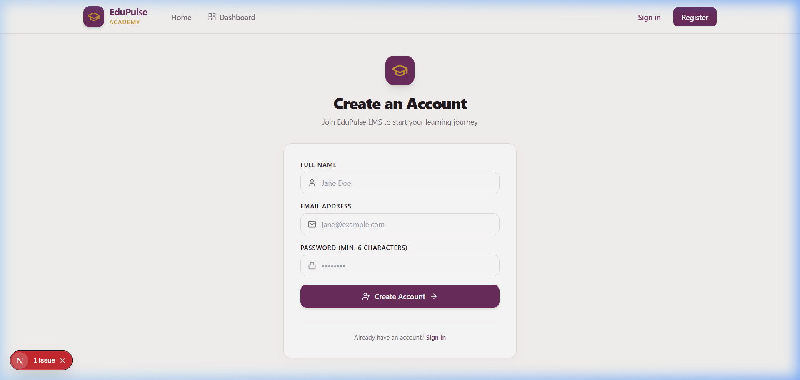 | 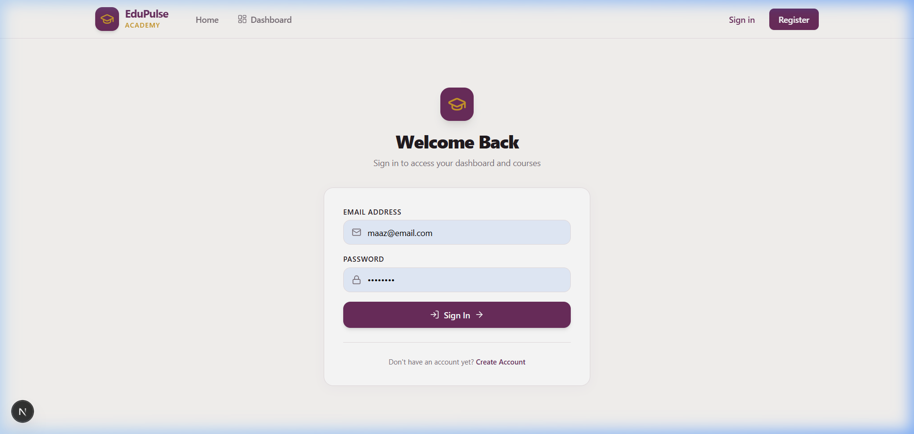 |
| **Authenticated Dashboard (`/dashboard`)** | **Duplicate Account Guard** |
| 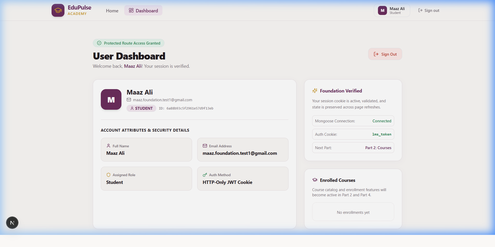 | 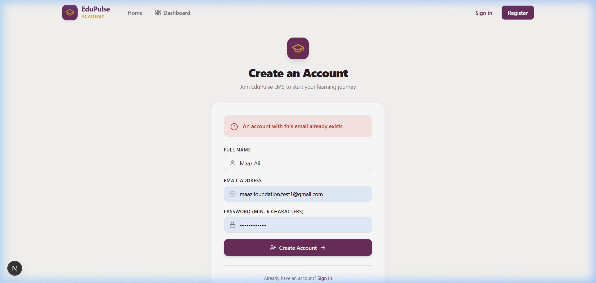 |

### Part 2: Course Catalog & Admin Management
| Public Course Catalog (`/`) | Course Detail Page (`/courses/[id]`) |
| :---: | :---: |
| 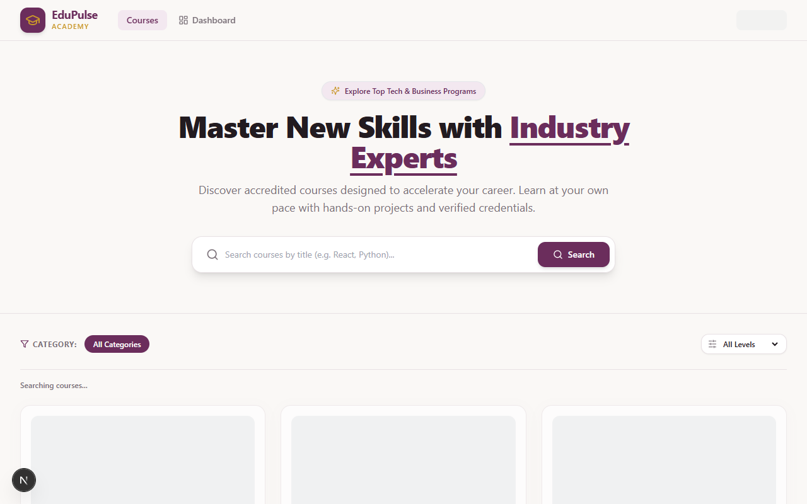 | 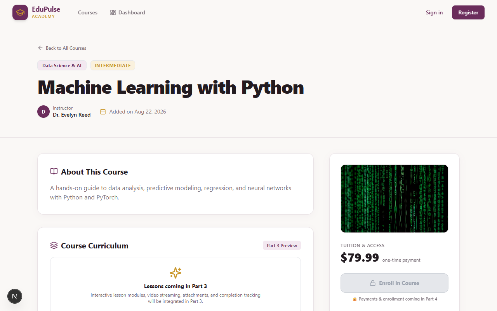 |
| **Admin Overview Dashboard (`/admin`)** | **Admin Categories Management (`/admin/categories`)** |
| 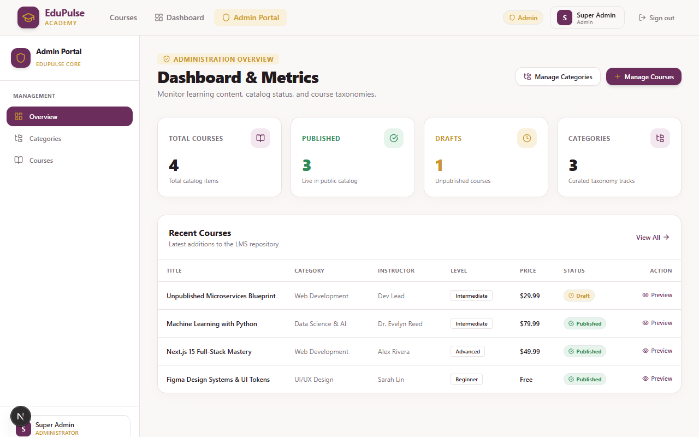 | 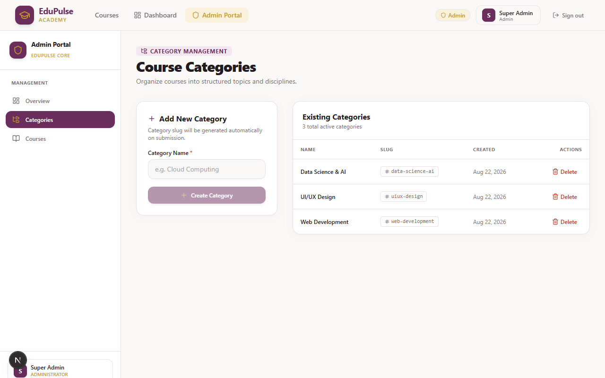 |
| **Admin Course Management (`/admin/courses`)** | **Category Deletion Guard (Error Banner)** |
| 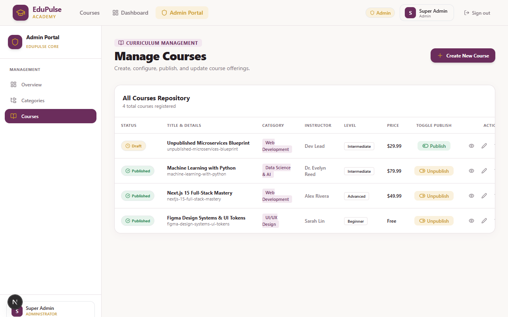 | 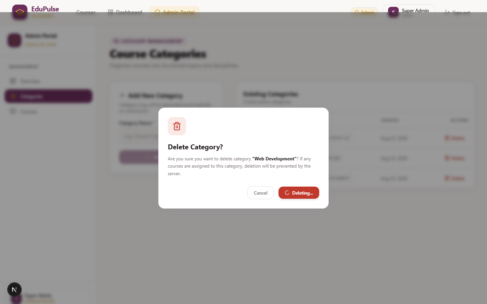 |
| **Unpublished Course 404 Guard** | |
| 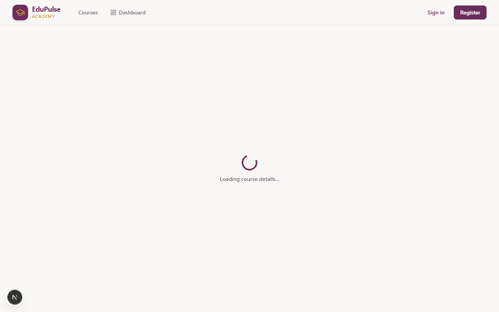 | |

---

## 🚀 Quick Start & Local Development

### 1. Clone the repository
```bash
git clone https://github.com/MaazzAlii/edupulse-lms-nextjs.git
cd edupulse-lms-nextjs
```

### 2. Configure Environment Variables
Create a `.env.local` file in the root directory:
```env
MONGO_URI=mongodb+srv://<username>:<password>@<cluster>.mongodb.net/edupulse_lms?retryWrites=true&w=majority
JWT_SECRET=your_jwt_secret_key_here
JWT_EXPIRE=7d
BLOB_READ_WRITE_TOKEN=your_vercel_blob_read_write_token_here
```

### 3. Install dependencies
```bash
npm install
```

### 4. Run development server
```bash
npm run dev
```
Open [http://localhost:3000](http://localhost:3000) in your browser.

### 5. Build for Production
```bash
npm run build
npm run start
```

---

## 📖 Architecture & Notes
For a comprehensive architectural breakdown and code structure, see **[LMS_Step_By_Step_Notes.md](./LMS_Step_By_Step_Notes.md)**.
