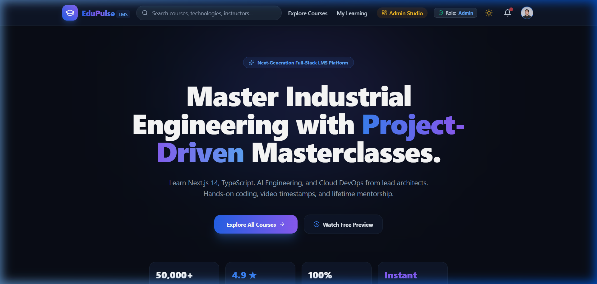
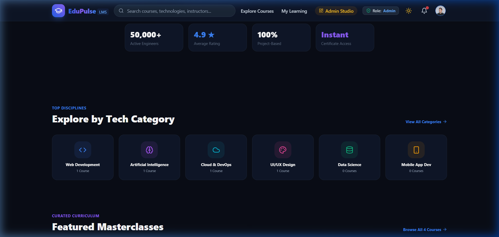
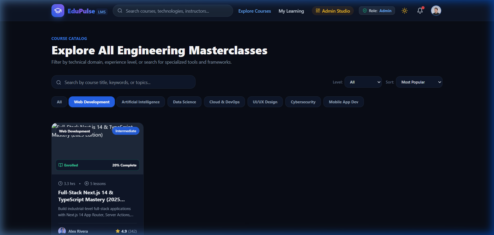
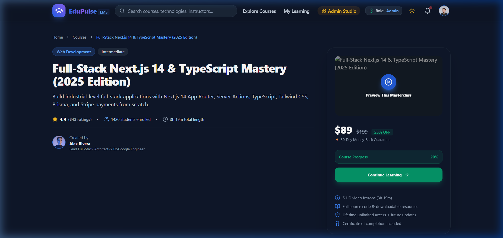
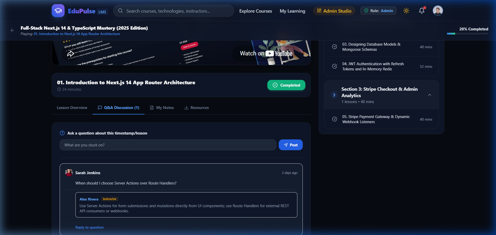
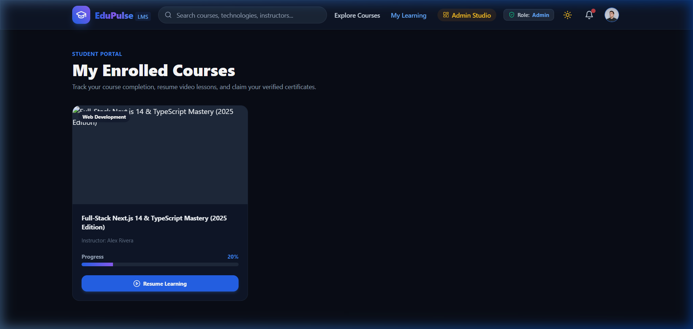
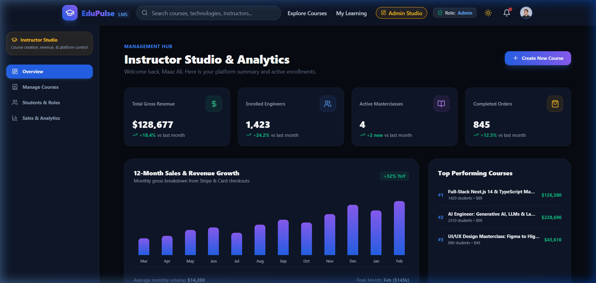
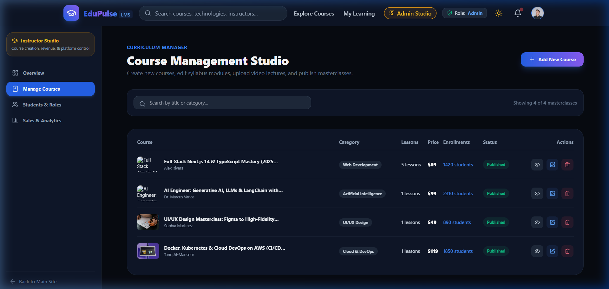
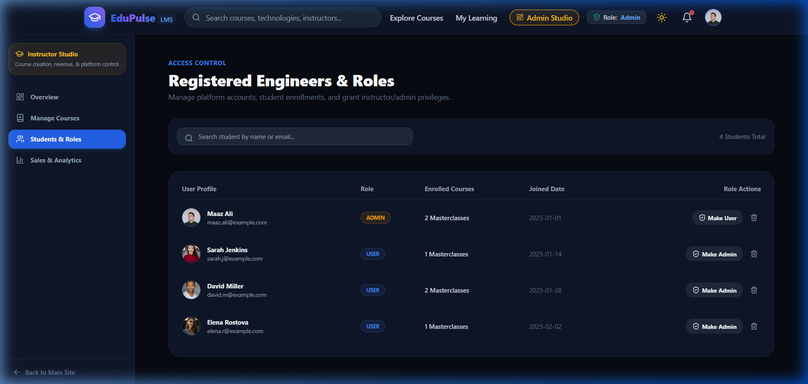
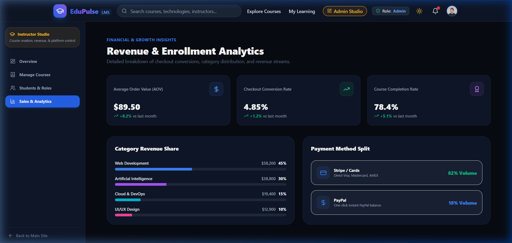

# EduPulse LMS — Full Project Source Code Dump
Generated for cross-file dependency analysis, architectural review, and end-to-end debugging.

--- FILE: .env.example ---
MONGO_URI=mongodb+srv://<username>:<password>@<cluster>.mongodb.net/lms?retryWrites=true&w=majority
JWT_SECRET=replace_with_a_long_random_secret
JWT_EXPIRE=7d


--- FILE: .env.local ---
# MongoDB Connection (Replace with your Atlas or Local URI)
MONGO_URI=mongodb://127.0.0.1:27017/edupulse_lms
JWT_SECRET=dev_jwt_super_secret_key_edupulse_foundation_2026
JWT_EXPIRE=7d


--- FILE: .eslintrc.json ---
{
  "extends": "next/core-web-vitals"
}


--- FILE: .gitignore ---
# dependencies
/node_modules
/.pnp
.pnp.js
.yarn/install-state.gz

# testing
/coverage

# next.js
/.next/
/out/

# production
/build
/dist

# misc
.DS_Store
*.pem

# debug
npm-debug.log*
yarn-debug.log*
yarn-error.log*

# local env files
.env*.local

# vercel
.vercel

# typescript
*.tsbuildinfo
next-env.d.ts


--- FILE: LMS_Step_By_Step_Notes.md ---
# 🎓 Full MERN Stack LMS (Learning Management System) - Step-by-Step Notes
> **Video Source:** [Becodemy - All Functional MERN Stack LMS Series with Next 13 & TypeScript (Part 1)](https://www.youtube.com/watch?v=kf6yyxMck8Y)  
> **Topic:** Complete Industrial-Level LMS Backend Architecture (Node.js, Express, TypeScript, MongoDB, Redis, Cloudinary)

---

## 📌 Table of Contents
1. [Project Overview & Architecture Plan](#1-project-overview--architecture-plan)
2. [Tech Stack Explanation (Why We Use What)](#2-tech-stack-explanation-why-we-use-what)
3. [Step 1: Project & TypeScript Server Setup](#3-step-1-project--typescript-server-setup)
4. [Step 2: Database & Cloud Services Connections](#4-step-2-database--cloud-services-connections)
5. [Step 3: Robust Error Handling Architecture](#5-step-3-robust-error-handling-architecture)
6. [Step 4: User Model & Secure Authentication System](#6-step-4-user-model--secure-authentication-system)
7. [Step 5: Authentication & Role Authorization Middlewares](#7-step-5-authentication--role-authorization-middlewares)
8. [Step 6: User Profile Management & Avatar Upload](#8-step-6-user-profile-management--avatar-upload)
9. [Step 7: Course Management System (CRUD, Q&A, Reviews)](#9-step-7-course-management-system-crud-qa-reviews)
10. [Step 8: Orders, Payments & Automated Cron Notifications](#10-step-8-orders-payments--automated-cron-notifications)
11. [Step 9: Admin Dashboard & Analytics Engine](#11-step-9-admin-dashboard--analytics-engine)
12. [Step 10: Dynamic Layout Management (Hero, FAQ, Categories)](#12-step-10-dynamic-layout-management-hero-faq-categories)
13. [Step 11: Advanced Redis Caching & Cache Invalidation](#13-step-11-advanced-redis-caching--cache-invalidation)
14. [Quick Reference API Cheat Sheet](#14-quick-reference-api-cheat-sheet)

---

## 1. Project Overview & Architecture Plan
*(Timestamp: 00:00:00 - 00:37:34)*

### 🎯 What is this LMS?
An industrial-grade online education platform (like Udemy / Coursera) containing:
- **Student Features:** Browse courses, view previews, purchase courses, watch video lessons, ask questions in video timestamps, write reviews, and receive email updates.
- **Admin Features:** Upload video lessons, structure modules, manage pricing, view financial & user growth analytics, handle user roles, customize homepage hero banners/FAQs/categories.
- **Performance & Security:** High-speed in-memory session and cache storage with Redis, JWT authentication with silent refresh tokens, and Cloudinary media processing.

### 📐 Backend Folder Architecture
```text
server/
├── @types/             # Custom TypeScript definitions
├── controllers/        # Business logic for endpoints (user, course, order, etc.)
├── mails/              # EJS email templates (activation, question reply, order confirmation)
├── middleware/         # Auth guards, error handlers, role validators
├── models/             # Mongoose database schemas (User, Course, Order, Notification, Layout)
├── routes/             # Express API routes
├── services/           # Reusable database and cache services
├── utils/              # Redis client, DB connection, JWT helpers, email sender, error classes
├── app.ts              # Express app configuration & global middleware
├── server.ts           # Server initialization & database bootstrap
├── tsconfig.json       # TypeScript compiler settings
└── package.json        # Dependencies & start scripts
```

---

## 2. Tech Stack Explanation (Why We Use What)
*(Timestamp: 00:37:34 - 00:53:09)*

| Technology | Why It's Used | In Simple Words |
| :--- | :--- | :--- |
| **TypeScript** | Static typing, interface checking, IntelliSense | Catches code errors before running the application |
| **Node.js & Express** | Fast, scalable, non-blocking asynchronous server | The engine that handles API requests and responses |
| **MongoDB & Mongoose** | Flexible JSON-like document database | Stores users, courses, orders, and site data |
| **Redis** | Super-fast in-memory key-value database | Stores user sessions & caches course data for speed |
| **Cloudinary** | Cloud image and video management CDN | Stores user profile pictures and course thumbnails |
| **JWT (JSON Web Tokens)** | Stateless token-based user verification | Securely tracks logged-in users with Access & Refresh tokens |
| **Nodemailer + EJS** | Email sending with customizable HTML templates | Sends OTP codes and notification emails to users |
| **Node-Cron** | Task scheduler for background routines | Automatically deletes old read notifications |

---

## 3. Step 1: Project & TypeScript Server Setup
*(Timestamp: 00:53:09 - 01:04:21)*

### 1. Initialize Node project
```bash
npm init -y
```

### 2. Install Dependencies
```bash
# Core dependencies
npm i express dotenv mongoose ioredis jsonwebtoken bcryptjs cors cookie-parser cloudinary nodemailer ejs node-cron

# Development dependencies (TypeScript & Type Definitions)
npm i -D typescript ts-node-dev @types/node @types/express @types/cors @types/cookie-parser @types/jsonwebtoken @types/bcryptjs @types/nodemailer @types/ejs @types/node-cron
```

### 3. Initialize TypeScript Configuration (`tsconfig.json`)
```bash
npx tsc --init
```
Key settings to enable inside `tsconfig.json`:
- `"target": "es2020"`
- `"module": "commonjs"`
- `"rootDir": "./"`
- `"outDir": "./dist"`
- `"strict": true`
- `"esModuleInterop": true`

### 4. Create `app.ts` (Express Configuration)
```typescript
import express, { Request, Response, NextFunction } from "express";
import cors from "cors";
import cookieParser from "cookie-parser";
import dotenv from "dotenv";
import { ErrorMiddleware } from "./middleware/error";

dotenv.config();
export const app = express();

// 1. Body parser with limits for base64 / Cloudinary uploads
app.use(express.json({ limit: "50mb" }));

// 2. Cookie parser for reading tokens
app.use(cookieParser());

// 3. CORS configuration for frontend connection
app.use(
  cors({
    origin: process.env.ORIGIN || "http://localhost:3000",
    credentials: true,
  })
);

// 4. Testing route
app.get("/test", (req: Request, res: Response, next: NextFunction) => {
  res.status(200).json({ success: true, message: "API is working properly" });
});

// 5. Global Error Handling Middleware (Always at the bottom)
app.use(ErrorMiddleware);
```

### 5. Create `server.ts` (Server Launcher)
```typescript
import { app } from "./app";
import connectDB from "./utils/db";
import { v2 as cloudinary } from "cloudinary";
import dotenv from "dotenv";

dotenv.config();

// Cloudinary config
cloudinary.config({
  cloud_name: process.env.CLOUD_NAME,
  api_key: process.env.CLOUD_API_KEY,
  api_secret: process.env.CLOUD_SECRET_KEY,
});

// Start Server
const PORT = process.env.PORT || 8000;
app.listen(PORT, () => {
  console.log(`🚀 Server connected on port ${PORT}`);
  connectDB();
});
```

---

## 4. Step 2: Database & Cloud Services Connections
*(Timestamp: 01:04:21 - 01:26:03)*

### 1. MongoDB Connection (`utils/db.ts`)
```typescript
import mongoose from "mongoose";
import dotenv from "dotenv";
dotenv.config();

const dbUrl: string = process.env.DB_URI || "";

const connectDB = async () => {
  try {
    const data = await mongoose.connect(dbUrl);
    console.log(`🍃 Database connected with ${data.connection.host}`);
  } catch (error: any) {
    console.error("❌ MongoDB connection error:", error.message);
    setTimeout(connectDB, 5000); // Retry connection after 5 seconds
  }
};

export default connectDB;
```

### 2. Redis Connection (`utils/redis.ts`)
Redis acts as a high-speed cache and stores user sessions.
```typescript
import { Redis } from "ioredis";
import dotenv from "dotenv";
dotenv.config();

const redisClient = () => {
  if (process.env.REDIS_URL) {
    console.log("⚡ Redis connected successfully");
    return process.env.REDIS_URL;
  }
  throw new Error("Redis connection failed: REDIS_URL missing");
};

export const redis = new Redis(redisClient());
```

---

## 5. Step 3: Robust Error Handling Architecture
*(Timestamp: 01:26:03 - 01:43:22)*

Instead of using repetitive `try-catch` blocks everywhere with messy response formats, we use:
1. **`ErrorHandler` Class:** Custom class inheriting from JavaScript's built-in `Error`.
2. **`CatchAsyncError` Wrapper:** Automatically catches unhandled promise rejections.
3. **`ErrorMiddleware`:** Centralized error interceptor handling MongoDB & JWT errors cleanly.

### Custom Error Class (`utils/ErrorHandler.ts`)
```typescript
class ErrorHandler extends Error {
  statusCode: number;

  constructor(message: string, statusCode: number) {
    super(message);
    this.statusCode = statusCode;
    Error.captureStackTrace(this, this.constructor);
  }
}

export default ErrorHandler;
```

### Async Error Wrapper (`middleware/catchAsyncErrors.ts`)
```typescript
import { Request, Response, NextFunction } from "express";

export const CatchAsyncError =
  (theFunc: any) => (req: Request, res: Response, next: NextFunction) => {
    Promise.resolve(theFunc(req, res, next)).catch(next);
  };
```

### Central Error Middleware (`middleware/error.ts`)
```typescript
import { Request, Response, NextFunction } from "express";
import ErrorHandler from "../utils/ErrorHandler";

export const ErrorMiddleware = (
  err: any,
  req: Request,
  res: Response,
  next: NextFunction
) => {
  err.statusCode = err.statusCode || 500;
  err.message = err.message || "Internal Server Error";

  // Wrong MongoDB ObjectId Error
  if (err.name === "CastError") {
    const message = `Resource not found. Invalid: ${err.path}`;
    err = new ErrorHandler(message, 400);
  }

  // Duplicate Key Error (e.g. email already exists)
  if (err.code === 11000) {
    const message = `Duplicate ${Object.keys(err.keyValue)} entered`;
    err = new ErrorHandler(message, 400);
  }

  // Wrong JWT Error
  if (err.name === "JsonWebTokenError") {
    const message = "Json Web Token is invalid, try again";
    err = new ErrorHandler(message, 400);
  }

  // JWT Token Expired
  if (err.name === "TokenExpiredError") {
    const message = "Json Web Token is expired, try again";
    err = new ErrorHandler(message, 400);
  }

  res.status(err.statusCode).json({
    success: false,
    message: err.message,
  });
};
```

---

## 6. Step 4: User Model & Secure Authentication System
*(Timestamp: 01:43:22 - 03:12:02)*

### How Authentication Works:
1. **Register:** User enters Name, Email, Password. Server generates a 4-digit OTP, creates an Activation Token (signed JWT containing user info + OTP), and emails the OTP using an EJS template.
2. **Activate:** User inputs the 4-digit code. Server verifies the code against the token and creates the user in MongoDB.
3. **Login:** Server verifies email & password (via bcrypt), generates an **Access Token** (short-lived, e.g. 5m) and a **Refresh Token** (long-lived, e.g. 3 days), caches user data in **Redis**, and stores tokens in **HTTP-only secure cookies**.

### User Model (`models/user.model.ts`)
```typescript
import mongoose, { Document, Model, Schema } from "mongoose";
import bcrypt from "bcryptjs";
import jwt from "jsonwebtoken";
import dotenv from "dotenv";
dotenv.config();

const emailRegexPattern: RegExp = /^[^\s@]+@[^\s@]+\.[^\s@]+$/;

export interface IUser extends Document {
  name: string;
  email: string;
  password?: string;
  avatar: {
    public_id: string;
    url: string;
  };
  role: string;
  isVerified: boolean;
  courses: Array<{ courseId: string }>;
  comparePassword: (enteredPassword: string) => Promise<boolean>;
  SignAccessToken: () => string;
  SignRefreshToken: () => string;
}

const userSchema: Schema<IUser> = new mongoose.Schema(
  {
    name: { type: String, required: [true, "Please enter your name"] },
    email: {
      type: String,
      required: [true, "Please enter your email"],
      validate: {
        validator: (value: string) => emailRegexPattern.test(value),
        message: "Please enter a valid email",
      },
      unique: true,
    },
    password: {
      type: String,
      minlength: [6, "Password must be at least 6 characters"],
      select: false, // Do not return password by default in queries
    },
    avatar: {
      public_id: String,
      url: String,
    },
    role: { type: String, default: "user" },
    isVerified: { type: Boolean, default: false },
    courses: [{ courseId: String }],
  },
  { timestamps: true }
);

// Hash password before saving
userSchema.pre<IUser>("save", async function (next) {
  if (!this.isModified("password")) return next();
  this.password = await bcrypt.hash(this.password!, 10);
  next();
});

// Compare password method
userSchema.methods.comparePassword = async function (enteredPassword: string) {
  return await bcrypt.compare(enteredPassword, this.password);
};

// Sign Access Token
userSchema.methods.SignAccessToken = function () {
  return jwt.sign({ id: this._id }, process.env.ACCESS_TOKEN || "", {
    expiresIn: "5m",
  });
};

// Sign Refresh Token
userSchema.methods.SignRefreshToken = function () {
  return jwt.sign({ id: this._id }, process.env.REFRESH_TOKEN || "", {
    expiresIn: "3d",
  });
};

const userModel: Model<IUser> = mongoose.model("User", userSchema);
export default userModel;
```

### JWT Token Helper & Redis Session Storage (`utils/jwt.ts`)
```typescript
import { Response } from "express";
import { IUser } from "../models/user.model";
import { redis } from "./redis";

interface ITokenOptions {
  expires: Date;
  maxAge: number;
  httpOnly: boolean;
  sameSite: "lax" | "strict" | "none" | undefined;
  secure?: boolean;
}

// Token cookie options
export const accessTokenOptions: ITokenOptions = {
  expires: new Date(Date.now() + 5 * 60 * 1000), // 5 minutes
  maxAge: 5 * 60 * 1000,
  httpOnly: true,
  sameSite: "lax",
};

export const refreshTokenOptions: ITokenOptions = {
  expires: new Date(Date.now() + 3 * 24 * 60 * 60 * 1000), // 3 days
  maxAge: 3 * 24 * 60 * 60 * 1000,
  httpOnly: true,
  sameSite: "lax",
};

export const sendToken = (user: IUser, statusCode: number, res: Response) => {
  const accessToken = user.SignAccessToken();
  const refreshToken = user.SignRefreshToken();

  // Save session to Redis
  redis.set(user._id.toString(), JSON.stringify(user));

  if (process.env.NODE_ENV === "production") {
    accessTokenOptions.secure = true;
    refreshTokenOptions.secure = true;
  }

  res.cookie("access_token", accessToken, accessTokenOptions);
  res.cookie("refresh_token", refreshToken, refreshTokenOptions);

  res.status(statusCode).json({
    success: true,
    user,
    accessToken,
  });
};
```

---

## 7. Step 5: Authentication & Role Authorization Middlewares
*(Timestamp: 03:12:02 - 03:23:34)*

### Middleware Guards (`middleware/auth.ts`)
1. **`isAuthenticated`:** Reads `access_token` cookie, decodes user ID, pulls session from Redis, and sets `req.user`.
2. **`authorizeRoles`:** Protects administrative endpoints from regular users.

```typescript
import { Request, Response, NextFunction } from "express";
import { CatchAsyncError } from "./catchAsyncErrors";
import ErrorHandler from "../utils/ErrorHandler";
import jwt, { JwtPayload } from "jsonwebtoken";
import { redis } from "../utils/redis";

// Check if user is logged in
export const isAuthenticated = CatchAsyncError(
  async (req: Request, res: Response, next: NextFunction) => {
    const access_token = req.cookies.access_token as string;

    if (!access_token) {
      return next(new ErrorHandler("Please login to access this resource", 400));
    }

    const decoded = jwt.verify(
      access_token,
      process.env.ACCESS_TOKEN as string
    ) as JwtPayload;

    if (!decoded) {
      return next(new ErrorHandler("Access token is invalid", 400));
    }

    // Retrieve active user from Redis session
    const user = await redis.get(decoded.id);

    if (!user) {
      return next(new ErrorHandler("User session expired, please login again", 400));
    }

    req.user = JSON.parse(user);
    next();
  }
);

// Role Authorization Middleware (e.g. admin only)
export const authorizeRoles = (...roles: string[]) => {
  return (req: Request, res: Response, next: NextFunction) => {
    if (!roles.includes(req.user?.role || "")) {
      return next(
        new ErrorHandler(
          `Role (${req.user?.role}) is not allowed to access this resource`,
          403
        )
      );
    }
    next();
  };
};
```

---

## 8. Step 6: User Profile Management & Avatar Upload
*(Timestamp: 03:49:16 - 04:19:55)*

Key user profile functionalities:
1. **Update User Info:** Allows modifying user name and email.
2. **Update Password:** Checks `oldPassword` using `comparePassword`, and assigns `newPassword`.
3. **Update Avatar with Cloudinary:**
   - Deletes the previous image from Cloudinary using `public_id`.
   - Uploads new base64 image to `"avatars"` folder.
   - Updates user record in MongoDB and synchronizes cache in Redis.

```typescript
// Updating Avatar Controller Snippet
export const updateProfilePicture = CatchAsyncError(
  async (req: Request, res: Response, next: NextFunction) => {
    const { avatar } = req.body;
    const userId = req.user?._id;
    const user = await userModel.findById(userId);

    if (avatar && user) {
      // If user already has an avatar on Cloudinary, delete old one
      if (user?.avatar?.public_id) {
        await cloudinary.v2.uploader.destroy(user.avatar.public_id);
      }
      const myCloud = await cloudinary.v2.uploader.upload(avatar, {
        folder: "avatars",
        width: 150,
      });

      user.avatar = {
        public_id: myCloud.public_id,
        url: myCloud.secure_url,
      };

      await user.save();
      await redis.set(userId, JSON.stringify(user));

      res.status(200).json({ success: true, user });
    }
  }
);
```

---

## 9. Step 7: Course Management System (CRUD, Q&A, Reviews)
*(Timestamp: 04:19:55 - 06:14:48)*

### Course Schema Architecture (`models/course.model.ts`)
A course contains:
- Basic info: `name`, `description`, `price`, `estimatedPrice`, `thumbnail`, `tags`, `level`, `demoUrl`.
- Benefits & Prerequisites list.
- **`courseData` (Sections/Episodes):** Title, description, `videoUrl`, `videoLength`, Q&A section.
- **Reviews & Ratings:** User comments with star ratings and instructor replies.

```typescript
interface IComment extends Document {
  user: IUser;
  question: string;
  questionReplies?: IComment[];
}

interface IReview extends Document {
  user: IUser;
  rating: number;
  comment: string;
  commentReplies?: IComment[];
}

interface ICourseData extends Document {
  title: string;
  description: string;
  videoUrl: string;
  videoSection: string;
  videoLength: number;
  videoPlayer: string;
  links: Array<{ title: string; url: string }>;
  suggestion: string;
  questions: IComment[];
}
```

### Key Course Operations:
- **Public Course View (`getSingleCourse` & `getAllCourses`):** Returns course data *without* private video URLs (for unpurchased visitors). Data is cached in Redis for fast load times.
- **Purchased Course View (`getCourseByUser`):** Verifies that the logged-in user has purchased the course (by checking `user.courses`) and provides full video streaming URLs and course content.
- **Add Question & Reply in Video:** Students can post questions under a specific video section. Instructors receive an automated email notification with link and details when a question is asked.
- **Add Review & Rating:** Enrolled students can rate the course (1–5 stars) and write feedback. Calculates the average rating dynamically.

---

## 10. Step 8: Orders, Payments & Automated Cron Notifications
*(Timestamp: 06:14:48 - 07:14:23)*

### 1. Order Creation Workflow (`controllers/order.controller.ts`)
1. User provides `courseId` and `payment_info`.
2. Validates that the user has not already purchased the course.
3. Sends an order confirmation invoice email (via EJS template).
4. Adds the `courseId` to the user's `courses` array in MongoDB and updates the Redis session.
5. Increments the course `purchased` count.
6. Creates a new **Notification** document for the Admin Dashboard.

### 2. Automated Notification Cleanup with `node-cron` (`utils/analytics.generator.ts`)
Deletes all notifications marked as `"read"` that are older than 30 days every night at midnight:
```typescript
import cron from "node-cron";
import notificationModel from "../models/notification.model";

// Cron job runs at 00:00 every day
cron.schedule("0 0 0 * * *", async () => {
  const thirtyDaysAgo = new Date(Date.now() - 30 * 24 * 60 * 60 * 1000);
  await notificationModel.deleteMany({
    status: "read",
    createdAt: { $lt: thirtyDaysAgo },
  });
  console.log("🧹 Deleted 30-day-old read notifications");
});
```

---

## 11. Step 9: Admin Dashboard & Analytics Engine
*(Timestamp: 07:14:23 - 08:00:16)*

### 12-Month Historical Analytics Generator (`utils/analytics.generator.ts`)
Generates monthly counts of new users, course sales, and revenue for the last 12 months for rendering Admin charts.

```typescript
import { Document, Model } from "mongoose";

interface MonthData {
  month: string;
  count: number;
}

export async function generateLast12MonthsData<T extends Document>(
  model: Model<T>
): Promise<{ last12Months: MonthData[] }> {
  const last12Months: MonthData[] = [];
  const currentDate = new Date();
  currentDate.setDate(currentDate.getDate() + 1);

  for (let i = 11; i >= 0; i--) {
    const endDate = new Date(
      currentDate.getFullYear(),
      currentDate.getMonth(),
      currentDate.getDate() - i * 28
    );
    const startDate = new Date(
      endDate.getFullYear(),
      endDate.getMonth(),
      endDate.getDate() - 28
    );

    const monthYear = endDate.toLocaleString("default", {
      day: "numeric",
      month: "short",
      year: "numeric",
    });
    const count = await model.countDocuments({
      createdAt: {
        $gte: startDate,
        $lt: endDate,
      },
    });
    last12Months.push({ month: monthYear, count });
  }
  return { last12Months };
}
```

---

## 12. Step 10: Dynamic Layout Management (Hero, FAQ, Categories)
*(Timestamp: 08:00:16 - 08:39:20)*

Instead of hardcoding the homepage banner, FAQ items, and category filters, an Admin can dynamically manage them via the `Layout` model.

### Layout Schema (`models/layout.model.ts`)
```typescript
const layoutSchema = new Schema({
  type: { type: String }, // "Banner", "FAQ", or "Categories"
  faq: [{ question: String, answer: String }],
  categories: [{ title: String }],
  banner: {
    image: { public_id: String, url: String },
    title: String,
    subTitle: String,
  },
});
```

### Endpoints:
- `POST /create-layout` (Admin only)
- `PUT /edit-layout` (Admin only)
- `GET /get-layout/:type` (Public - used by Next.js frontend to render Hero & FAQ)

---

## 13. Step 11: Advanced Redis Caching & Cache Invalidation
*(Timestamp: 08:39:20 - 08:55:00)*

### Why Invalidate Caches?
When an admin edits a course or updates the hero layout, visitors shouldn't see stale cached data from Redis.

### Strategy:
1. **On Read:** Check Redis for key `allCourses`. If found, return instantly. If not found, fetch from MongoDB, store in Redis, and return.
2. **On Write/Update/Delete:** Update MongoDB **and** delete or update the Redis key (`redis.del("allCourses")`).

```typescript
// Example: Invalidate Cache on Course Update
export const editCourse = CatchAsyncError(
  async (req: Request, res: Response, next: NextFunction) => {
    // 1. Update in MongoDB
    const course = await courseModel.findByIdAndUpdate(req.params.id, req.body, { new: true });
    
    // 2. Invalidate / update Redis cache
    await redis.set(req.params.id, JSON.stringify(course));
    await redis.del("allCourses");

    res.status(200).json({ success: true, course });
  }
);
```

---

## 14. Quick Reference API Cheat Sheet

### 🔐 Auth & User Routes (`/api/v1/`)
- `POST /registration` - Register user & send OTP email
- `POST /activate-user` - Verify OTP & create database account
- `POST /login` - Login with email/password & receive cookies
- `GET /logout` - Logout & clear Redis session
- `GET /refresh` - Generate new access token using refresh token
- `GET /me` - Get logged-in user profile
- `PUT /update-user-info` - Update name/email
- `PUT /update-user-password` - Update password
- `PUT /update-user-avatar` - Upload new profile photo

### 📚 Course Routes (`/api/v1/`)
- `POST /create-course` - *(Admin)* Create new course with sections
- `PUT /edit-course/:id` - *(Admin)* Update existing course
- `GET /get-course/:id` - Get single course preview (Public)
- `GET /get-courses` - Get all courses list (Public)
- `GET /get-course-content/:id` - Get full course video content *(Enrolled users only)*
- `PUT /add-question` - Post a question under a video
- `PUT /add-answer` - Reply to a question & notify student
- `PUT /add-review/:id` - Add rating and review
- `PUT /add-reply` - *(Admin)* Reply to user review

### 🛒 Order & Admin Routes (`/api/v1/`)
- `POST /create-order` - Purchase course
- `GET /get-notifications` - *(Admin)* Fetch real-time system alerts
- `PUT /update-notification/:id` - *(Admin)* Mark alert as read
- `GET /get-users-analytics` - *(Admin)* 12-month user sign-up analytics
- `GET /get-courses-analytics` - *(Admin)* 12-month course creation analytics
- `GET /get-orders-analytics` - *(Admin)* 12-month sales & revenue analytics
- `POST /create-layout` / `PUT /edit-layout` - Manage Hero, FAQ, and Categories


--- FILE: README.md ---
<div align="center">

# ⚡ EduPulse LMS — Next.js 14 Learning Management System

An industrial-grade, full-stack Learning Management System built with **Next.js 14 (App Router)**, **TypeScript**, **Tailwind CSS**, **Stripe Checkout Simulation**, and an interactive **Admin Studio**.

[](https://nextjs.org/)
[](https://www.typescriptlang.org/)
[](https://tailwindcss.com/)
[](https://vercel.com/)
[](https://opensource.org/licenses/MIT)

</div>

---

## 🌟 Key Features

### 👨‍🎓 Student Learning Experience
- **Interactive Video Classroom (`/learn/[courseId]`):** Video streaming with playlist navigation, timestamp jumping, lesson completion checkboxes, and live Q&A threads with instructor replies.
- **Course Catalog & Filtering (`/courses`):** Filter by category (Web Dev, AI, Cloud, UI/UX, Data Science), skill level (Beginner, Intermediate, Expert), price sorting, and instant search.
- **Detailed Course Syllabus (`/courses/[id]`):** Module breakdown, free preview video modal, instructor credentials, and student reviews.
- **Stripe Checkout & Instant Enrollment:** Card payment gateway modal with promo coupons, instant invoice generation, and immediate course access.
- **Student Dashboard ("My Learning"):** Track percentage completion per course and generate verifiable completion certificates.

### 🛡️ Instructor & Admin Studio (`/admin`)
- **Executive Analytics Dashboard:** Gross revenue metrics, total student count, 12-month sales chart, and top performing masterclasses.
- **Full Course Builder Studio (`/admin/courses`):** Create, edit, publish/draft, and delete masterclasses with comprehensive section/lesson/video builders.
- **User & Access Management (`/admin/users`):** Manage student accounts, inspect enrollments, and toggle roles (Admin ↔ Student).
- **Financial Analytics (`/admin/analytics`):** Category revenue distribution and payment gateway volume split.

---

## 📸 Interface Walkthrough & Screenshots

### 1. Landing Page & Hero


### 2. Category Navigation


### 3. Course Catalog with Filters & Search


### 4. Course Details & Syllabus


### 5. Interactive Video Player Classroom


### 6. Student Portal & Progress Tracker


### 7. Admin Executive Dashboard & 12-Month Sales Chart


### 8. Course Management Studio (Full CRUD)


### 9. User Role Management


### 10. Financial & Category Revenue Analytics


---

## 🚀 Quick Start & Local Development

### 1. Clone the repository
```bash
git clone https://github.com/MaazzAlii/edupulse-lms-nextjs.git
cd edupulse-lms-nextjs
```

### 2. Install dependencies
```bash
npm install
```

### 3. Run development server
```bash
npm run dev
```
Open [http://localhost:3000](http://localhost:3000) in your browser.

### 4. Build for Production
```bash
npm run build
npm run start
```

---

## ☁️ Deploying to Vercel (1-Click Ready)

This repository is optimized for zero-configuration deployment on **Vercel**:
1. Push your repository to GitHub.
2. Go to [vercel.com](https://vercel.com) and click **"Add New Project"**.
3. Import `edupulse-lms-nextjs`.
4. Click **"Deploy"**. Next.js App Router will automatically compile all static and dynamic edge routes.

---

## 📖 Architecture & Learning Notes
Check the complete step-by-step backend and LMS architecture guide in **[LMS_Step_By_Step_Notes.md](./LMS_Step_By_Step_Notes.md)**.


--- FILE: lms-part1-foundation-spec.md ---
# LMS Project — Part 1: Foundation

**Goal:** Set up the Next.js project, database models, authentication (register/login/logout), protected routes, and a basic layout with role-aware navigation. This is the base every later part builds on top of.

---

## 1. Project Setup

Scaffold with the official CLI, pinned to **Next.js 15** (not 16 — the LMS course and later parts assume Next 15's App Router conventions):

```bash
npx create-next-app@latest lms-nextjs --typescript --tailwind --eslint --app --src-dir --import-alias "@/*" --use-npm --no-turbopack
```

After scaffolding, edit `package.json`:
- Change `"next"` to `"^15.5.23"` (or latest 15.x)
- Add dependencies: `mongoose@^8.5.2`, `bcryptjs@^2.4.3`, `jsonwebtoken@^9.0.2`
- Add dev dependencies: `@types/bcryptjs@^2.4.6`, `@types/jsonwebtoken@^9.0.6`

Then delete `node_modules` and `package-lock.json`, and run `npm install` again so the lockfile matches.

Remove unused CLI boilerplate: `AGENTS.md`, `CLAUDE.md`, `public/file.svg`, `public/globe.svg`, `public/next.svg`, `public/vercel.svg`, `public/window.svg`.

**Do not use `next/font/google`** (or any Google Fonts import) — use Tailwind's default system font stack instead. This avoids a network dependency at build time.

---

## 2. Environment Variables

Create `.env.example`:

```env
MONGO_URI=mongodb+srv://<username>:<password>@<cluster>.mongodb.net/lms?retryWrites=true&w=majority
JWT_SECRET=replace_with_a_long_random_secret
JWT_EXPIRE=7d
```

(Later parts will add `BLOB_READ_WRITE_TOKEN`, `STRIPE_SECRET_KEY`, `STRIPE_WEBHOOK_SECRET`, `NEXT_PUBLIC_APP_URL` — don't add them yet.)

---

## 3. Design Tokens

In `src/app/globals.css`, replace the default `:root` and `@theme inline` blocks with these tokens (Tailwind v4 CSS-first theming — academic/education visual identity: deep plum primary + gold accent):

```css
@import "tailwindcss";

:root {
  --background: #faf8f6;
  --foreground: #221b20;
  --muted: #7a7078;
  --border: #e8e1e4;
  --surface: #ffffff;
  --primary: #6b2d5c;
  --primary-dark: #4f2144;
  --primary-tint: #f3e8f0;
  --gold: #c9972a;
  --gold-tint: #faf1dd;
  --green: #2e8b57;
  --green-tint: #e6f4ec;
  --red: #c0392b;
  --red-tint: #fbe9e7;
}

@theme inline {
  --color-background: var(--background);
  --color-foreground: var(--foreground);
  --color-muted: var(--muted);
  --color-border: var(--border);
  --color-surface: var(--surface);
  --color-primary: var(--primary);
  --color-primary-dark: var(--primary-dark);
  --color-primary-tint: var(--primary-tint);
  --color-gold: var(--gold);
  --color-gold-tint: var(--gold-tint);
  --color-green: var(--green);
  --color-green-tint: var(--green-tint);
  --color-red: var(--red);
  --color-red-tint: var(--red-tint);
  --font-sans: ui-sans-serif, system-ui, -apple-system, "Segoe UI", Roboto, sans-serif;
  --font-serif: ui-serif, Georgia, "Times New Roman", serif;
  --font-mono: ui-monospace, "SFMono-Regular", "IBM Plex Mono", Menlo, monospace;
}

body {
  background: var(--background);
  color: var(--foreground);
}
```

---

## 4. Folder Structure

```
src/
├── app/
│   ├── layout.tsx
│   ├── page.tsx              # Home page
│   ├── register/page.tsx
│   ├── login/page.tsx
│   ├── dashboard/page.tsx    # Protected placeholder page
│   └── api/
│       └── auth/
│           ├── register/route.ts
│           ├── login/route.ts
│           ├── logout/route.ts
│           └── me/route.ts
├── components/
│   └── Navbar.tsx
├── context/
│   └── AuthContext.tsx
├── lib/
│   ├── db.ts                 # MongoDB connection
│   ├── jwt.ts                # JWT sign/verify
│   ├── auth.ts                # Cookie-based auth helpers
│   └── response.ts             # Shared API response shape
└── models/
    ├── User.ts
    ├── Category.ts            # Empty schema now, used in Part 2
    ├── Course.ts               # Empty schema now, used in Part 2
    ├── Lesson.ts                # Empty schema now, used in Part 3
    └── Enrollment.ts             # Empty schema now, used in Part 4
```

Build all 5 models now even though only `User` is used in Part 1 — this avoids rework when Part 2 onward references them.

---

## 5. Database Models

### `src/lib/db.ts` — MongoDB connection

Use a cached-connection pattern (via `global`) so Next.js's dev-mode hot reload and serverless warm invocations don't create a new Mongoose connection every time. Throw a clear error if `MONGO_URI` is missing.

### `src/models/User.ts`

Fields: `name` (String, required), `email` (String, required, unique, lowercase), `password` (String, required, min 6 chars, `select: false`), `role` (enum `'student' | 'admin'`, default `'student'`), timestamps.

- `pre('save')` hook: hash `password` with bcrypt (10 rounds) if modified.
- Instance method `comparePassword(entered: string): Promise<boolean>` using `bcrypt.compare`.
- Export pattern: `mongoose.models.User || mongoose.model('User', userSchema)` (guards against Next.js hot-reload redefining the model).

### `src/models/Category.ts`

Fields: `name` (String, required, unique), `slug` (String, required, unique, lowercase), timestamps. Same `mongoose.models.X ||` export guard.

### `src/models/Course.ts`

Fields: `title`, `slug` (unique), `description`, `category` (ObjectId ref `'Category'`), `instructor` (String), `level` (enum `'Beginner' | 'Intermediate' | 'Advanced'`), `price` (Number, min 0), `thumbnailUrl` (String), `isPublished` (Boolean, default false), timestamps.

### `src/models/Lesson.ts`

Fields: `course` (ObjectId ref `'Course'`), `title`, `order` (Number), `videoUrl` (String), `durationSeconds` (Number), `isPreview` (Boolean, default false — watchable without purchasing), timestamps. Index on `{ course: 1, order: 1 }`.

### `src/models/Enrollment.ts`

Fields: `user` (ObjectId ref `'User'`), `course` (ObjectId ref `'Course'`), `amount` (Number), `paymentStatus` (enum `'Pending' | 'Paid'`), `stripeSessionId`, `stripePaymentIntentId`, `completedLessons` (array of ObjectId ref `'Lesson'`). Timestamps mapped as `{ createdAt: 'enrolledAt', updatedAt: true }`. **Unique compound index** on `{ user: 1, course: 1 }` — a user can only have one enrollment per course.

---

## 6. Auth Utilities

### `src/lib/jwt.ts`

`signToken({ id, role })` and `verifyToken(token)` using `jsonwebtoken`, reading `JWT_SECRET` and `JWT_EXPIRE` from env.

### `src/lib/response.ts`

Two helpers used by every API route for a consistent shape:
- `apiError(message, status)` → `NextResponse.json({ success: false, message }, { status })`
- `apiSuccess(data, status = 200)` → `NextResponse.json({ success: true, ...data }, { status })`

### `src/lib/auth.ts`

Cookie name constant: `AUTH_COOKIE = 'lms_token'`.

Two helper functions, both reading the JWT from the cookie, verifying it, and loading the user from MongoDB:
- `getAuthUserFromRequest(req: NextRequest)` — for use inside Route Handlers, reads `req.cookies.get(AUTH_COOKIE)`.
- `getServerUser()` — for use inside Server Components, reads via `await cookies()` (Next.js 15's `cookies()` is async).

Both return `null` (not a thrown error) if there's no valid session — callers decide whether that's an error.

---

## 7. Auth API Routes

All four routes go through `connectDB()` first, validate input, and return the shared `apiSuccess`/`apiError` shape.

- **`POST /api/auth/register`** — body `{ name, email, password }`. Validate all three present, password ≥ 6 chars. Check email not already taken (400 if so). Create user, sign JWT with `{ id, role }`, set it as an **httpOnly cookie** (`secure` in production, `sameSite: 'lax'`, 7-day maxAge), return `201` with the user object (never the password).
- **`POST /api/auth/login`** — body `{ email, password }`. Look up user with `.select('+password')` (since password has `select: false` on the schema), compare password, same cookie-setting pattern as register, return `200`.
- **`POST /api/auth/logout`** — clears the cookie (`maxAge: 0`), returns success.
- **`GET /api/auth/me`** — uses `getAuthUserFromRequest`, returns `401` if not authenticated, otherwise the user object.

---

## 8. Frontend

### `src/context/AuthContext.tsx`

Client-side React context (`'use client'`). On mount, calls `GET /api/auth/me` to restore session state (sets `loading` false once resolved). Exposes `user`, `loading`, `isAuthenticated`, `isAdmin`, and `register`/`login`/`logout`/`refresh` functions that call the corresponding API routes and update local state. Throw if `useAuth()` is called outside the provider.

### `src/components/Navbar.tsx`

Client component. Shows: brand logo/link to `/`, a "Courses" nav link, and then conditionally:
- While `loading`: nothing extra.
- If logged in: "Admin" link (only if `isAdmin`), "My Learning" link, the user's name, and a "Sign out" button that calls `logout()` then redirects to `/`.
- If logged out: a "Sign in" button linking to `/login`.

Use `usePathname()` to highlight the active link.

### `src/app/layout.tsx`

Root layout. Wrap `children` in `<AuthProvider>`, render `<Navbar />` above `{children}`. Set metadata title/description for the LMS.

### `src/app/page.tsx`

Simple home page explaining what's built so far in Part 1 (auth working, protected routes, role-aware nav) — this is a placeholder; the real course catalog replaces it in Part 2.

### `src/app/register/page.tsx` and `src/app/login/page.tsx`

Client components with controlled form inputs, calling `useAuth().register(...)` / `.login(...)`, showing a validation/error banner on failure, redirecting to `/dashboard` on success.

### `src/app/dashboard/page.tsx`

Client component demonstrating the **protected route pattern**: on mount, if `!loading && !isAuthenticated`, redirect to `/login` via `router.replace('/login')`. While loading or unauthenticated, show a loading state instead of flashing protected content. Once authenticated, show the user's name/email/role as proof the session works.

---

## 9. Verification Checklist (do this before pushing)

1. `npm install` completes cleanly.
2. `npm run build` succeeds with **zero errors**.
3. `npm run lint` passes with **zero errors**.
4. Manually test against a real MongoDB Atlas database (use `.env.example` as a template for a real `.env`):
   - Register a new account → should land on `/dashboard` showing your name/email/role.
   - Refresh the page → should stay logged in (session persists via cookie).
   - Click "Sign out" → should return to logged-out state.
   - Try to open `/dashboard` directly while logged out → should redirect to `/login`.
   - Log back in with the same credentials → should succeed and land on `/dashboard`.
   - Try registering with the same email again → should show a clear error, not crash.
5. Take screenshots of: the register page, login page, dashboard (logged in), and the terminal output of a successful `npm run build`.

## 10. GitHub

- Repo name suggestion: `lms-nextjs-foundation` (or just `lms-nextjs` if you want one repo for the whole project across all 6 parts — recommended, since later parts extend this same codebase rather than starting fresh).
- Public repo, empty (no auto-generated README/gitignore).
- Commit files individually with descriptive messages.
- Push to `origin main`.
- Add the verification screenshots to `docs/screenshots/` and reference them in the README under a "Part 1: Foundation" heading.

**Do not deploy to Vercel yet** — later parts add more environment variables (Blob storage, Stripe), so we'll deploy once more of the app exists. Local verification against a real MongoDB Atlas database is enough for this part.


--- FILE: next-env.d.ts ---
/// <reference types="next" />
/// <reference types="next/image-types/global" />
/// <reference path="./.next/types/routes.d.ts" />

// NOTE: This file should not be edited
// see https://nextjs.org/docs/app/api-reference/config/typescript for more information.


--- FILE: next.config.mjs ---
/** @type {import('next').NextConfig} */
const nextConfig = {
  images: {
    remotePatterns: [
      {
        protocol: "https",
        hostname: "**",
      },
    ],
  },
};

export default nextConfig;


--- FILE: package.json ---
{
  "name": "edupulse-lms",
  "version": "1.0.0",
  "private": true,
  "description": "⚡ EduPulse LMS — Full-Stack Next.js 15 Learning Management System with Complete Authentication, MongoDB Mongoose, and Protected Routes",
  "scripts": {
    "dev": "next dev",
    "build": "next build",
    "start": "next start",
    "lint": "next lint"
  },
  "dependencies": {
    "bcryptjs": "^2.4.3",
    "clsx": "^2.1.1",
    "jsonwebtoken": "^9.0.2",
    "lucide-react": "^0.453.0",
    "mongoose": "^8.5.2",
    "next": "^15.1.7",
    "react": "^19.0.0",
    "react-dom": "^19.0.0",
    "tailwind-merge": "^2.5.4"
  },
  "devDependencies": {
    "@types/bcryptjs": "^2.4.6",
    "@types/jsonwebtoken": "^9.0.6",
    "@types/node": "^20.17.0",
    "@types/react": "^19.0.0",
    "@types/react-dom": "^19.0.0",
    "autoprefixer": "^10.4.20",
    "eslint": "^8.57.0",
    "eslint-config-next": "^15.1.7",
    "postcss": "^8.4.47",
    "tailwindcss": "^3.4.14",
    "typescript": "^5.6.3"
  }
}


--- FILE: postcss.config.mjs ---
/** @type {import('postcss-load-config').Config} */
const config = {
  plugins: {
    tailwindcss: {},
    autoprefixer: {},
  },
};

export default config;


--- FILE: src/app/admin/analytics/page.tsx ---
"use client";

import React from "react";
import { useLMS } from "@/context/LMSContext";
import { StatCard } from "@/components/admin/StatCard";
import { formatPrice } from "@/lib/utils";
import {
  TrendingUp,
  DollarSign,
  Users,
  Award,
  CreditCard,
  PieChart,
} from "lucide-react";

export default function AdminAnalyticsPage() {
  const { courses, orders } = useLMS();

  return (
    <div className="space-y-8 max-w-6xl mx-auto">
      {/* Header */}
      <div>
        <span className="text-xs font-bold text-brand-500 uppercase tracking-wider">
          Financial & Growth Insights
        </span>
        <h1 className="text-2xl sm:text-3xl font-extrabold text-slate-900 dark:text-white mt-1">
          Revenue & Enrollment Analytics
        </h1>
        <p className="text-xs sm:text-sm text-slate-500 mt-1">
          Detailed breakdown of checkout conversions, category distribution, and revenue streams.
        </p>
      </div>

      {/* KPI Highlights */}
      <div className="grid grid-cols-1 sm:grid-cols-3 gap-5">
        <StatCard
          title="Average Order Value (AOV)"
          value="$89.50"
          growth="+8.2%"
          icon={DollarSign}
          colorTheme="brand"
        />
        <StatCard
          title="Checkout Conversion Rate"
          value="4.85%"
          growth="+1.2%"
          icon={TrendingUp}
          colorTheme="emerald"
        />
        <StatCard
          title="Course Completion Rate"
          value="78.4%"
          growth="+5.1%"
          icon={Award}
          colorTheme="purple"
        />
      </div>

      {/* Category Sales Distribution */}
      <div className="grid grid-cols-1 lg:grid-cols-2 gap-6">
        <div className="bg-white rounded-3xl p-6 border border-slate-200 shadow-sm space-y-4">
          <h3 className="font-extrabold text-base text-slate-900">
            Category Revenue Share
          </h3>
          <div className="space-y-4 pt-2">
            {[
              { cat: "Web Development", percent: 45, color: "bg-blue-600", rev: "$58,200" },
              { cat: "Artificial Intelligence", percent: 30, color: "bg-purple-600", rev: "$38,800" },
              { cat: "Cloud & DevOps", percent: 15, color: "bg-cyan-600", rev: "$19,400" },
              { cat: "UI/UX Design", percent: 10, color: "bg-pink-600", rev: "$12,900" },
            ].map((item, idx) => (
              <div key={idx} className="space-y-1.5 text-xs">
                <div className="flex items-center justify-between font-semibold">
                  <span className="text-slate-800">{item.cat}</span>
                  <div className="flex items-center gap-2">
                    <span className="text-slate-500">{item.rev}</span>
                    <span className="font-bold text-slate-900">{item.percent}%</span>
                  </div>
                </div>
                <div className="w-full h-2 rounded-full bg-slate-100 overflow-hidden">
                  <div
                    className={`h-full ${item.color}`}
                    style={{ width: `${item.percent}%` }}
                  />
                </div>
              </div>
            ))}
          </div>
        </div>

        {/* Payment Gateways Breakdown */}
        <div className="bg-white rounded-3xl p-6 border border-slate-200 shadow-sm space-y-4">
          <h3 className="font-extrabold text-base text-slate-900">
            Payment Method Split
          </h3>
          <div className="space-y-4 pt-2">
            <div className="p-4 rounded-2xl bg-slate-50 border border-slate-200 flex items-center justify-between">
              <div className="flex items-center gap-3">
                <div className="p-2.5 rounded-xl bg-blue-50 text-blue-700 border border-blue-200">
                  <CreditCard className="w-5 h-5" />
                </div>
                <div>
                  <h4 className="font-bold text-xs text-slate-900">Stripe / Cards</h4>
                  <p className="text-[10px] text-slate-500">Direct Visa, Mastercard, AMEX</p>
                </div>
              </div>
              <span className="text-sm font-extrabold text-emerald-700">82% Volume</span>
            </div>

            <div className="p-4 rounded-2xl bg-slate-50 border border-slate-200 flex items-center justify-between">
              <div className="flex items-center gap-3">
                <div className="p-2.5 rounded-xl bg-blue-50 text-blue-700 border border-blue-200">
                  <DollarSign className="w-5 h-5" />
                </div>
                <div>
                  <h4 className="font-bold text-xs text-slate-900">PayPal</h4>
                  <p className="text-[10px] text-slate-500">One-click instant PayPal balance</p>
                </div>
              </div>
              <span className="text-sm font-extrabold text-blue-700">18% Volume</span>
            </div>
          </div>
        </div>
      </div>
    </div>
  );
}


--- FILE: src/app/admin/courses/page.tsx ---
"use client";

import React, { useState } from "react";
import Link from "next/link";
import { useLMS } from "@/context/LMSContext";
import { CourseFormModal } from "@/components/admin/CourseFormModal";
import { ICourse } from "@/types";
import { formatPrice } from "@/lib/utils";
import {
  Plus,
  Edit,
  Trash2,
  Eye,
  Search,
  BookOpen,
  CheckCircle2,
  Clock,
  Sparkles,
} from "lucide-react";

export default function AdminCoursesPage() {
  const { courses, deleteCourse, updateCourse } = useLMS();

  const [isModalOpen, setIsModalOpen] = useState(false);
  const [courseToEdit, setCourseToEdit] = useState<ICourse | null>(null);
  const [search, setSearch] = useState("");

  const filteredCourses = courses.filter(
    (c) =>
      c.title.toLowerCase().includes(search.toLowerCase()) ||
      c.category.toLowerCase().includes(search.toLowerCase())
  );

  const handleEdit = (course: ICourse) => {
    setCourseToEdit(course);
    setIsModalOpen(true);
  };

  const handleCreate = () => {
    setCourseToEdit(null);
    setIsModalOpen(true);
  };

  const handleDelete = (id: string, title: string) => {
    if (confirm(`Are you sure you want to delete "${title}"?`)) {
      deleteCourse(id);
    }
  };

  const handleTogglePublish = (course: ICourse) => {
    updateCourse(course.id, { isPublished: !course.isPublished });
  };

  return (
    <div className="space-y-8 max-w-6xl mx-auto">
      {/* Header */}
      <div className="flex flex-col sm:flex-row sm:items-center justify-between gap-4">
        <div>
          <span className="text-xs font-bold text-brand-500 uppercase tracking-wider">
            Curriculum Manager
          </span>
          <h1 className="text-2xl sm:text-3xl font-extrabold text-slate-900 dark:text-white mt-1">
            Course Management Studio
          </h1>
          <p className="text-xs sm:text-sm text-slate-500 mt-1">
            Create new courses, edit syllabus modules, upload video lectures, and publish masterclasses.
          </p>
        </div>

        <button
          onClick={handleCreate}
          className="px-5 py-2.5 rounded-xl bg-gradient-to-r from-brand-600 to-accent-500 hover:from-brand-500 hover:to-accent-400 text-white font-bold text-xs shadow-lg shadow-brand-500/25 flex items-center gap-2 transition hover:scale-105"
        >
          <Plus className="w-4 h-4" /> Add New Course
        </button>
      </div>

      {/* Search & Stats Bar */}
      <div className="bg-white rounded-2xl p-4 border border-slate-200 shadow-sm flex flex-col sm:flex-row items-center justify-between gap-4">
        <div className="relative w-full sm:max-w-md">
          <Search className="w-4 h-4 absolute left-3.5 top-3 text-slate-400" />
          <input
            type="text"
            placeholder="Search by title or category..."
            value={search}
            onChange={(e) => setSearch(e.target.value)}
            className="w-full pl-10 pr-4 py-2 text-xs rounded-xl bg-slate-50 border border-slate-200 focus:outline-none focus:ring-2 focus:ring-brand-500/20 text-slate-900"
          />
        </div>

        <div className="text-xs text-slate-600 font-semibold">
          Showing <strong className="text-slate-900">{filteredCourses.length}</strong> of{" "}
          <strong className="text-slate-900">{courses.length}</strong> masterclasses
        </div>
      </div>

      {/* Courses Table */}
      <div className="bg-white rounded-3xl p-6 border border-slate-200 shadow-sm overflow-hidden">
        <div className="overflow-x-auto">
          <table className="w-full text-left text-xs">
            <thead>
              <tr className="border-b border-slate-200 text-slate-500 font-semibold">
                <th className="pb-3">Course</th>
                <th className="pb-3">Category</th>
                <th className="pb-3">Lessons</th>
                <th className="pb-3">Price</th>
                <th className="pb-3">Enrollments</th>
                <th className="pb-3">Status</th>
                <th className="pb-3 text-right">Actions</th>
              </tr>
            </thead>
            <tbody className="divide-y divide-slate-100">
              {filteredCourses.map((course) => {
                const totalLessons = course.sections.reduce(
                  (acc, s) => acc + s.lessons.length,
                  0
                );

                return (
                  <tr key={course.id} className="hover:bg-slate-50/80 transition">
                    <td className="py-4">
                      <div className="flex items-center gap-3">
                        
                        <div className="max-w-xs">
                          <p className="font-bold text-slate-900 line-clamp-1">
                            {course.title}
                          </p>
                          <span className="text-[10px] text-slate-500">
                            {course.instructor.name}
                          </span>
                        </div>
                      </div>
                    </td>

                    <td className="py-4">
                      <span className="px-2.5 py-1 rounded-full text-[10px] font-bold bg-slate-100 text-slate-700 border border-slate-200">
                        {course.category}
                      </span>
                    </td>

                    <td className="py-4 font-semibold text-slate-700">
                      {totalLessons} lessons
                    </td>

                    <td className="py-4 font-extrabold text-slate-900">
                      {formatPrice(course.price)}
                    </td>

                    <td className="py-4 font-semibold text-brand-600">
                      {course.purchasedCount} students
                    </td>

                    <td className="py-4">
                      <button
                        onClick={() => handleTogglePublish(course)}
                        className={`px-2.5 py-1 rounded-full text-[10px] font-bold transition border ${
                          course.isPublished
                            ? "bg-emerald-50 text-emerald-700 border-emerald-200 hover:bg-emerald-100"
                            : "bg-amber-50 text-amber-700 border-amber-200 hover:bg-amber-100"
                        }`}
                      >
                        {course.isPublished ? "Published" : "Draft"}
                      </button>
                    </td>

                    <td className="py-4 text-right">
                      <div className="flex items-center justify-end gap-2">
                        <Link
                          href={`/courses/${course.id}`}
                          className="p-2 rounded-lg bg-slate-100 text-slate-600 hover:text-brand-600 hover:bg-slate-200 transition"
                          title="View Public Page"
                        >
                          <Eye className="w-3.5 h-3.5" />
                        </Link>
                        <button
                          onClick={() => handleEdit(course)}
                          className="p-2 rounded-lg bg-brand-50 text-brand-700 border border-brand-200 hover:bg-brand-100 transition"
                          title="Edit Course"
                        >
                          <Edit className="w-3.5 h-3.5" />
                        </button>
                        <button
                          onClick={() => handleDelete(course.id, course.title)}
                          className="p-2 rounded-lg bg-rose-50 text-rose-700 border border-rose-200 hover:bg-rose-100 transition"
                          title="Delete Course"
                        >
                          <Trash2 className="w-3.5 h-3.5" />
                        </button>
                      </div>
                    </td>
                  </tr>
                );
              })}
            </tbody>
          </table>
        </div>
      </div>

      {/* Course Modal */}
      <CourseFormModal
        isOpen={isModalOpen}
        onClose={() => setIsModalOpen(false)}
        courseToEdit={courseToEdit}
      />
    </div>
  );
}


--- FILE: src/app/admin/layout.tsx ---
"use client";

import React from "react";
import { AdminSidebar } from "@/components/admin/AdminSidebar";
import { useLMS } from "@/context/LMSContext";
import { ShieldCheck, LogIn, Sparkles } from "lucide-react";

export default function AdminLayout({
  children,
}: {
  children: React.ReactNode;
}) {
  const { user, quickLoginAs, openAuthModal, toggleUserRole } = useLMS();

  // If visitor is logged out or not an admin, show a friendly access helper
  if (!user || user.role !== "admin") {
    return (
      <div className="max-w-2xl mx-auto px-4 py-20 text-center space-y-6">
        <div className="w-16 h-16 rounded-3xl bg-amber-500/10 text-amber-600 flex items-center justify-center mx-auto border border-amber-200 shadow-inner">
          <ShieldCheck className="w-8 h-8" />
        </div>
        <div className="space-y-2">
          <h1 className="text-2xl sm:text-3xl font-extrabold text-slate-900">
            Admin Studio Access
          </h1>
          <p className="text-xs sm:text-sm text-slate-500 max-w-md mx-auto leading-relaxed">
            {user
              ? `You are currently logged in as a Student (${user.name}). Switch to Admin mode or sign in as Admin to access Course CRUD, revenue charts, and user management.`
              : "Sign in with Admin credentials or use the 1-click Demo Admin login to access course authoring, user roles, and sales analytics."}
          </p>
        </div>

        <div className="flex flex-wrap items-center justify-center gap-3 pt-2">
          {user ? (
            <button
              onClick={toggleUserRole}
              className="px-6 py-3 rounded-xl bg-amber-600 hover:bg-amber-500 text-white font-bold text-xs shadow-lg shadow-amber-500/25 flex items-center gap-2 transition"
            >
              <ShieldCheck className="w-4 h-4" />
              <span>Switch to Admin Mode</span>
            </button>
          ) : (
            <>
              <button
                onClick={() => quickLoginAs("admin")}
                className="px-6 py-3 rounded-xl bg-gradient-to-r from-amber-600 to-brand-600 text-white font-bold text-xs shadow-lg shadow-brand-500/25 flex items-center gap-2 transition hover:scale-105"
              >
                <Sparkles className="w-4 h-4" />
                <span>1-Click Sign In as Admin</span>
              </button>
              <button
                onClick={() => openAuthModal("signin")}
                className="px-5 py-3 rounded-xl bg-slate-100 hover:bg-slate-200 text-slate-700 font-bold text-xs transition"
              >
                Sign In with Email
              </button>
            </>
          )}
        </div>
      </div>
    );
  }

  return (
    <div className="flex min-h-[calc(100vh-4rem)]">
      <AdminSidebar />
      <div className="flex-1 p-6 sm:p-10 overflow-y-auto bg-slate-50">
        {children}
      </div>
    </div>
  );
}


--- FILE: src/app/admin/page.tsx ---
"use client";

import React, { useState } from "react";
import Link from "next/link";
import { useLMS } from "@/context/LMSContext";
import { StatCard } from "@/components/admin/StatCard";
import { CourseFormModal } from "@/components/admin/CourseFormModal";
import { formatPrice } from "@/lib/utils";
import {
  DollarSign,
  Users,
  BookOpen,
  TrendingUp,
  Plus,
  ArrowRight,
  Sparkles,
  ShoppingBag,
} from "lucide-react";

export default function AdminOverviewPage() {
  const { courses, orders, user } = useLMS();
  const [isCourseModalOpen, setIsCourseModalOpen] = useState(false);

  const totalRevenue = orders.reduce((sum, ord) => sum + ord.amount, 0) + 128400; // Simulated past baseline
  const totalStudents = 1420 + orders.length;

  return (
    <div className="space-y-8 max-w-6xl mx-auto">
      {/* Header */}
      <div className="flex flex-col sm:flex-row sm:items-center justify-between gap-4">
        <div>
          <span className="text-xs font-bold text-brand-500 uppercase tracking-wider">
            Management Hub
          </span>
          <h1 className="text-2xl sm:text-3xl font-extrabold text-slate-900 dark:text-white mt-1">
            Instructor Studio & Analytics
          </h1>
          <p className="text-xs sm:text-sm text-slate-500 mt-1">
            Welcome back, {user?.name || "Admin"}. Here is your platform summary and active enrollments.
          </p>
        </div>

        <button
          onClick={() => setIsCourseModalOpen(true)}
          className="px-5 py-2.5 rounded-xl bg-gradient-to-r from-brand-600 to-accent-500 hover:from-brand-500 hover:to-accent-400 text-white font-bold text-xs shadow-lg shadow-brand-500/25 flex items-center gap-2 transition hover:scale-105"
        >
          <Plus className="w-4 h-4" /> Create New Course
        </button>
      </div>

      {/* KPI Stats Grid */}
      <div className="grid grid-cols-1 sm:grid-cols-2 lg:grid-cols-4 gap-5">
        <StatCard
          title="Total Gross Revenue"
          value={formatPrice(totalRevenue)}
          growth="+18.4%"
          icon={DollarSign}
          colorTheme="emerald"
        />
        <StatCard
          title="Enrolled Engineers"
          value={totalStudents.toLocaleString()}
          growth="+24.2%"
          icon={Users}
          colorTheme="brand"
        />
        <StatCard
          title="Active Masterclasses"
          value={courses.length}
          growth="+2 new"
          icon={BookOpen}
          colorTheme="purple"
        />
        <StatCard
          title="Completed Orders"
          value={orders.length + 842}
          growth="+12.5%"
          icon={ShoppingBag}
          colorTheme="amber"
        />
      </div>

      {/* Visual Analytics Chart Simulation & Course Popularity */}
      <div className="grid grid-cols-1 lg:grid-cols-3 gap-6">
        {/* Monthly Revenue Bar Chart */}
        <div className="lg:col-span-2 bg-white rounded-3xl p-6 border border-slate-200 shadow-sm space-y-6">
          <div className="flex items-center justify-between">
            <div>
              <h3 className="font-extrabold text-base text-slate-900">
                12-Month Sales & Revenue Growth
              </h3>
              <p className="text-xs text-slate-500">
                Monthly gross breakdown from Stripe & Card checkouts
              </p>
            </div>
            <span className="text-xs font-bold text-emerald-700 bg-emerald-50 border border-emerald-200 px-2.5 py-1 rounded-lg">
              +32% YoY
            </span>
          </div>

          {/* Bar Chart Visualization */}
          <div className="h-48 flex items-end gap-2 pt-6 pb-2 border-b border-slate-100">
            {[
              { month: "Mar", val: 45 },
              { month: "Apr", val: 52 },
              { month: "May", val: 68 },
              { month: "Jun", val: 74 },
              { month: "Jul", val: 60 },
              { month: "Aug", val: 82 },
              { month: "Sep", val: 95 },
              { month: "Oct", val: 88 },
              { month: "Nov", val: 110 },
              { month: "Dec", val: 135 },
              { month: "Jan", val: 120 },
              { month: "Feb", val: 145 },
            ].map((bar, i) => (
              <div key={i} className="flex-1 flex flex-col items-center gap-2 group">
                <div className="w-full flex items-end justify-center h-36">
                  <div
                    style={{ height: `${(bar.val / 150) * 100}%` }}
                    className="w-full max-w-[28px] rounded-t-lg bg-gradient-to-t from-brand-600 to-indigo-500 group-hover:from-brand-500 group-hover:to-indigo-400 transition-all duration-300 shadow-sm"
                    title={`$${bar.val * 1000}`}
                  />
                </div>
                <span className="text-[10px] font-semibold text-slate-500">{bar.month}</span>
              </div>
            ))}
          </div>

          <div className="flex items-center justify-between text-xs text-slate-600">
            <span>Average monthly volume: <strong className="text-slate-900">$14,200</strong></span>
            <span>Peak Month: <strong className="text-slate-900">Feb ($145k)</strong></span>
          </div>
        </div>

        {/* Top Performing Courses */}
        <div className="lg:col-span-1 bg-white rounded-3xl p-6 border border-slate-200 shadow-sm space-y-4">
          <h3 className="font-extrabold text-base text-slate-900">
            Top Performing Courses
          </h3>
          <div className="divide-y divide-slate-100 space-y-3">
            {courses.slice(0, 3).map((course, idx) => (
              <div key={course.id} className="pt-3 flex items-center justify-between gap-3 text-xs">
                <div className="flex items-center gap-3 min-w-0">
                  <span className="font-bold text-brand-600 text-xs">#{idx + 1}</span>
                  <div className="min-w-0">
                    <p className="font-bold text-slate-900 truncate">
                      {course.title}
                    </p>
                    <span className="text-[10px] text-slate-500">
                      {course.purchasedCount} students • {formatPrice(course.price)}
                    </span>
                  </div>
                </div>
                <span className="font-bold text-emerald-600 shrink-0">
                  {formatPrice(course.price * course.purchasedCount)}
                </span>
              </div>
            ))}
          </div>
        </div>
      </div>

      {/* Recent Transactions Table */}
      <div className="bg-white rounded-3xl p-6 border border-slate-200 shadow-sm space-y-4">
        <div className="flex items-center justify-between">
          <h3 className="font-extrabold text-base text-slate-900">
            Recent Enrolled Orders
          </h3>
          <Link
            href="/admin/analytics"
            className="text-xs font-bold text-brand-600 hover:underline flex items-center gap-1"
          >
            View Full Report <ArrowRight className="w-3.5 h-3.5" />
          </Link>
        </div>

        <div className="overflow-x-auto">
          <table className="w-full text-left text-xs">
            <thead>
              <tr className="border-b border-slate-200 text-slate-500 font-semibold">
                <th className="pb-3">Order ID</th>
                <th className="pb-3">Student</th>
                <th className="pb-3">Course</th>
                <th className="pb-3">Method</th>
                <th className="pb-3">Amount</th>
                <th className="pb-3">Status</th>
              </tr>
            </thead>
            <tbody className="divide-y divide-slate-100">
              {orders.map((ord) => (
                <tr key={ord.id} className="hover:bg-slate-50/80">
                  <td className="py-3 font-mono text-slate-500">{ord.id}</td>
                  <td className="py-3 font-bold text-slate-800">
                    {ord.userName}
                  </td>
                  <td className="py-3 text-slate-600 max-w-xs truncate">
                    {ord.courseTitle}
                  </td>
                  <td className="py-3">
                    <span className="px-2 py-0.5 rounded text-[10px] font-bold bg-slate-100 text-slate-700 border border-slate-200">
                      {ord.paymentMethod}
                    </span>
                  </td>
                  <td className="py-3 font-bold text-slate-900">
                    {formatPrice(ord.amount)}
                  </td>
                  <td className="py-3">
                    <span className="px-2.5 py-0.5 rounded-full text-[10px] font-bold bg-emerald-50 text-emerald-700 border border-emerald-200">
                      {ord.status}
                    </span>
                  </td>
                </tr>
              ))}
            </tbody>
          </table>
        </div>
      </div>

      {/* Course Builder Modal */}
      <CourseFormModal
        isOpen={isCourseModalOpen}
        onClose={() => setIsCourseModalOpen(false)}
      />
    </div>
  );
}


--- FILE: src/app/admin/users/page.tsx ---
"use client";

import React, { useState } from "react";
import { useLMS } from "@/context/LMSContext";
import { IUser } from "@/types";
import {
  Users,
  ShieldCheck,
  UserCheck,
  Trash2,
  Mail,
  Calendar,
  BookOpen,
  Search,
  UserPlus,
} from "lucide-react";

export default function AdminUsersPage() {
  const { usersList, switchUser, toggleUserRole, user: currentUser, openAuthModal } = useLMS();

  const [search, setSearch] = useState("");

  const filteredUsers = usersList.filter(
    (u) =>
      u.name.toLowerCase().includes(search.toLowerCase()) ||
      u.email.toLowerCase().includes(search.toLowerCase())
  );

  return (
    <div className="space-y-8 max-w-6xl mx-auto">
      {/* Header */}
      <div className="flex flex-col sm:flex-row sm:items-center justify-between gap-4">
        <div>
          <span className="text-xs font-bold text-brand-500 uppercase tracking-wider">
            Access Control
          </span>
          <h1 className="text-2xl sm:text-3xl font-extrabold text-slate-900 mt-1">
            Registered Engineers & Roles
          </h1>
          <p className="text-xs sm:text-sm text-slate-500 mt-1">
            Manage platform accounts, student enrollments, and grant instructor/admin privileges.
          </p>
        </div>

        <button
          onClick={() => openAuthModal("signup")}
          className="px-4 py-2.5 rounded-xl bg-brand-600 hover:bg-brand-500 text-white font-bold text-xs shadow-md shadow-brand-500/25 flex items-center gap-2 transition"
        >
          <UserPlus className="w-4 h-4" />
          <span>Register New Student</span>
        </button>
      </div>

      {/* Search Bar */}
      <div className="bg-white rounded-2xl p-4 border border-slate-200 shadow-sm flex items-center justify-between">
        <div className="relative w-full sm:max-w-md">
          <Search className="w-4 h-4 absolute left-3.5 top-3 text-slate-400" />
          <input
            type="text"
            placeholder="Search student by name or email..."
            value={search}
            onChange={(e) => setSearch(e.target.value)}
            className="w-full pl-10 pr-4 py-2 text-xs rounded-xl bg-slate-50 border border-slate-200 focus:outline-none focus:ring-2 focus:ring-brand-500/20 text-slate-900"
          />
        </div>
        <span className="text-xs text-slate-600 font-semibold">
          {filteredUsers.length} Students Total
        </span>
      </div>

      {/* Table */}
      <div className="bg-white rounded-3xl p-6 border border-slate-200 shadow-sm overflow-hidden">
        <div className="overflow-x-auto">
          <table className="w-full text-left text-xs">
            <thead>
              <tr className="border-b border-slate-200 text-slate-500 font-semibold">
                <th className="pb-3">User Profile</th>
                <th className="pb-3">Role</th>
                <th className="pb-3">Enrolled Courses</th>
                <th className="pb-3">Joined Date</th>
                <th className="pb-3 text-right">Switch / Role Actions</th>
              </tr>
            </thead>
            <tbody className="divide-y divide-slate-100">
              {filteredUsers.map((u) => {
                const isCurrent = currentUser?.id === u.id;
                return (
                  <tr key={u.id} className={`hover:bg-slate-50/80 transition ${isCurrent ? "bg-brand-50/30" : ""}`}>
                    <td className="py-4">
                      <div className="flex items-center gap-3">
                        
                        <div>
                          <div className="flex items-center gap-2">
                            <p className="font-bold text-slate-900">{u.name}</p>
                            {isCurrent && (
                              <span className="px-1.5 py-0.5 rounded bg-brand-600 text-white text-[9px] font-bold">
                                You
                              </span>
                            )}
                          </div>
                          <span className="text-[11px] text-slate-500">{u.email}</span>
                        </div>
                      </div>
                    </td>

                    <td className="py-4">
                      <span
                        className={`px-2.5 py-1 rounded-full text-[10px] font-bold border ${
                          u.role === "admin"
                            ? "bg-amber-50 text-amber-800 border-amber-200"
                            : "bg-blue-50 text-blue-700 border-blue-200"
                        }`}
                      >
                        {u.role.toUpperCase()}
                      </span>
                    </td>

                    <td className="py-4 font-semibold text-slate-700">
                      {u.enrolledCourseIds.length} Masterclasses
                    </td>

                    <td className="py-4 text-slate-500">{u.createdAt?.slice(0, 10)}</td>

                    <td className="py-4 text-right">
                      <div className="flex items-center justify-end gap-2">
                        {!isCurrent && (
                          <button
                            onClick={() => switchUser(u.id)}
                            className="px-3 py-1.5 rounded-xl bg-slate-100 hover:bg-brand-600 hover:text-white text-slate-700 font-bold text-[11px] transition flex items-center gap-1"
                            title="Switch active session to this user"
                          >
                            <UserCheck className="w-3.5 h-3.5" />
                            <span>Login As</span>
                          </button>
                        )}
                      </div>
                    </td>
                  </tr>
                );
              })}
            </tbody>
          </table>
        </div>
      </div>
    </div>
  );
}


--- FILE: src/app/api/auth/login/route.ts ---
import { NextRequest } from "next/server";
import { connectDB } from "@/lib/db";
import User from "@/models/User";
import { signToken } from "@/lib/jwt";
import { apiError, apiSuccess } from "@/lib/response";
import { AUTH_COOKIE } from "@/lib/auth";

export async function POST(req: NextRequest) {
  try {
    await connectDB();

    const body = await req.json();
    const { email, password } = body;

    if (!email || !password) {
      return apiError("Please provide email and password", 400);
    }

    const normalizedEmail = email.toLowerCase().trim();
    // Select password explicitly since it has select: false on schema
    const user = await User.findOne({ email: normalizedEmail }).select("+password");

    if (!user) {
      return apiError("Invalid email or password", 401);
    }

    const isMatch = await user.comparePassword(password);
    if (!isMatch) {
      return apiError("Invalid email or password", 401);
    }

    const token = signToken({
      id: user._id.toString(),
      role: user.role,
    });

    const userResponse = {
      _id: user._id,
      name: user.name,
      email: user.email,
      role: user.role,
      createdAt: user.createdAt,
      updatedAt: user.updatedAt,
    };

    const response = apiSuccess({
      message: "Logged in successfully",
      user: userResponse,
    });

    // Set HTTP-only auth cookie
    response.cookies.set({
      name: AUTH_COOKIE,
      value: token,
      httpOnly: true,
      secure: process.env.NODE_ENV === "production",
      sameSite: "lax",
      maxAge: 7 * 24 * 60 * 60, // 7 days
      path: "/",
    });

    return response;
  } catch (error: any) {
    console.error("Login error:", error);
    return apiError(error.message || "Failed to log in", 500);
  }
}


--- FILE: src/app/api/auth/logout/route.ts ---
import { NextResponse } from "next/server";
import { apiSuccess } from "@/lib/response";
import { AUTH_COOKIE } from "@/lib/auth";

export async function POST() {
  const response = apiSuccess({
    message: "Logged out successfully",
  });

  // Clear HTTP-only auth cookie
  response.cookies.set({
    name: AUTH_COOKIE,
    value: "",
    httpOnly: true,
    secure: process.env.NODE_ENV === "production",
    sameSite: "lax",
    maxAge: 0,
    path: "/",
  });

  return response;
}


--- FILE: src/app/api/auth/me/route.ts ---
import { NextRequest } from "next/server";
import { getAuthUserFromRequest } from "@/lib/auth";
import { apiError, apiSuccess } from "@/lib/response";

export async function GET(req: NextRequest) {
  try {
    const user = await getAuthUserFromRequest(req);

    if (!user) {
      return apiError("Not authenticated", 401);
    }

    return apiSuccess({
      user: {
        _id: user._id,
        name: user.name,
        email: user.email,
        role: user.role,
        createdAt: user.createdAt,
        updatedAt: user.updatedAt,
      },
    });
  } catch (error: any) {
    console.error("Auth check error:", error);
    return apiError(error.message || "Authentication check failed", 500);
  }
}


--- FILE: src/app/api/auth/register/route.ts ---
import { NextRequest, NextResponse } from "next/server";
import { connectDB } from "@/lib/db";
import User from "@/models/User";
import { signToken } from "@/lib/jwt";
import { apiError, apiSuccess } from "@/lib/response";
import { AUTH_COOKIE } from "@/lib/auth";

export async function POST(req: NextRequest) {
  try {
    await connectDB();

    const body = await req.json();
    const { name, email, password } = body;

    if (!name || !email || !password) {
      return apiError("Please provide name, email, and password", 400);
    }

    if (password.length < 6) {
      return apiError("Password must be at least 6 characters long", 400);
    }

    const normalizedEmail = email.toLowerCase().trim();
    const existingUser = await User.findOne({ email: normalizedEmail });
    if (existingUser) {
      return apiError("An account with this email already exists", 400);
    }

    const user = await User.create({
      name: name.trim(),
      email: normalizedEmail,
      password,
      role: "student",
    });

    const token = signToken({
      id: user._id.toString(),
      role: user.role,
    });

    const userResponse = {
      _id: user._id,
      name: user.name,
      email: user.email,
      role: user.role,
      createdAt: user.createdAt,
      updatedAt: user.updatedAt,
    };

    const response = apiSuccess(
      {
        message: "Account created successfully",
        user: userResponse,
      },
      201
    );

    // Set HTTP-only auth cookie
    response.cookies.set({
      name: AUTH_COOKIE,
      value: token,
      httpOnly: true,
      secure: process.env.NODE_ENV === "production",
      sameSite: "lax",
      maxAge: 7 * 24 * 60 * 60, // 7 days in seconds
      path: "/",
    });

    return response;
  } catch (error: any) {
    console.error("Register error:", error);
    return apiError(error.message || "Failed to register user", 500);
  }
}


--- FILE: src/app/courses/[id]/page.tsx ---
"use client";

import React, { useState } from "react";
import { useParams, useRouter } from "next/navigation";
import Link from "next/link";
import { useLMS } from "@/context/LMSContext";
import { CurriculumAccordion } from "@/components/courses/CurriculumAccordion";
import { CheckoutModal } from "@/components/checkout/CheckoutModal";
import { VideoPlayer } from "@/components/courses/VideoPlayer";
import { ILesson } from "@/types";
import { formatPrice, formatDuration } from "@/lib/utils";
import {
  Star,
  Users,
  Clock,
  BookOpen,
  Award,
  CheckCircle2,
  PlayCircle,
  ShieldCheck,
  Share2,
  ArrowRight,
  Sparkles,
  MessageSquare,
  Lock,
  ChevronRight,
  Eye,
} from "lucide-react";

export default function CourseDetailsPage() {
  const params = useParams();
  const router = useRouter();
  const courseId = params.id as string;

  const { courses, user, getCourseProgress, addReview, openAuthModal } = useLMS();

  const course = courses.find((c) => c.id === courseId);

  const [isCheckoutOpen, setIsCheckoutOpen] = useState(false);
  const [previewLesson, setPreviewLesson] = useState<ILesson | null>(null);

  // Review submission state
  const [reviewRating, setReviewRating] = useState(5);
  const [reviewComment, setReviewComment] = useState("");
  const [isSubmittingReview, setIsSubmittingReview] = useState(false);

  if (!course) {
    return (
      <div className="max-w-4xl mx-auto px-4 py-20 text-center space-y-4">
        <h2 className="text-2xl font-bold">Course Not Found</h2>
        <p className="text-slate-500 text-sm">The course you are looking for does not exist or has been removed.</p>
        <Link href="/courses" className="inline-block px-5 py-2.5 rounded-xl bg-brand-600 text-white text-xs font-bold">
          Back to Courses
        </Link>
      </div>
    );
  }

  const isEnrolled = user ? user.enrolledCourseIds.includes(course.id) : false;
  const progress = isEnrolled ? getCourseProgress(course.id) : 0;

  const totalLessons = course.sections.reduce(
    (acc, sec) => acc + sec.lessons.length,
    0
  );
  const totalMinutes = course.sections.reduce(
    (acc, sec) =>
      acc + sec.lessons.reduce((lAcc, les) => lAcc + les.videoLengthMinutes, 0),
    0
  );

  const handleEnrollClick = () => {
    if (!user) {
      openAuthModal("signin", () => {
        setIsCheckoutOpen(true);
      });
      return;
    }
    setIsCheckoutOpen(true);
  };

  const handleReviewSubmit = (e: React.FormEvent) => {
    e.preventDefault();
    if (!reviewComment.trim()) return;
    if (!user) {
      openAuthModal("signin");
      return;
    }
    setIsSubmittingReview(true);
    addReview(course.id, reviewRating, reviewComment);
    setReviewComment("");
    setIsSubmittingReview(false);
  };

  return (
    <div className="pb-24">
      {/* Top Breadcrumb & Hero */}
      <section className="bg-slate-900 text-white pt-10 pb-16 border-b border-slate-800">
        <div className="max-w-7xl mx-auto px-4 sm:px-6 lg:px-8">
          {/* Breadcrumb */}
          <div className="flex items-center gap-2 text-xs text-slate-400 mb-6">
            <Link href="/" className="hover:text-white">Home</Link>
            <ChevronRight className="w-3.5 h-3.5" />
            <Link href="/courses" className="hover:text-white">Courses</Link>
            <ChevronRight className="w-3.5 h-3.5" />
            <span className="text-brand-400 font-semibold truncate">{course.title}</span>
          </div>

          <div className="grid grid-cols-1 lg:grid-cols-3 gap-10">
            {/* Left Header info */}
            <div className="lg:col-span-2 space-y-4">
              <div className="flex flex-wrap items-center gap-2">
                <span className="px-3 py-1 rounded-full text-xs font-bold bg-brand-500/20 text-brand-400 border border-brand-500/30">
                  {course.category}
                </span>
                <span className="px-3 py-1 rounded-full text-xs font-semibold bg-slate-800 text-slate-300">
                  {course.level}
                </span>
              </div>

              <h1 className="text-2xl sm:text-4xl font-extrabold tracking-tight leading-tight">
                {course.title}
              </h1>

              <p className="text-sm sm:text-base text-slate-300 leading-relaxed">
                {course.description}
              </p>

              {/* Social proof stats */}
              <div className="flex flex-wrap items-center gap-4 text-xs pt-2 text-slate-300">
                <div className="flex items-center gap-1.5 font-bold">
                  <Star className="w-4 h-4 fill-amber-400 text-amber-400" />
                  <span className="text-white text-sm">{course.rating.toFixed(1)}</span>
                  <span className="text-slate-400">({course.totalRatingsCount} ratings)</span>
                </div>
                <div className="flex items-center gap-1.5 text-slate-300">
                  <Users className="w-4 h-4 text-brand-400" />
                  <span>{course.purchasedCount.toLocaleString()} enrolled</span>
                </div>
                <div className="flex items-center gap-1.5 text-slate-300">
                  <Clock className="w-4 h-4 text-brand-400" />
                  <span>{formatDuration(totalMinutes)} total</span>
                </div>
              </div>

              <div className="flex items-center gap-3 pt-3">
                
                <div>
                  <p className="text-xs text-slate-400">Created by</p>
                  <p className="text-xs font-bold text-white">{course.instructor.name}</p>
                </div>
              </div>
            </div>

            {/* Right Card / Enrollment Box */}
            <div className="bg-white text-slate-900 rounded-3xl p-6 shadow-2xl border border-slate-200 space-y-6 self-start">
              <div className="relative aspect-video rounded-2xl overflow-hidden bg-slate-100 group cursor-pointer" onClick={() => setPreviewLesson(course.sections[0]?.lessons[0])}>
                
                <div className="absolute inset-0 bg-black/40 flex items-center justify-center group-hover:bg-black/30 transition">
                  <div className="w-12 h-12 rounded-full bg-white text-brand-600 flex items-center justify-center shadow-lg group-hover:scale-110 transition">
                    <PlayCircle className="w-7 h-7" />
                  </div>
                </div>
                <span className="absolute bottom-2 left-2 text-[10px] bg-black/75 text-white px-2 py-0.5 rounded font-semibold">
                  Watch Preview
                </span>
              </div>

              <div className="space-y-4">
                <div className="flex items-baseline gap-3">
                  <span className="text-3xl font-extrabold text-slate-900">
                    {formatPrice(course.price)}
                  </span>
                  <span className="text-sm text-slate-400 line-through">
                    {formatPrice(course.estimatedPrice)}
                  </span>
                  <span className="text-xs font-bold text-emerald-600 bg-emerald-50 px-2 py-0.5 rounded-full border border-emerald-200">
                    {Math.round(((course.estimatedPrice - course.price) / course.estimatedPrice) * 100)}% OFF
                  </span>
                </div>

                {isEnrolled ? (
                  <div className="space-y-3">
                    <div className="p-3 rounded-xl bg-emerald-500/10 border border-emerald-500/20 text-emerald-500 text-xs font-semibold flex items-center justify-between">
                      <span>Course Progress</span>
                      <span className="font-bold">{progress}%</span>
                    </div>
                    <Link
                      href={`/learn/${course.id}`}
                      className="w-full py-3.5 px-4 rounded-xl bg-emerald-600 hover:bg-emerald-500 text-white font-bold text-xs shadow-lg shadow-emerald-500/25 flex items-center justify-center gap-2 transition"
                    >
                      <span>Continue Learning</span>
                      <ArrowRight className="w-4 h-4" />
                    </Link>
                  </div>
                ) : (
                  <button
                    onClick={handleEnrollClick}
                    className="w-full py-3.5 px-4 rounded-xl bg-gradient-to-r from-brand-600 to-accent-500 hover:from-brand-500 hover:to-accent-400 text-white font-bold text-xs shadow-xl shadow-brand-500/25 flex items-center justify-center gap-2 transition hover:scale-[1.02]"
                  >
                    <Sparkles className="w-4 h-4" />
                    <span>Enroll Now — Instant Access</span>
                  </button>
                )}

                {/* Features Checklist */}
                <div className="space-y-2.5 pt-4 border-t border-slate-100 text-xs text-slate-600">
                  <div className="flex items-center gap-2">
                    <PlayCircle className="w-4 h-4 text-brand-500 shrink-0" />
                    <span>{totalLessons} HD video lessons ({formatDuration(totalMinutes)})</span>
                  </div>
                  <div className="flex items-center gap-2">
                    <BookOpen className="w-4 h-4 text-brand-500 shrink-0" />
                    <span>Full source code & downloadable resources</span>
                  </div>
                  <div className="flex items-center gap-2">
                    <ShieldCheck className="w-4 h-4 text-brand-500 shrink-0" />
                    <span>Lifetime unlimited access + future updates</span>
                  </div>
                  <div className="flex items-center gap-2">
                    <Award className="w-4 h-4 text-brand-500 shrink-0" />
                    <span>Certificate of completion included</span>
                  </div>
                </div>
              </div>
            </div>
          </div>
        </div>
      </section>

      {/* Main Content Details */}
      <div className="max-w-7xl mx-auto px-4 sm:px-6 lg:px-8 pt-12">
        <div className="grid grid-cols-1 lg:grid-cols-3 gap-10">
          <div className="lg:col-span-2 space-y-12">
            {/* What you'll learn (Benefits) */}
            <div className="p-6 rounded-3xl bg-white border border-slate-200 shadow-sm space-y-4">
              <h2 className="text-lg font-extrabold text-slate-900">
                What You Will Learn
              </h2>
              <div className="grid grid-cols-1 sm:grid-cols-2 gap-3">
                {course.benefits.map((benefit, i) => (
                  <div key={i} className="flex items-start gap-2 text-xs text-slate-700">
                    <CheckCircle2 className="w-4 h-4 text-emerald-600 shrink-0 mt-0.5" />
                    <span>{benefit}</span>
                  </div>
                ))}
              </div>
            </div>

            {/* Course Content / Curriculum */}
            <div className="space-y-4">
              <div>
                <h2 className="text-lg font-extrabold text-slate-900">
                  Course Curriculum
                </h2>
                <p className="text-xs text-slate-500">
                  {course.sections.length} sections • {totalLessons} lessons • {formatDuration(totalMinutes)} total length
                </p>
              </div>

              <CurriculumAccordion
                sections={course.sections}
                isEnrolled={isEnrolled}
                onPreviewLesson={(lesson) => setPreviewLesson(lesson)}
                onSelectLesson={(lesson) => {
                  if (isEnrolled) {
                    router.push(`/learn/${course.id}`);
                  }
                }}
              />
            </div>

            {/* Requirements / Prerequisites */}
            <div className="p-6 rounded-3xl bg-white border border-slate-200 shadow-sm space-y-3">
              <h2 className="text-lg font-extrabold text-slate-900">
                Requirements & Prerequisites
              </h2>
              <ul className="space-y-2 text-xs text-slate-600 list-disc list-inside">
                {course.prerequisites.map((p, i) => (
                  <li key={i}>{p}</li>
                ))}
              </ul>
            </div>

            {/* Instructor Profile Details */}
            <div className="p-6 rounded-3xl bg-white border border-slate-200 shadow-sm space-y-4">
              <h2 className="text-lg font-extrabold text-slate-900">
                About Your Instructor
              </h2>
              <div className="flex items-start gap-4">
                
                <div className="space-y-1">
                  <h3 className="font-extrabold text-sm text-slate-900">
                    {course.instructor.name}
                  </h3>
                  <p className="text-xs text-brand-600 font-semibold">
                    {course.instructor.role}
                  </p>
                  <p className="text-xs text-slate-600 pt-2 leading-relaxed">
                    {course.instructor.bio}
                  </p>
                </div>
              </div>
            </div>

            {/* Reviews Section */}
            <div className="space-y-6">
              <div className="flex items-center justify-between">
                <h2 className="text-lg font-extrabold text-slate-900 flex items-center gap-2">
                  <span>Student Feedback & Reviews</span>
                  <span className="text-xs px-2 py-0.5 rounded-full bg-brand-50 text-brand-700 border border-brand-200">
                    {course.reviews.length}
                  </span>
                </h2>
              </div>

              {/* Review Input for Enrolled Students */}
              {isEnrolled && (
                <form
                  onSubmit={handleReviewSubmit}
                  className="p-5 rounded-2xl bg-white border border-slate-200 shadow-sm space-y-3"
                >
                  <h3 className="text-xs font-bold text-slate-800">
                    Leave a Course Review
                  </h3>
                  <div className="flex items-center gap-2">
                    <span className="text-xs text-slate-500">Your Rating:</span>
                    {[1, 2, 3, 4, 5].map((star) => (
                      <button
                        type="button"
                        key={star}
                        onClick={() => setReviewRating(star)}
                        className="p-1"
                      >
                        <Star
                          className={`w-4 h-4 ${
                            star <= reviewRating
                              ? "fill-amber-400 text-amber-400"
                              : "text-slate-300"
                          }`}
                        />
                      </button>
                    ))}
                  </div>

                  <textarea
                    rows={2}
                    required
                    placeholder="Write your honest review and what you learned..."
                    value={reviewComment}
                    onChange={(e) => setReviewComment(e.target.value)}
                    className="w-full px-3 py-2 text-xs rounded-xl bg-slate-50 border border-slate-200 focus:outline-none"
                  />

                  <button
                    type="submit"
                    disabled={isSubmittingReview || !reviewComment.trim()}
                    className="px-4 py-2 rounded-xl bg-brand-600 text-white text-xs font-bold hover:bg-brand-500 disabled:opacity-50 transition"
                  >
                    Submit Review
                  </button>
                </form>
              )}

              {/* Reviews List */}
              <div className="space-y-3">
                {course.reviews.length === 0 ? (
                  <p className="text-xs text-slate-400 italic">No reviews yet for this masterclass.</p>
                ) : (
                  course.reviews.map((rev) => (
                    <div key={rev.id} className="p-4 rounded-2xl glass-card border space-y-2">
                      <div className="flex items-center justify-between">
                        <div className="flex items-center gap-2.5">
                          
                          <span className="text-xs font-bold text-slate-800">
                            {rev.user.name}
                          </span>
                        </div>
                        <div className="flex items-center gap-1">
                          {[...Array(5)].map((_, i) => (
                            <Star
                              key={i}
                              className={`w-3 h-3 ${
                                i < rev.rating
                                  ? "fill-amber-400 text-amber-400"
                                  : "text-slate-300"
                              }`}
                            />
                          ))}
                        </div>
                      </div>
                      <p className="text-xs text-slate-600 leading-relaxed pl-9">
                        {rev.comment}
                      </p>
                      <span className="text-[10px] text-slate-400 pl-9 block">
                        {rev.createdAt}
                      </span>
                    </div>
                  ))
                )}
              </div>
            </div>
          </div>
        </div>
      </div>

      {/* Checkout Modal */}
      <CheckoutModal
        course={course}
        isOpen={isCheckoutOpen}
        onClose={() => setIsCheckoutOpen(false)}
        onSuccess={() => {
          router.push(`/learn/${course.id}`);
        }}
      />

      {/* Video Preview Modal */}
      {previewLesson && (
        <div className="fixed inset-0 z-50 flex items-center justify-center p-4 bg-black/85 backdrop-blur-md">
          <div className="relative w-full max-w-3xl glass-card rounded-3xl overflow-hidden border bg-black shadow-2xl">
            <div className="p-4 bg-slate-900 border-b border-slate-800 flex items-center justify-between text-white">
              <div>
                <span className="text-[10px] font-bold text-brand-400 uppercase tracking-wider">Free Preview</span>
                <h3 className="text-xs font-bold">{previewLesson.title}</h3>
              </div>
              <button
                onClick={() => setPreviewLesson(null)}
                className="p-1.5 rounded-full text-slate-400 hover:text-white hover:bg-slate-800"
              >
                ✕
              </button>
            </div>
            <div className="p-4">
              <VideoPlayer
                videoUrl={previewLesson.videoUrl}
                title={previewLesson.title}
              />
            </div>
          </div>
        </div>
      )}
    </div>
  );
}


--- FILE: src/app/courses/page.tsx ---
"use client";

import React, { useState, useMemo, Suspense } from "react";
import { useSearchParams } from "next/navigation";
import { useLMS } from "@/context/LMSContext";
import { CourseCard } from "@/components/courses/CourseCard";
import { CourseFilter } from "@/components/courses/CourseFilter";
import { Category, CourseLevel } from "@/types";
import { BookOpen, Loader2 } from "lucide-react";

const ALL_CATEGORIES: (Category | "All")[] = [
  "All",
  "Web Development",
  "Artificial Intelligence",
  "Data Science",
  "Cloud & DevOps",
  "UI/UX Design",
  "Cybersecurity",
  "Mobile App Dev",
];

function CoursesContent() {
  const searchParams = useSearchParams();
  const initialCategory = (searchParams.get("category") as Category) || "All";
  const initialSearch = searchParams.get("search") || "";

  const { courses, selectedCategory, setSelectedCategory } = useLMS();

  const [category, setCategory] = useState<Category | "All">(initialCategory);
  const [level, setLevel] = useState<CourseLevel | "All">("All");
  const [searchQuery, setSearchQuery] = useState(initialSearch);
  const [sortBy, setSortBy] = useState("popular");

  // Sync category with global LMS context if changed
  const handleCategoryChange = (cat: Category | "All") => {
    setCategory(cat);
    setSelectedCategory(cat);
  };

  const filteredCourses = useMemo(() => {
    return courses
      .filter((course) => {
        // Category filter
        if (category !== "All" && course.category !== category) {
          return false;
        }
        // Level filter
        if (level !== "All" && course.level !== level) {
          return false;
        }
        // Search query
        if (searchQuery.trim()) {
          const query = searchQuery.toLowerCase();
          const matchTitle = course.title.toLowerCase().includes(query);
          const matchDesc = course.description.toLowerCase().includes(query);
          const matchTags = course.tags.some((t) => t.toLowerCase().includes(query));
          const matchInstructor = course.instructor.name.toLowerCase().includes(query);
          if (!matchTitle && !matchDesc && !matchTags && !matchInstructor) {
            return false;
          }
        }
        return true;
      })
      .sort((a, b) => {
        if (sortBy === "popular") return b.purchasedCount - a.purchasedCount;
        if (sortBy === "highest-rated") return b.rating - a.rating;
        if (sortBy === "price-low") return a.price - b.price;
        if (sortBy === "price-high") return b.price - a.price;
        if (sortBy === "newest") return new Date(b.createdAt).getTime() - new Date(a.createdAt).getTime();
        return 0;
      });
  }, [courses, category, level, searchQuery, sortBy]);

  return (
    <div className="max-w-7xl mx-auto px-4 sm:px-6 lg:px-8 py-10">
      {/* Header */}
      <div className="mb-8">
        <span className="text-xs font-bold uppercase tracking-wider text-brand-600">
          Course Catalog
        </span>
        <h1 className="text-3xl sm:text-4xl font-extrabold text-slate-900 mt-1">
          Explore All Engineering Masterclasses
        </h1>
        <p className="text-xs sm:text-sm text-slate-600 mt-2">
          Filter by technical domain, experience level, or search for specialized tools and frameworks.
        </p>
      </div>

      {/* Filter Component */}
      <CourseFilter
        categories={ALL_CATEGORIES}
        selectedCategory={category}
        onSelectCategory={handleCategoryChange}
        selectedLevel={level}
        onSelectLevel={setLevel}
        searchQuery={searchQuery}
        onSearchChange={setSearchQuery}
        sortBy={sortBy}
        onSortChange={setSortBy}
      />

      {/* Courses Grid */}
      {filteredCourses.length > 0 ? (
        <div className="grid grid-cols-1 sm:grid-cols-2 lg:grid-cols-3 xl:grid-cols-4 gap-6">
          {filteredCourses.map((course) => (
            <CourseCard key={course.id} course={course} />
          ))}
        </div>
      ) : (
        <div className="text-center py-20 bg-white rounded-3xl border border-slate-200 shadow-sm space-y-3">
          <BookOpen className="w-12 h-12 text-slate-400 mx-auto" />
          <h3 className="text-lg font-bold text-slate-800">
            No courses found matching your criteria
          </h3>
          <p className="text-xs text-slate-500 max-w-sm mx-auto">
            Try adjusting your search keywords, clearing the category filter, or exploring our full catalog.
          </p>
          <button
            onClick={() => {
              setCategory("All");
              setLevel("All");
              setSearchQuery("");
            }}
            className="px-4 py-2 rounded-xl bg-brand-600 text-white text-xs font-bold hover:bg-brand-500 shadow-md shadow-brand-500/20 transition"
          >
            Reset All Filters
          </button>
        </div>
      )}
    </div>
  );
}

export default function CoursesPage() {
  return (
    <Suspense
      fallback={
        <div className="min-h-[50vh] flex items-center justify-center">
          <Loader2 className="w-8 h-8 text-brand-500 animate-spin" />
        </div>
      }
    >
      <CoursesContent />
    </Suspense>
  );
}


--- FILE: src/app/dashboard/page.tsx ---
"use client";

import React, { useEffect } from "react";
import { useRouter } from "next/navigation";
import { useAuth } from "@/context/AuthContext";
import {
  ShieldCheck,
  User,
  Mail,
  Shield,
  Key,
  Calendar,
  Sparkles,
  CheckCircle2,
  Lock,
  LogOut,
  GraduationCap,
  Loader2,
} from "lucide-react";

export default function DashboardPage() {
  const router = useRouter();
  const { user, loading, isAuthenticated, logout } = useAuth();

  useEffect(() => {
    if (!loading && !isAuthenticated) {
      router.replace("/login");
    }
  }, [loading, isAuthenticated, router]);

  if (loading || !isAuthenticated || !user) {
    return (
      <div className="min-h-[calc(100vh-4rem)] flex flex-col items-center justify-center p-4">
        <div className="flex flex-col items-center gap-4 card-surface p-8 max-w-sm text-center shadow-lg">
          <Loader2 className="w-10 h-10 text-primary animate-spin" />
          <div>
            <h2 className="text-base font-bold text-foreground">
              Verifying Authentication
            </h2>
            <p className="text-xs text-muted mt-1">
              Checking HTTP-Only cookie session tokens...
            </p>
          </div>
        </div>
      </div>
    );
  }

  return (
    <div className="max-w-5xl mx-auto px-4 sm:px-6 lg:px-8 py-10 sm:py-14">
      {/* Header Banner */}
      <div className="mb-8 flex flex-col sm:flex-row sm:items-center justify-between gap-4">
        <div>
          <div className="inline-flex items-center gap-2 px-3 py-1 rounded-full bg-green-tint text-green text-xs font-semibold mb-2 border border-green/30">
            <CheckCircle2 className="w-3.5 h-3.5" />
            <span>Protected Route Access Granted</span>
          </div>
          <h1 className="text-3xl font-extrabold text-foreground tracking-tight">
            User Dashboard
          </h1>
          <p className="text-sm text-muted mt-1">
            Welcome back, <span className="font-semibold text-primary">{user.name}</span>! Your session is verified.
          </p>
        </div>

        <button
          onClick={async () => {
            await logout();
            router.push("/");
          }}
          className="inline-flex items-center gap-2 px-4 py-2.5 rounded-xl border border-red/30 bg-red-tint text-red font-semibold text-xs hover:bg-red hover:text-white transition-all self-start sm:self-auto"
        >
          <LogOut className="w-4 h-4" />
          <span>Sign Out</span>
        </button>
      </div>

      <div className="grid grid-cols-1 md:grid-cols-3 gap-6">
        {/* User Profile Card */}
        <div className="card-surface p-6 md:col-span-2 shadow-md">
          <div className="flex items-center gap-4 pb-6 border-b border-border">
            <div className="w-16 h-16 rounded-2xl bg-primary text-white flex items-center justify-center text-2xl font-black shadow-md shadow-primary/20">
              {user.name.charAt(0).toUpperCase()}
            </div>
            <div>
              <h2 className="text-xl font-bold text-foreground">{user.name}</h2>
              <p className="text-xs text-muted flex items-center gap-1.5 mt-0.5">
                <Mail className="w-3.5 h-3.5" />
                {user.email}
              </p>
              <div className="mt-2 flex items-center gap-2">
                <span
                  className={`inline-flex items-center gap-1 px-2.5 py-0.5 rounded-full text-xs font-bold ${
                    user.role === "admin"
                      ? "bg-gold-tint text-gold border border-gold/40"
                      : "bg-primary-tint text-primary border border-primary/30"
                  }`}
                >
                  {user.role === "admin" ? (
                    <Shield className="w-3 h-3" />
                  ) : (
                    <User className="w-3 h-3" />
                  )}
                  {user.role.toUpperCase()}
                </span>
                <span className="text-[11px] text-muted font-mono">
                  ID: {user._id}
                </span>
              </div>
            </div>
          </div>

          <div className="mt-6 space-y-4">
            <h3 className="text-xs font-bold text-foreground uppercase tracking-wider">
              Account Attributes & Security Details
            </h3>

            <div className="grid grid-cols-1 sm:grid-cols-2 gap-4">
              <div className="p-4 rounded-xl bg-background border border-border">
                <div className="text-[11px] font-semibold text-muted flex items-center gap-1.5">
                  <User className="w-3.5 h-3.5 text-primary" />
                  Full Name
                </div>
                <div className="text-sm font-bold text-foreground mt-1">
                  {user.name}
                </div>
              </div>

              <div className="p-4 rounded-xl bg-background border border-border">
                <div className="text-[11px] font-semibold text-muted flex items-center gap-1.5">
                  <Mail className="w-3.5 h-3.5 text-primary" />
                  Email Address
                </div>
                <div className="text-sm font-bold text-foreground mt-1 truncate">
                  {user.email}
                </div>
              </div>

              <div className="p-4 rounded-xl bg-background border border-border">
                <div className="text-[11px] font-semibold text-muted flex items-center gap-1.5">
                  <Shield className="w-3.5 h-3.5 text-gold" />
                  Assigned Role
                </div>
                <div className="text-sm font-bold text-foreground capitalize mt-1">
                  {user.role}
                </div>
              </div>

              <div className="p-4 rounded-xl bg-background border border-border">
                <div className="text-[11px] font-semibold text-muted flex items-center gap-1.5">
                  <Key className="w-3.5 h-3.5 text-green" />
                  Auth Method
                </div>
                <div className="text-sm font-bold text-foreground mt-1">
                  HTTP-Only JWT Cookie
                </div>
              </div>
            </div>
          </div>
        </div>

        {/* Foundation Status Sidebar */}
        <div className="space-y-6">
          <div className="card-surface p-6 shadow-md bg-gradient-to-br from-primary-tint/60 to-surface">
            <div className="flex items-center gap-2 text-primary font-bold text-sm mb-3">
              <Sparkles className="w-4 h-4 text-gold" />
              <span>Foundation Verified</span>
            </div>
            <p className="text-xs text-muted leading-relaxed mb-4">
              Your session cookie is active, validated, and state is preserved across page refreshes.
            </p>
            <div className="space-y-2">
              <div className="flex items-center justify-between text-xs p-2 rounded-lg bg-surface/90 border border-border">
                <span className="text-muted">Mongoose Connection:</span>
                <span className="font-semibold text-green">Connected</span>
              </div>
              <div className="flex items-center justify-between text-xs p-2 rounded-lg bg-surface/90 border border-border">
                <span className="text-muted">Auth Cookie:</span>
                <span className="font-semibold text-green font-mono">lms_token</span>
              </div>
              <div className="flex items-center justify-between text-xs p-2 rounded-lg bg-surface/90 border border-border">
                <span className="text-muted">Next Part:</span>
                <span className="font-semibold text-primary">Part 2: Courses</span>
              </div>
            </div>
          </div>

          <div className="card-surface p-6 shadow-md">
            <div className="flex items-center gap-2 text-foreground font-bold text-sm mb-3">
              <GraduationCap className="w-4 h-4 text-primary" />
              <span>Enrolled Courses</span>
            </div>
            <p className="text-xs text-muted mb-4">
              Course catalog and enrollment features will become active in Part 2 and Part 4.
            </p>
            <div className="p-4 rounded-xl border border-dashed border-border text-center bg-background/50">
              <span className="text-xs text-muted">No enrollments yet</span>
            </div>
          </div>
        </div>
      </div>
    </div>
  );
}


--- FILE: src/app/globals.css ---
@tailwind base;
@tailwind components;
@tailwind utilities;

:root {
  --background: #faf8f6;
  --foreground: #221b20;
  --muted: #7a7078;
  --border: #e8e1e4;
  --surface: #ffffff;
  --primary: #6b2d5c;
  --primary-dark: #4f2144;
  --primary-tint: #f3e8f0;
  --gold: #c9972a;
  --gold-tint: #faf1dd;
  --green: #2e8b57;
  --green-tint: #e6f4ec;
  --red: #c0392b;
  --red-tint: #fbe9e7;
}

body {
  background: var(--background);
  color: var(--foreground);
  font-family: ui-sans-serif, system-ui, -apple-system, "Segoe UI", Roboto, sans-serif;
  min-height: 100vh;
}

/* Glassmorphism & Cards */
.card-surface {
  background: var(--surface);
  border: 1px solid var(--border);
  border-radius: 1rem;
  box-shadow: 0 4px 20px -2px rgba(107, 45, 92, 0.05);
}

.card-surface-hover {
  transition: all 0.2s ease-in-out;
}
.card-surface-hover:hover {
  border-color: rgba(107, 45, 92, 0.3);
  box-shadow: 0 10px 25px -5px rgba(107, 45, 92, 0.1);
  transform: translateY(-2px);
}


--- FILE: src/app/layout.tsx ---
import type { Metadata } from "next";
import "./globals.css";
import { AuthProvider } from "@/context/AuthContext";
import { LMSProvider } from "@/context/LMSContext";
import Navbar from "@/components/Navbar";

export const metadata: Metadata = {
  title: "EduPulse LMS — Modern Next.js 15 Learning Platform",
  description:
    "Full-Stack Learning Management System built with Next.js 15, TypeScript, MongoDB Mongoose, JWT Authentication, and Protected Routes.",
};

export default function RootLayout({
  children,
}: {
  children: React.ReactNode;
}) {
  return (
    <html lang="en">
      <body className="min-h-screen flex flex-col bg-background text-foreground antialiased font-sans">
        <AuthProvider>
          <LMSProvider>
            <Navbar />
            <main className="flex-1">{children}</main>
          </LMSProvider>
        </AuthProvider>
      </body>
    </html>
  );
}


--- FILE: src/app/learn/[courseId]/page.tsx ---
"use client";

import React, { useState } from "react";
import { useParams, useRouter } from "next/navigation";
import Link from "next/link";
import { useLMS } from "@/context/LMSContext";
import { VideoPlayer } from "@/components/courses/VideoPlayer";
import { CurriculumAccordion } from "@/components/courses/CurriculumAccordion";
import { ILesson, ISection } from "@/types";
import {
  BookOpen,
  CheckCircle2,
  ChevronLeft,
  ChevronRight,
  MessageSquare,
  FileText,
  Download,
  Share2,
  Award,
  Sparkles,
  Send,
  HelpCircle,
  Clock,
  ArrowLeft,
  LogIn,
} from "lucide-react";

export default function CourseLearningPage() {
  const params = useParams();
  const router = useRouter();
  const courseId = params.courseId as string;

  const {
    courses,
    user,
    toggleLessonCompletion,
    isLessonCompleted,
    getCourseProgress,
    addQuestion,
    addQuestionReply,
    enrollCourse,
    openAuthModal,
  } = useLMS();

  const course = courses.find((c) => c.id === courseId);

  // Active Lesson State
  const defaultLesson = course?.sections[0]?.lessons[0] || null;
  const [activeLesson, setActiveLesson] = useState<ILesson | null>(defaultLesson);
  const [activeSectionId, setActiveSectionId] = useState<string>(
    course?.sections[0]?.id || ""
  );

  // Active tab under video player: "overview" | "qa" | "notes" | "resources"
  const [activeTab, setActiveTab] = useState<"overview" | "qa" | "notes" | "resources">(
    "overview"
  );

  // Q&A form state
  const [questionText, setQuestionText] = useState("");
  const [replyTexts, setReplyTexts] = useState<Record<string, string>>({});
  const [showReplyInput, setShowReplyInput] = useState<Record<string, boolean>>({});

  // Notes state
  const [studentNotes, setStudentNotes] = useState(
    "Key concepts learned in this lesson:\n- Server Actions vs Route Handlers\n- In-memory Redis session management"
  );

  if (!course) {
    return (
      <div className="max-w-4xl mx-auto px-4 py-20 text-center space-y-4">
        <h2 className="text-2xl font-bold">Course Not Found</h2>
        <Link href="/courses" className="text-brand-500 font-bold text-xs">
          ← Back to Catalog
        </Link>
      </div>
    );
  }

  // If visitor is logged out
  if (!user) {
    return (
      <div className="max-w-md mx-auto px-4 py-24 text-center space-y-5">
        <div className="w-16 h-16 rounded-3xl bg-brand-500/10 text-brand-600 mx-auto flex items-center justify-center shadow-inner">
          <LogIn className="w-8 h-8" />
        </div>
        <div className="space-y-2">
          <h2 className="text-2xl font-extrabold text-slate-900">
            Sign In to Access Classroom
          </h2>
          <p className="text-xs text-slate-500 leading-relaxed">
            Please sign in to your EduPulse account to watch video lectures and track your progress in <strong>{course.title}</strong>.
          </p>
        </div>
        <div className="pt-2 space-y-2">
          <button
            onClick={() => openAuthModal("signin")}
            className="w-full py-3.5 rounded-xl bg-brand-600 hover:bg-brand-500 text-white font-bold text-xs transition shadow-lg shadow-brand-500/25 flex items-center justify-center gap-2"
          >
            <LogIn className="w-4 h-4" />
            <span>Sign In to Classroom</span>
          </button>
          <Link
            href={`/courses/${course.id}`}
            className="block py-2.5 text-xs font-semibold text-slate-500 hover:text-brand-600"
          >
            ← View Course Details & Syllabus
          </Link>
        </div>
      </div>
    );
  }

  const isEnrolled = user.enrolledCourseIds.includes(course.id);

  // If visitor arrives directly without enrollment
  if (!isEnrolled) {
    return (
      <div className="max-w-md mx-auto px-4 py-24 text-center space-y-4">
        <div className="w-12 h-12 rounded-full bg-brand-500/10 text-brand-500 mx-auto flex items-center justify-center">
          <BookOpen className="w-6 h-6" />
        </div>
        <h2 className="text-xl font-extrabold text-slate-900">
          Enrollment Required
        </h2>
        <p className="text-xs text-slate-500">
          You need to be enrolled in <strong>{course.title}</strong> to access the video player.
        </p>
        <button
          onClick={() => {
            enrollCourse(course.id);
          }}
          className="w-full py-3 rounded-xl bg-brand-600 hover:bg-brand-500 text-white font-bold text-xs transition shadow-lg shadow-brand-500/20"
        >
          Instant Enroll (Free Demo Access)
        </button>
        <Link
          href={`/courses/${course.id}`}
          className="block text-xs text-slate-500 hover:text-brand-500 pt-2 font-medium"
        >
          ← View Course Details
        </Link>
      </div>
    );
  }

  const currentLesson = activeLesson || course.sections[0]?.lessons[0];
  const progress = getCourseProgress(course.id);

  // Flatten lessons to handle Next / Previous navigation
  const allLessons: { lesson: ILesson; sectionId: string }[] = [];
  course.sections.forEach((sec) => {
    sec.lessons.forEach((les) => {
      allLessons.push({ lesson: les, sectionId: sec.id });
    });
  });

  const currentIndex = allLessons.findIndex((item) => item.lesson.id === currentLesson?.id);
  const prevLessonItem = currentIndex > 0 ? allLessons[currentIndex - 1] : null;
  const nextLessonItem =
    currentIndex < allLessons.length - 1 ? allLessons[currentIndex + 1] : null;

  const handleLessonSelect = (lesson: ILesson, sectionId: string) => {
    setActiveLesson(lesson);
    setActiveSectionId(sectionId);
  };

  const handleNextLesson = () => {
    if (nextLessonItem) {
      handleLessonSelect(nextLessonItem.lesson, nextLessonItem.sectionId);
    }
  };

  const handlePrevLesson = () => {
    if (prevLessonItem) {
      handleLessonSelect(prevLessonItem.lesson, prevLessonItem.sectionId);
    }
  };

  const handleAddQuestion = (e: React.FormEvent) => {
    e.preventDefault();
    if (!questionText.trim() || !currentLesson) return;
    addQuestion(course.id, activeSectionId || course.sections[0].id, currentLesson.id, questionText);
    setQuestionText("");
  };

  const handleAddReply = (questionId: string) => {
    const text = replyTexts[questionId];
    if (!text?.trim() || !currentLesson) return;
    addQuestionReply(
      course.id,
      activeSectionId || course.sections[0].id,
      currentLesson.id,
      questionId,
      text
    );
    setReplyTexts((prev) => ({ ...prev, [questionId]: "" }));
    setShowReplyInput((prev) => ({ ...prev, [questionId]: false }));
  };

  return (
    <div className="min-h-screen bg-slate-900 text-slate-100 flex flex-col">
      {/* Top Classroom Bar */}
      <div className="h-14 bg-slate-950 border-b border-slate-800 px-4 sm:px-6 flex items-center justify-between gap-4">
        <div className="flex items-center gap-3">
          <Link
            href={`/courses/${course.id}`}
            className="p-1.5 rounded-lg bg-slate-800 hover:bg-slate-700 text-slate-300 hover:text-white transition flex items-center gap-1.5 text-xs font-semibold"
          >
            <ArrowLeft className="w-4 h-4" />
            <span className="hidden sm:inline">Back to Course</span>
          </Link>
          <div className="h-4 w-px bg-slate-700 hidden sm:block" />
          <h1 className="text-xs sm:text-sm font-bold text-white truncate max-w-xs sm:max-w-md">
            {course.title}
          </h1>
        </div>

        {/* Progress pill & Certificate indicator */}
        <div className="flex items-center gap-3">
          <div className="flex items-center gap-2">
            <span className="text-xs text-slate-400 hidden sm:inline">Progress:</span>
            <div className="w-24 sm:w-32 h-2 rounded-full bg-slate-800 overflow-hidden">
              <div
                className="h-full bg-gradient-to-r from-brand-500 to-emerald-400 transition-all duration-300"
                style={{ width: `${progress}%` }}
              />
            </div>
            <span className="text-xs font-bold text-emerald-400">{progress}%</span>
          </div>

          {progress === 100 && (
            <Link
              href="/my-courses"
              className="flex items-center gap-1 px-2.5 py-1 rounded-full bg-emerald-500/20 text-emerald-400 border border-emerald-500/30 text-xs font-bold animate-pulse"
            >
              <Award className="w-3.5 h-3.5" />
              <span className="hidden sm:inline">Claim Certificate</span>
            </Link>
          )}
        </div>
      </div>

      {/* Main Learning Classroom: Video Player (Left) + Playlist Sidebar (Right) */}
      <div className="flex-1 flex flex-col lg:flex-row">
        {/* Left Video Area */}
        <div className="flex-1 flex flex-col">
          {/* Responsive 16:9 Video Canvas */}
          <div className="bg-black p-2 sm:p-4 border-b border-slate-800">
            <div className="max-w-5xl mx-auto aspect-video rounded-2xl overflow-hidden shadow-2xl border border-slate-800 bg-slate-950">
              {currentLesson ? (
                <VideoPlayer
                  videoUrl={currentLesson.videoUrl}
                  title={currentLesson.title}
                />
              ) : (
                <div className="w-full h-full flex items-center justify-center text-slate-500 text-sm">
                  Select a lesson from the syllabus playlist
                </div>
              )}
            </div>
          </div>

          {/* Action Bar (Lesson Title, Next/Prev, Mark Completed) */}
          <div className="bg-slate-950 px-4 sm:px-8 py-3.5 border-b border-slate-800 flex flex-wrap items-center justify-between gap-3">
            <div>
              <h2 className="text-sm sm:text-base font-extrabold text-white">
                {currentLesson?.title}
              </h2>
              <p className="text-xs text-slate-400 flex items-center gap-2 mt-0.5">
                <Clock className="w-3.5 h-3.5 text-brand-400" />
                <span>{currentLesson?.videoLengthMinutes} Minutes</span>
              </p>
            </div>

            <div className="flex items-center gap-2">
              {/* Mark Completed Button */}
              {currentLesson && (
                <button
                  onClick={() => toggleLessonCompletion(currentLesson.id)}
                  className={`px-3.5 py-2 rounded-xl text-xs font-bold flex items-center gap-2 transition ${
                    isLessonCompleted(currentLesson.id)
                      ? "bg-emerald-500/20 text-emerald-400 border border-emerald-500/30"
                      : "bg-slate-800 hover:bg-slate-700 text-slate-300"
                  }`}
                >
                  <CheckCircle2
                    className={`w-4 h-4 ${
                      isLessonCompleted(currentLesson.id)
                        ? "text-emerald-400 fill-emerald-400/20"
                        : "text-slate-400"
                    }`}
                  />
                  <span>
                    {isLessonCompleted(currentLesson.id)
                      ? "Completed"
                      : "Mark as Completed"}
                  </span>
                </button>
              )}

              {/* Prev / Next buttons */}
              <button
                onClick={handlePrevLesson}
                disabled={!prevLessonItem}
                className="p-2 rounded-xl bg-slate-800 hover:bg-slate-700 disabled:opacity-30 disabled:hover:bg-slate-800 text-slate-300 transition"
                title="Previous Lesson"
              >
                <ChevronLeft className="w-4 h-4" />
              </button>
              <button
                onClick={handleNextLesson}
                disabled={!nextLessonItem}
                className="p-2 rounded-xl bg-slate-800 hover:bg-slate-700 disabled:opacity-30 disabled:hover:bg-slate-800 text-slate-300 transition"
                title="Next Lesson"
              >
                <ChevronRight className="w-4 h-4" />
              </button>
            </div>
          </div>

          {/* Classroom Tabs (Overview, Live Q&A, Notes, Resources) */}
          <div className="flex-1 bg-slate-900 p-4 sm:p-8 max-w-5xl w-full mx-auto space-y-6">
            {/* Tabs Header */}
            <div className="flex items-center gap-2 border-b border-slate-800 pb-2">
              {[
                { id: "overview", label: "Lesson Overview", icon: FileText },
                { id: "qa", label: "Live Q&A & Doubts", icon: MessageSquare },
                { id: "notes", label: "My Notes", icon: Sparkles },
                { id: "resources", label: "Code & Resources", icon: Download },
              ].map((tab) => {
                const Icon = tab.icon;
                return (
                  <button
                    key={tab.id}
                    onClick={() => setActiveTab(tab.id as any)}
                    className={`flex items-center gap-2 px-3.5 py-2 rounded-xl text-xs font-bold transition ${
                      activeTab === tab.id
                        ? "bg-brand-600 text-white shadow-md shadow-brand-500/20"
                        : "text-slate-400 hover:text-slate-200 hover:bg-slate-800"
                    }`}
                  >
                    <Icon className="w-3.5 h-3.5" />
                    <span>{tab.label}</span>
                  </button>
                );
              })}
            </div>

            {/* Tab 1: Overview */}
            {activeTab === "overview" && (
              <div className="space-y-4 text-xs text-slate-300 leading-relaxed">
                <h3 className="text-sm font-bold text-white">Lesson Summary</h3>
                <p>{currentLesson?.description}</p>

                <div className="p-4 rounded-2xl bg-slate-950 border border-slate-800 space-y-2 mt-4">
                  <h4 className="font-bold text-white">Learning Objectives:</h4>
                  <ul className="list-disc list-inside space-y-1 text-slate-400">
                    <li>Understand Next.js 14 App Router server & client boundaries</li>
                    <li>Optimize data hydration with TypeScript strict safety</li>
                    <li>Manage token invalidations and cached API state</li>
                  </ul>
                </div>
              </div>
            )}

            {/* Tab 2: Live Q&A */}
            {activeTab === "qa" && (
              <div className="space-y-6">
                <form onSubmit={handleAddQuestion} className="space-y-3">
                  <h3 className="text-xs font-bold text-white flex items-center gap-2">
                    <HelpCircle className="w-4 h-4 text-brand-400" />
                    <span>Ask a Question to Instructor ({course.instructor.name})</span>
                  </h3>
                  <textarea
                    rows={2}
                    required
                    placeholder="Describe your question or error in this lesson..."
                    value={questionText}
                    onChange={(e) => setQuestionText(e.target.value)}
                    className="w-full p-3 rounded-xl bg-slate-950 border border-slate-800 text-xs text-white placeholder-slate-500 focus:outline-none focus:border-brand-500"
                  />
                  <button
                    type="submit"
                    className="px-4 py-2 rounded-xl bg-brand-600 hover:bg-brand-500 text-white font-bold text-xs flex items-center gap-1.5 transition"
                  >
                    <Send className="w-3.5 h-3.5" /> Post Question
                  </button>
                </form>

                {/* Q&A Thread List */}
                <div className="space-y-4 pt-4 border-t border-slate-800">
                  {(!currentLesson?.questions || currentLesson.questions.length === 0) ? (
                    <p className="text-xs text-slate-500 italic">
                      No questions asked yet in this lesson. Be the first to ask!
                    </p>
                  ) : (
                    currentLesson.questions.map((q) => (
                      <div
                        key={q.id}
                        className="p-4 rounded-2xl bg-slate-950 border border-slate-800 space-y-3"
                      >
                        <div className="flex items-center justify-between">
                          <div className="flex items-center gap-2.5">
                            
                            <span className="text-xs font-bold text-white">
                              {q.user.name}
                            </span>
                          </div>
                          <span className="text-[10px] text-slate-500">{q.createdAt}</span>
                        </div>

                        <p className="text-xs text-slate-300 pl-9">{q.question}</p>

                        {/* Replies */}
                        {q.questionReplies && q.questionReplies.length > 0 && (
                          <div className="ml-9 space-y-2 pt-2 border-t border-slate-900">
                            {q.questionReplies.map((rep) => (
                              <div
                                key={rep.id}
                                className="p-3 rounded-xl bg-slate-900 border border-slate-800/80 space-y-1"
                              >
                                <div className="flex items-center gap-2">
                                  
                                  <span className="text-[11px] font-bold text-brand-400">
                                    {rep.user.name}
                                  </span>
                                  <span className="text-[9px] px-1.5 py-0.2 rounded bg-brand-500/20 text-brand-400 font-semibold">
                                    {rep.user.role}
                                  </span>
                                </div>
                                <p className="text-xs text-slate-300 pl-7">{rep.answer}</p>
                              </div>
                            ))}
                          </div>
                        )}

                        {/* Reply Button / Box */}
                        <div className="pl-9 pt-1">
                          {showReplyInput[q.id] ? (
                            <div className="space-y-2">
                              <input
                                type="text"
                                placeholder="Write your reply..."
                                value={replyTexts[q.id] || ""}
                                onChange={(e) =>
                                  setReplyTexts((prev) => ({
                                    ...prev,
                                    [q.id]: e.target.value,
                                  }))
                                }
                                className="w-full px-3 py-1.5 rounded-lg bg-slate-900 border border-slate-800 text-xs text-white focus:outline-none"
                              />
                              <div className="flex gap-2">
                                <button
                                  onClick={() => handleAddReply(q.id)}
                                  className="px-3 py-1 rounded-lg bg-brand-600 text-white font-bold text-[10px]"
                                >
                                  Submit Reply
                                </button>
                                <button
                                  onClick={() =>
                                    setShowReplyInput((prev) => ({
                                      ...prev,
                                      [q.id]: false,
                                    }))
                                  }
                                  className="px-3 py-1 rounded-lg text-slate-400 hover:text-white text-[10px]"
                                >
                                  Cancel
                                </button>
                              </div>
                            </div>
                          ) : (
                            <button
                              onClick={() =>
                                setShowReplyInput((prev) => ({
                                  ...prev,
                                  [q.id]: true,
                                }))
                              }
                              className="text-[11px] font-semibold text-brand-400 hover:underline"
                            >
                              Reply to thread
                            </button>
                          )}
                        </div>
                      </div>
                    ))
                  )}
                </div>
              </div>
            )}

            {/* Tab 3: Notes */}
            {activeTab === "notes" && (
              <div className="space-y-3">
                <div className="flex items-center justify-between">
                  <h3 className="text-xs font-bold text-white">Student Lesson Notes</h3>
                  <span className="text-[10px] text-slate-500">Auto-saved locally</span>
                </div>
                <textarea
                  rows={6}
                  value={studentNotes}
                  onChange={(e) => setStudentNotes(e.target.value)}
                  className="w-full p-4 rounded-2xl bg-slate-950 border border-slate-800 text-xs text-slate-200 leading-relaxed font-mono focus:outline-none focus:border-brand-500"
                />
              </div>
            )}

            {/* Tab 4: Resources */}
            {activeTab === "resources" && (
              <div className="space-y-3">
                <h3 className="text-xs font-bold text-white">Downloadable Attachments</h3>
                {currentLesson?.resources && currentLesson.resources.length > 0 ? (
                  <div className="space-y-2">
                    {currentLesson.resources.map((res, i) => (
                      <a
                        key={i}
                        href={res.url}
                        target="_blank"
                        rel="noreferrer"
                        className="flex items-center justify-between p-3.5 rounded-xl bg-slate-950 border border-slate-800 hover:border-brand-500 transition text-xs group"
                      >
                        <div className="flex items-center gap-2">
                          <Download className="w-4 h-4 text-brand-400" />
                          <span className="font-semibold text-white group-hover:text-brand-400">
                            {res.title}
                          </span>
                        </div>
                        <span className="text-[10px] text-slate-500">External Resource ↗</span>
                      </a>
                    ))}
                  </div>
                ) : (
                  <p className="text-xs text-slate-500 italic">No attachments for this lesson.</p>
                )}
              </div>
            )}
          </div>
        </div>

        {/* Right Syllabus Playlist Sidebar */}
        <div className="w-full lg:w-96 bg-slate-950 border-t lg:border-t-0 lg:border-l border-slate-800 flex flex-col h-auto lg:h-[calc(100vh-3.5rem)] shrink-0">
          <div className="p-4 border-b border-slate-800 bg-slate-950/80">
            <h3 className="font-extrabold text-xs uppercase tracking-wider text-slate-400">
              Course Playlist
            </h3>
            <p className="text-xs text-slate-200 font-bold mt-0.5">{course.title}</p>
          </div>

          <div className="flex-1 overflow-y-auto p-3 space-y-4 divide-y divide-slate-900">
            {course.sections.map((section, sIdx) => (
              <div key={section.id} className="pt-3 first:pt-0 space-y-2">
                <div className="flex items-center justify-between px-2 text-xs font-bold text-slate-300">
                  <span className="truncate">{section.title}</span>
                  <span className="text-[10px] text-slate-500 shrink-0">
                    {section.lessons.length} lessons
                  </span>
                </div>

                <div className="space-y-1">
                  {section.lessons.map((lesson, lIdx) => {
                    const isActive = currentLesson?.id === lesson.id;
                    const isDone = isLessonCompleted(lesson.id);

                    return (
                      <button
                        key={lesson.id}
                        onClick={() => handleLessonSelect(lesson, section.id)}
                        className={`w-full text-left p-2.5 rounded-xl transition flex items-center justify-between gap-3 text-xs ${
                          isActive
                            ? "bg-brand-600 text-white font-bold shadow-md shadow-brand-500/25"
                            : "hover:bg-slate-900 text-slate-300"
                        }`}
                      >
                        <div className="flex items-center gap-2.5 truncate">
                          <div
                            onClick={(e) => {
                              e.stopPropagation();
                              toggleLessonCompletion(lesson.id);
                            }}
                            className="shrink-0"
                          >
                            <CheckCircle2
                              className={`w-4 h-4 ${
                                isDone
                                  ? isActive
                                    ? "text-white fill-white/20"
                                    : "text-emerald-400 fill-emerald-400/20"
                                  : "text-slate-600"
                              }`}
                            />
                          </div>
                          <span className="truncate">{lesson.title}</span>
                        </div>

                        <span
                          className={`text-[10px] shrink-0 ${
                            isActive ? "text-white/80" : "text-slate-500"
                          }`}
                        >
                          {lesson.videoLengthMinutes}m
                        </span>
                      </button>
                    );
                  })}
                </div>
              </div>
            ))}
          </div>
        </div>
      </div>
    </div>
  );
}


--- FILE: src/app/login/page.tsx ---
"use client";

import React, { useState } from "react";
import Link from "next/link";
import { useRouter } from "next/navigation";
import { useAuth } from "@/context/AuthContext";
import {
  LogIn,
  Mail,
  Lock,
  AlertCircle,
  ArrowRight,
  GraduationCap,
  Loader2,
} from "lucide-react";

export default function LoginPage() {
  const router = useRouter();
  const { login } = useAuth();

  const [email, setEmail] = useState("");
  const [password, setPassword] = useState("");
  const [error, setError] = useState<string | null>(null);
  const [submitting, setSubmitting] = useState(false);

  const handleSubmit = async (e: React.FormEvent) => {
    e.preventDefault();
    setError(null);

    if (!email.trim() || !password) {
      setError("Please provide both email and password.");
      return;
    }

    setSubmitting(true);
    try {
      const res = await login(email, password);
      if (res.success) {
        router.push("/dashboard");
      } else {
        setError(res.message || "Invalid credentials. Please try again.");
      }
    } catch {
      setError("An unexpected error occurred. Please try again.");
    } finally {
      setSubmitting(false);
    }
  };

  return (
    <div className="min-h-[calc(100vh-4rem)] flex items-center justify-center p-4 sm:p-6 lg:p-8">
      <div className="w-full max-w-md">
        {/* Header Branding */}
        <div className="text-center mb-8">
          <div className="inline-flex items-center justify-center w-14 h-14 rounded-2xl bg-primary text-white shadow-lg shadow-primary/20 mb-4">
            <GraduationCap className="w-8 h-8 text-gold" />
          </div>
          <h1 className="text-2xl sm:text-3xl font-extrabold text-foreground tracking-tight">
            Welcome Back
          </h1>
          <p className="text-sm text-muted mt-2">
            Sign in to access your dashboard and courses
          </p>
        </div>

        {/* Card */}
        <div className="card-surface p-6 sm:p-8 shadow-xl">
          {error && (
            <div className="mb-6 p-4 rounded-xl bg-red-tint border border-red/30 flex items-start gap-3 text-red">
              <AlertCircle className="w-5 h-5 flex-shrink-0 mt-0.5" />
              <div className="text-xs sm:text-sm font-medium">{error}</div>
            </div>
          )}

          <form onSubmit={handleSubmit} className="space-y-4">
            <div>
              <label
                htmlFor="email"
                className="block text-xs font-semibold text-foreground uppercase tracking-wider mb-1.5"
              >
                Email Address
              </label>
              <div className="relative">
                <div className="absolute inset-y-0 left-0 pl-3.5 flex items-center pointer-events-none text-muted">
                  <Mail className="w-4 h-4" />
                </div>
                <input
                  id="email"
                  type="email"
                  required
                  placeholder="jane@example.com"
                  value={email}
                  onChange={(e) => setEmail(e.target.value)}
                  className="w-full pl-10 pr-4 py-2.5 bg-background/50 border border-border rounded-xl text-sm focus:outline-none focus:ring-2 focus:ring-primary/20 focus:border-primary transition-all"
                />
              </div>
            </div>

            <div>
              <div className="flex items-center justify-between mb-1.5">
                <label
                  htmlFor="password"
                  className="block text-xs font-semibold text-foreground uppercase tracking-wider"
                >
                  Password
                </label>
              </div>
              <div className="relative">
                <div className="absolute inset-y-0 left-0 pl-3.5 flex items-center pointer-events-none text-muted">
                  <Lock className="w-4 h-4" />
                </div>
                <input
                  id="password"
                  type="password"
                  required
                  placeholder="••••••••"
                  value={password}
                  onChange={(e) => setPassword(e.target.value)}
                  className="w-full pl-10 pr-4 py-2.5 bg-background/50 border border-border rounded-xl text-sm focus:outline-none focus:ring-2 focus:ring-primary/20 focus:border-primary transition-all"
                />
              </div>
            </div>

            <button
              type="submit"
              disabled={submitting}
              className="w-full mt-2 py-3 px-4 rounded-xl bg-primary hover:bg-primary-dark text-white font-semibold text-sm shadow-md shadow-primary/25 hover:shadow-lg transition-all flex items-center justify-center gap-2 disabled:opacity-60 disabled:cursor-not-allowed active:scale-[0.99]"
            >
              {submitting ? (
                <>
                  <Loader2 className="w-4 h-4 animate-spin" />
                  <span>Signing In...</span>
                </>
              ) : (
                <>
                  <LogIn className="w-4 h-4" />
                  <span>Sign In</span>
                  <ArrowRight className="w-4 h-4" />
                </>
              )}
            </button>
          </form>

          <div className="mt-6 pt-6 border-t border-border text-center text-xs text-muted">
            Don&apos;t have an account yet?{" "}
            <Link
              href="/register"
              className="font-semibold text-primary hover:text-primary-dark transition-colors"
            >
              Create Account
            </Link>
          </div>
        </div>
      </div>
    </div>
  );
}


--- FILE: src/app/my-courses/page.tsx ---
"use client";

import React, { useState } from "react";
import Link from "next/link";
import { useLMS } from "@/context/LMSContext";
import { formatPrice } from "@/lib/utils";
import {
  BookOpen,
  Award,
  PlayCircle,
  Clock,
  Sparkles,
  ArrowRight,
  CheckCircle2,
  Download,
  Printer,
  X,
  LogIn,
} from "lucide-react";
import { ICourse } from "@/types";

export default function MyCoursesPage() {
  const { courses, user, getCourseProgress, openAuthModal } = useLMS();

  const [selectedCertificateCourse, setSelectedCertificateCourse] = useState<ICourse | null>(
    null
  );

  // If user is not signed in
  if (!user) {
    return (
      <div className="max-w-4xl mx-auto px-4 py-20 text-center space-y-6">
        <div className="w-16 h-16 rounded-3xl bg-brand-500/10 text-brand-600 flex items-center justify-center mx-auto shadow-inner">
          <BookOpen className="w-8 h-8" />
        </div>
        <div className="space-y-2">
          <h1 className="text-2xl sm:text-3xl font-extrabold text-slate-900">
            Sign In to View Your Enrolled Courses
          </h1>
          <p className="text-xs sm:text-sm text-slate-500 max-w-md mx-auto">
            Access your personalized video classroom, track lesson milestones, and download verified certificates.
          </p>
        </div>
        <div className="flex items-center justify-center gap-3 pt-2">
          <button
            onClick={() => openAuthModal("signin")}
            className="px-6 py-3 rounded-xl bg-brand-600 hover:bg-brand-500 text-white font-bold text-xs shadow-lg shadow-brand-500/25 flex items-center gap-2 transition"
          >
            <LogIn className="w-4 h-4" />
            <span>Sign In to Account</span>
          </button>
          <button
            onClick={() => openAuthModal("signup")}
            className="px-6 py-3 rounded-xl bg-slate-100 hover:bg-slate-200 text-slate-700 font-bold text-xs transition"
          >
            Create New Account
          </button>
        </div>
      </div>
    );
  }

  const enrolledCourses = courses.filter((c) =>
    user.enrolledCourseIds.includes(c.id)
  );

  return (
    <div className="max-w-7xl mx-auto px-4 sm:px-6 lg:px-8 py-10">
      {/* Header */}
      <div className="mb-8">
        <span className="text-xs font-bold uppercase tracking-wider text-brand-600">
          Student Portal
        </span>
        <h1 className="text-3xl sm:text-4xl font-extrabold text-slate-900 mt-1">
          My Enrolled Courses
        </h1>
        <p className="text-xs sm:text-sm text-slate-600 mt-2">
          Welcome back, <strong>{user.name}</strong>. Track your progress, resume video lessons, and claim your verified certificates.
        </p>
      </div>

      {enrolledCourses.length === 0 ? (
        <div className="text-center py-20 bg-white rounded-3xl border border-slate-200 shadow-sm space-y-4">
          <BookOpen className="w-12 h-12 text-slate-400 mx-auto" />
          <h3 className="text-lg font-bold text-slate-800">
            You are not enrolled in any courses yet
          </h3>
          <p className="text-xs text-slate-500 max-w-sm mx-auto">
            Browse our curated engineering masterclasses and start learning today.
          </p>
          <Link
            href="/courses"
            className="inline-flex items-center gap-2 px-5 py-2.5 rounded-xl bg-brand-600 hover:bg-brand-500 text-white font-bold text-xs shadow-lg shadow-brand-500/25 transition"
          >
            <span>Explore Courses</span>
            <ArrowRight className="w-4 h-4" />
          </Link>
        </div>
      ) : (
        <div className="grid grid-cols-1 sm:grid-cols-2 lg:grid-cols-3 gap-6">
          {enrolledCourses.map((course) => {
            const progress = getCourseProgress(course.id);
            const isCompleted = progress === 100;

            return (
              <div
                key={course.id}
                className="bg-white rounded-2xl overflow-hidden border border-slate-200 shadow-sm flex flex-col justify-between group hover:shadow-xl hover:border-brand-500/40 transition duration-300"
              >
                <div>
                  <div className="relative aspect-video w-full overflow-hidden bg-slate-100">
                    
                    <span className="absolute top-3 left-3 px-2.5 py-1 text-[11px] font-bold rounded-full bg-white/90 text-slate-800 backdrop-blur-md shadow-sm border border-slate-200/60">
                      {course.category}
                    </span>
                  </div>

                  <div className="p-5 space-y-3">
                    <h3 className="font-bold text-sm text-slate-900 line-clamp-2">
                      {course.title}
                    </h3>
                    <p className="text-xs text-slate-500">
                      Instructor: {course.instructor.name}
                    </p>

                    {/* Progress Bar */}
                    <div className="space-y-1.5 pt-2">
                      <div className="flex items-center justify-between text-xs font-bold">
                        <span className="text-slate-600">Progress</span>
                        <span className={isCompleted ? "text-emerald-600 font-extrabold" : "text-brand-600"}>
                          {progress}%
                        </span>
                      </div>
                      <div className="w-full h-2 rounded-full bg-slate-100 overflow-hidden">
                        <div
                          className={`h-full transition-all duration-500 ${
                            isCompleted
                              ? "bg-emerald-500"
                              : "bg-gradient-to-r from-brand-600 to-indigo-600"
                          }`}
                          style={{ width: `${progress}%` }}
                        />
                      </div>
                    </div>
                  </div>
                </div>

                {/* Actions */}
                <div className="p-5 pt-0 flex gap-2">
                  <Link
                    href={`/learn/${course.id}`}
                    className="flex-1 py-2.5 px-3 rounded-xl bg-brand-600 hover:bg-brand-500 text-white font-bold text-xs text-center transition flex items-center justify-center gap-1.5 shadow-md shadow-brand-500/20"
                  >
                    <PlayCircle className="w-3.5 h-3.5" />
                    <span>{progress > 0 ? "Resume Course" : "Start Course"}</span>
                  </Link>

                  {isCompleted && (
                    <button
                      onClick={() => setSelectedCertificateCourse(course)}
                      className="px-3 py-2.5 rounded-xl bg-emerald-50 text-emerald-700 border border-emerald-200 hover:bg-emerald-100 font-bold text-xs transition flex items-center gap-1"
                      title="View Certificate"
                    >
                      <Award className="w-4 h-4" />
                    </button>
                  )}
                </div>
              </div>
            );
          })}
        </div>
      )}

      {/* Certificate Modal */}
      {selectedCertificateCourse && (
        <div className="fixed inset-0 z-50 flex items-center justify-center p-4 bg-black/85 backdrop-blur-md">
          <div className="relative w-full max-w-2xl bg-white text-slate-900 p-8 rounded-3xl shadow-2xl border-4 border-amber-400/80 space-y-6">
            <button
              onClick={() => setSelectedCertificateCourse(null)}
              className="absolute top-4 right-4 p-2 rounded-full text-slate-400 hover:text-slate-600"
            >
              <X className="w-5 h-5" />
            </button>

            {/* Certificate Header */}
            <div className="text-center space-y-2 border-b pb-4">
              <div className="w-12 h-12 rounded-full bg-amber-400/20 text-amber-600 mx-auto flex items-center justify-center">
                <Award className="w-8 h-8" />
              </div>
              <span className="text-xs font-bold uppercase tracking-widest text-amber-600">
                Certificate of Completion
              </span>
              <h2 className="text-2xl font-serif font-bold text-slate-900">
                EduPulse Engineering Institute
              </h2>
            </div>

            {/* Certificate Body */}
            <div className="text-center space-y-4 py-2">
              <p className="text-xs text-slate-500">This is proudly presented to</p>
              <h3 className="text-3xl font-extrabold text-brand-600 tracking-tight font-serif">
                {user.name}
              </h3>
              <p className="text-xs text-slate-600 max-w-md mx-auto leading-relaxed">
                for successfully completing all curriculum modules and project milestones in
              </p>
              <p className="text-lg font-bold text-slate-900">
                &quot;{selectedCertificateCourse.title}&quot;
              </p>
            </div>

            {/* Certificate Footer */}
            <div className="flex items-center justify-between pt-6 border-t text-xs text-slate-500">
              <div>
                <p className="font-bold text-slate-800">
                  {selectedCertificateCourse.instructor.name}
                </p>
                <span className="text-[10px]">Lead Instructor</span>
              </div>
              <div className="text-right">
                <p className="font-mono text-[10px] text-slate-400">
                  ID: EDP-{Date.now().toString(36).toUpperCase()}
                </p>
                <span className="text-[10px] text-emerald-600 font-bold">
                  ✓ Verified Credential
                </span>
              </div>
            </div>

            {/* Action buttons */}
            <div className="pt-2 flex justify-center gap-3">
              <button
                onClick={() => window.print()}
                className="px-5 py-2 rounded-xl bg-slate-900 text-white text-xs font-bold flex items-center gap-2 hover:bg-slate-800 transition"
              >
                <Printer className="w-4 h-4" /> Print / Save as PDF
              </button>
            </div>
          </div>
        </div>
      )}
    </div>
  );
}


--- FILE: src/app/page.tsx ---
import Link from "next/link";
import {
  ShieldCheck,
  KeyRound,
  Database,
  Lock,
  ArrowRight,
  CheckCircle2,
  Sparkles,
  Layers,
} from "lucide-react";

export default function HomePage() {
  return (
    <div className="min-h-[calc(100vh-4rem)] flex flex-col justify-between">
      {/* Hero Section */}
      <section className="relative overflow-hidden py-16 sm:py-24">
        <div className="max-w-5xl mx-auto px-4 sm:px-6 lg:px-8 text-center">
          {/* Badge */}
          <div className="inline-flex items-center gap-2 px-3.5 py-1.5 rounded-full bg-primary-tint border border-primary/20 text-primary text-xs font-semibold mb-6 shadow-sm">
            <Sparkles className="w-3.5 h-3.5 text-gold" />
            <span>Part 1: Full-Stack Foundation Ready</span>
          </div>

          <h1 className="text-4xl sm:text-5xl lg:text-6xl font-extrabold text-foreground tracking-tight max-w-3xl mx-auto leading-tight">
            Next.js 15 LMS{" "}
            <span className="text-primary underline decoration-gold/40 decoration-4 underline-offset-8">
              Foundation
            </span>{" "}
            & Auth Engine
          </h1>

          <p className="mt-6 text-lg sm:text-xl text-muted max-w-2xl mx-auto leading-relaxed">
            Welcome to the base architectural layer of EduPulse LMS. Built with
            Next.js 15 App Router, MongoDB Mongoose, secure HTTP-Only JWT cookies,
            and role-aware navigation.
          </p>

          {/* Call to Actions */}
          <div className="mt-10 flex flex-wrap items-center justify-center gap-4">
            <Link
              href="/register"
              className="inline-flex items-center gap-2 px-6 py-3.5 rounded-xl font-semibold text-white bg-primary hover:bg-primary-dark shadow-md shadow-primary/25 hover:shadow-lg transition-all active:scale-[0.98]"
            >
              <span>Create Account</span>
              <ArrowRight className="w-4 h-4" />
            </Link>

            <Link
              href="/login"
              className="inline-flex items-center gap-2 px-6 py-3.5 rounded-xl font-semibold text-primary bg-surface hover:bg-primary-tint/50 border border-border shadow-sm hover:border-primary/30 transition-all active:scale-[0.98]"
            >
              <KeyRound className="w-4 h-4 text-gold" />
              <span>Sign In</span>
            </Link>

            <Link
              href="/dashboard"
              className="inline-flex items-center gap-2 px-6 py-3.5 rounded-xl font-semibold text-muted hover:text-foreground bg-surface hover:bg-black/5 border border-border transition-all active:scale-[0.98]"
            >
              <Lock className="w-4 h-4 text-primary" />
              <span>Test Protected Route</span>
            </Link>
          </div>
        </div>
      </section>

      {/* Feature Highlights Section */}
      <section className="py-12 bg-surface/60 border-y border-border">
        <div className="max-w-6xl mx-auto px-4 sm:px-6 lg:px-8">
          <div className="text-center mb-10">
            <h2 className="text-2xl sm:text-3xl font-bold text-foreground">
              What We Built in Part 1
            </h2>
            <p className="text-sm text-muted mt-2">
              All 5 Mongoose schemas, token infrastructure, and auth flows are active.
            </p>
          </div>

          <div className="grid grid-cols-1 md:grid-cols-3 gap-6">
            {/* Card 1 */}
            <div className="card-surface p-6 card-surface-hover">
              <div className="w-12 h-12 rounded-xl bg-primary-tint text-primary flex items-center justify-center mb-4">
                <Lock className="w-6 h-6" />
              </div>
              <h3 className="text-lg font-bold text-foreground mb-2">
                Secure JWT & Cookies
              </h3>
              <p className="text-sm text-muted mb-4">
                HttpOnly, SameSite cookie authentication protecting credentials
                against XSS and unauthorized access across server & client.
              </p>
              <ul className="space-y-2 text-xs text-muted">
                <li className="flex items-center gap-2">
                  <CheckCircle2 className="w-4 h-4 text-green" />
                  Bcrypt 10 rounds password hashing
                </li>
                <li className="flex items-center gap-2">
                  <CheckCircle2 className="w-4 h-4 text-green" />
                  Stateless signed JWT verification
                </li>
              </ul>
            </div>

            {/* Card 2 */}
            <div className="card-surface p-6 card-surface-hover">
              <div className="w-12 h-12 rounded-xl bg-gold-tint text-gold flex items-center justify-center mb-4">
                <Database className="w-6 h-6" />
              </div>
              <h3 className="text-lg font-bold text-foreground mb-2">
                5 Mongoose Schemas
              </h3>
              <p className="text-sm text-muted mb-4">
                Full database model layer initialized: User, Category, Course,
                Lesson, and unique compound-indexed Enrollment.
              </p>
              <ul className="space-y-2 text-xs text-muted">
                <li className="flex items-center gap-2">
                  <CheckCircle2 className="w-4 h-4 text-green" />
                  Global cached DB connection
                </li>
                <li className="flex items-center gap-2">
                  <CheckCircle2 className="w-4 h-4 text-green" />
                  Hot-reload resilient model exports
                </li>
              </ul>
            </div>

            {/* Card 3 */}
            <div className="card-surface p-6 card-surface-hover">
              <div className="w-12 h-12 rounded-xl bg-primary-tint text-primary flex items-center justify-center mb-4">
                <ShieldCheck className="w-6 h-6 text-gold" />
              </div>
              <h3 className="text-lg font-bold text-foreground mb-2">
                Protected Dashboard
              </h3>
              <p className="text-sm text-muted mb-4">
                Client & Server auth guards verifying sessions before rendering
                protected views and preventing layout shift.
              </p>
              <ul className="space-y-2 text-xs text-muted">
                <li className="flex items-center gap-2">
                  <CheckCircle2 className="w-4 h-4 text-green" />
                  Seamless automatic redirect to /login
                </li>
                <li className="flex items-center gap-2">
                  <CheckCircle2 className="w-4 h-4 text-green" />
                  Live session state in React Context
                </li>
              </ul>
            </div>
          </div>
        </div>
      </section>

      {/* Footer info */}
      <footer className="py-8 text-center text-xs text-muted">
        <div className="max-w-7xl mx-auto px-4 flex flex-col sm:flex-row items-center justify-between gap-4">
          <p>© 2026 EduPulse LMS. Part 1 — Foundation Completed.</p>
          <div className="flex items-center gap-4">
            <span className="inline-flex items-center gap-1.5 text-green font-medium">
              <span className="w-2 h-2 rounded-full bg-green animate-ping" />
              API Routes Operational
            </span>
          </div>
        </div>
      </footer>
    </div>
  );
}


--- FILE: src/app/register/page.tsx ---
"use client";

import React, { useState } from "react";
import Link from "next/link";
import { useRouter } from "next/navigation";
import { useAuth } from "@/context/AuthContext";
import {
  UserPlus,
  Mail,
  Lock,
  User,
  AlertCircle,
  ArrowRight,
  GraduationCap,
  Loader2,
} from "lucide-react";

export default function RegisterPage() {
  const router = useRouter();
  const { register } = useAuth();

  const [name, setName] = useState("");
  const [email, setEmail] = useState("");
  const [password, setPassword] = useState("");
  const [error, setError] = useState<string | null>(null);
  const [submitting, setSubmitting] = useState(false);

  const handleSubmit = async (e: React.FormEvent) => {
    e.preventDefault();
    setError(null);

    if (!name.trim() || !email.trim() || !password) {
      setError("Please fill out all fields.");
      return;
    }

    if (password.length < 6) {
      setError("Password must be at least 6 characters.");
      return;
    }

    setSubmitting(true);
    try {
      const res = await register(name, email, password);
      if (res.success) {
        router.push("/dashboard");
      } else {
        setError(res.message || "Registration failed. Please try again.");
      }
    } catch {
      setError("An unexpected error occurred. Please try again.");
    } finally {
      setSubmitting(false);
    }
  };

  return (
    <div className="min-h-[calc(100vh-4rem)] flex items-center justify-center p-4 sm:p-6 lg:p-8">
      <div className="w-full max-w-md">
        {/* Header Branding */}
        <div className="text-center mb-8">
          <div className="inline-flex items-center justify-center w-14 h-14 rounded-2xl bg-primary text-white shadow-lg shadow-primary/20 mb-4">
            <GraduationCap className="w-8 h-8 text-gold" />
          </div>
          <h1 className="text-2xl sm:text-3xl font-extrabold text-foreground tracking-tight">
            Create an Account
          </h1>
          <p className="text-sm text-muted mt-2">
            Join EduPulse LMS to start your learning journey
          </p>
        </div>

        {/* Card */}
        <div className="card-surface p-6 sm:p-8 shadow-xl">
          {error && (
            <div className="mb-6 p-4 rounded-xl bg-red-tint border border-red/30 flex items-start gap-3 text-red">
              <AlertCircle className="w-5 h-5 flex-shrink-0 mt-0.5" />
              <div className="text-xs sm:text-sm font-medium">{error}</div>
            </div>
          )}

          <form onSubmit={handleSubmit} className="space-y-4">
            <div>
              <label
                htmlFor="name"
                className="block text-xs font-semibold text-foreground uppercase tracking-wider mb-1.5"
              >
                Full Name
              </label>
              <div className="relative">
                <div className="absolute inset-y-0 left-0 pl-3.5 flex items-center pointer-events-none text-muted">
                  <User className="w-4 h-4" />
                </div>
                <input
                  id="name"
                  type="text"
                  required
                  placeholder="Jane Doe"
                  value={name}
                  onChange={(e) => setName(e.target.value)}
                  className="w-full pl-10 pr-4 py-2.5 bg-background/50 border border-border rounded-xl text-sm focus:outline-none focus:ring-2 focus:ring-primary/20 focus:border-primary transition-all"
                />
              </div>
            </div>

            <div>
              <label
                htmlFor="email"
                className="block text-xs font-semibold text-foreground uppercase tracking-wider mb-1.5"
              >
                Email Address
              </label>
              <div className="relative">
                <div className="absolute inset-y-0 left-0 pl-3.5 flex items-center pointer-events-none text-muted">
                  <Mail className="w-4 h-4" />
                </div>
                <input
                  id="email"
                  type="email"
                  required
                  placeholder="jane@example.com"
                  value={email}
                  onChange={(e) => setEmail(e.target.value)}
                  className="w-full pl-10 pr-4 py-2.5 bg-background/50 border border-border rounded-xl text-sm focus:outline-none focus:ring-2 focus:ring-primary/20 focus:border-primary transition-all"
                />
              </div>
            </div>

            <div>
              <label
                htmlFor="password"
                className="block text-xs font-semibold text-foreground uppercase tracking-wider mb-1.5"
              >
                Password (min. 6 characters)
              </label>
              <div className="relative">
                <div className="absolute inset-y-0 left-0 pl-3.5 flex items-center pointer-events-none text-muted">
                  <Lock className="w-4 h-4" />
                </div>
                <input
                  id="password"
                  type="password"
                  required
                  minLength={6}
                  placeholder="••••••••"
                  value={password}
                  onChange={(e) => setPassword(e.target.value)}
                  className="w-full pl-10 pr-4 py-2.5 bg-background/50 border border-border rounded-xl text-sm focus:outline-none focus:ring-2 focus:ring-primary/20 focus:border-primary transition-all"
                />
              </div>
            </div>

            <button
              type="submit"
              disabled={submitting}
              className="w-full mt-2 py-3 px-4 rounded-xl bg-primary hover:bg-primary-dark text-white font-semibold text-sm shadow-md shadow-primary/25 hover:shadow-lg transition-all flex items-center justify-center gap-2 disabled:opacity-60 disabled:cursor-not-allowed active:scale-[0.99]"
            >
              {submitting ? (
                <>
                  <Loader2 className="w-4 h-4 animate-spin" />
                  <span>Creating Account...</span>
                </>
              ) : (
                <>
                  <UserPlus className="w-4 h-4" />
                  <span>Create Account</span>
                  <ArrowRight className="w-4 h-4" />
                </>
              )}
            </button>
          </form>

          <div className="mt-6 pt-6 border-t border-border text-center text-xs text-muted">
            Already have an account?{" "}
            <Link
              href="/login"
              className="font-semibold text-primary hover:text-primary-dark transition-colors"
            >
              Sign In
            </Link>
          </div>
        </div>
      </div>
    </div>
  );
}


--- FILE: src/components/Navbar.tsx ---
"use client";

import Link from "next/link";
import { usePathname, useRouter } from "next/navigation";
import { useAuth } from "@/context/AuthContext";
import { GraduationCap, LogOut, LayoutDashboard, Shield, BookOpen, User } from "lucide-react";

export default function Navbar() {
  const pathname = usePathname();
  const router = useRouter();
  const { user, loading, isAuthenticated, isAdmin, logout } = useAuth();

  const handleLogout = async () => {
    await logout();
    router.push("/");
    router.refresh();
  };

  const isActive = (path: string) => {
    return pathname === path;
  };

  return (
    <header className="sticky top-0 z-50 w-full border-b border-border bg-surface/90 backdrop-blur-md transition-all">
      <div className="max-w-7xl mx-auto px-4 sm:px-6 lg:px-8 h-16 flex items-center justify-between">
        {/* Brand Logo */}
        <div className="flex items-center gap-8">
          <Link
            href="/"
            className="flex items-center gap-2.5 group focus:outline-none"
          >
            <div className="w-10 h-10 rounded-xl bg-primary flex items-center justify-center text-white shadow-md shadow-primary/20 group-hover:bg-primary-dark transition-colors">
              <GraduationCap className="w-6 h-6 text-gold" />
            </div>
            <div className="flex flex-col">
              <span className="font-bold text-lg text-primary tracking-tight leading-none group-hover:text-primary-dark transition-colors">
                EduPulse
              </span>
              <span className="text-[11px] font-semibold text-gold tracking-widest uppercase mt-0.5">
                Academy
              </span>
            </div>
          </Link>

          {/* Navigation Links */}
          <nav className="hidden md:flex items-center space-x-1">
            <Link
              href="/"
              className={`px-3.5 py-1.5 rounded-lg text-sm font-medium transition-all ${
                isActive("/")
                  ? "bg-primary-tint text-primary font-semibold"
                  : "text-muted hover:text-foreground hover:bg-black/5"
              }`}
            >
              Home
            </Link>
            <Link
              href="/dashboard"
              className={`px-3.5 py-1.5 rounded-lg text-sm font-medium transition-all flex items-center gap-1.5 ${
                isActive("/dashboard")
                  ? "bg-primary-tint text-primary font-semibold"
                  : "text-muted hover:text-foreground hover:bg-black/5"
              }`}
            >
              <LayoutDashboard className="w-4 h-4" />
              Dashboard
            </Link>
          </nav>
        </div>

        {/* Right Side: Auth / User State */}
        <div className="flex items-center gap-3">
          {loading ? (
            <div className="flex items-center gap-2">
              <div className="w-20 h-8 bg-gray-200/60 animate-pulse rounded-lg" />
            </div>
          ) : isAuthenticated && user ? (
            <div className="flex items-center gap-3">
              {isAdmin && (
                <span className="hidden sm:inline-flex items-center gap-1 px-2.5 py-1 text-xs font-semibold rounded-full bg-gold-tint text-gold border border-gold/30">
                  <Shield className="w-3 h-3" />
                  Admin
                </span>
              )}

              <div className="flex items-center gap-2 px-3 py-1.5 rounded-xl bg-primary-tint/60 border border-primary/10">
                <div className="w-7 h-7 rounded-lg bg-primary text-white flex items-center justify-center text-xs font-bold shadow-sm">
                  {user.name ? user.name.charAt(0).toUpperCase() : "U"}
                </div>
                <div className="hidden sm:flex flex-col text-left pr-1">
                  <span className="text-xs font-semibold text-foreground leading-tight max-w-[120px] truncate">
                    {user.name}
                  </span>
                  <span className="text-[10px] text-muted capitalize leading-none">
                    {user.role}
                  </span>
                </div>
              </div>

              <button
                onClick={handleLogout}
                className="inline-flex items-center gap-1.5 px-3 py-1.5 text-xs font-semibold text-muted hover:text-red hover:bg-red-tint rounded-lg transition-colors border border-transparent hover:border-red/20"
                title="Sign out"
              >
                <LogOut className="w-3.5 h-3.5" />
                <span className="hidden sm:inline">Sign out</span>
              </button>
            </div>
          ) : (
            <div className="flex items-center gap-2">
              <Link
                href="/login"
                className="px-4 py-2 text-sm font-medium text-primary hover:text-primary-dark hover:bg-primary-tint/70 rounded-lg transition-all"
              >
                Sign in
              </Link>
              <Link
                href="/register"
                className="px-4 py-2 text-sm font-semibold text-white bg-primary hover:bg-primary-dark rounded-lg shadow-sm shadow-primary/20 hover:shadow-md transition-all active:scale-[0.98]"
              >
                Register
              </Link>
            </div>
          )}
        </div>
      </div>
    </header>
  );
}


--- FILE: src/components/admin/AdminSidebar.tsx ---
"use client";

import React from "react";
import Link from "next/link";
import { usePathname } from "next/navigation";
import {
  LayoutDashboard,
  BookPlus,
  Users,
  BarChart3,
  GraduationCap,
  Layers,
  Settings,
  ArrowLeft,
} from "lucide-react";

export const AdminSidebar: React.FC = () => {
  const pathname = usePathname();

  const links = [
    {
      label: "Overview",
      href: "/admin",
      icon: LayoutDashboard,
    },
    {
      label: "Manage Courses",
      href: "/admin/courses",
      icon: BookPlus,
    },
    {
      label: "Students & Roles",
      href: "/admin/users",
      icon: Users,
    },
    {
      label: "Sales & Analytics",
      href: "/admin/analytics",
      icon: BarChart3,
    },
  ];

  return (
    <aside className="w-64 border-r border-slate-200 bg-white min-h-[calc(100vh-4rem)] p-4 flex flex-col justify-between shrink-0">
      <div className="space-y-6">
        {/* Admin Badge */}
        <div className="p-3 rounded-2xl bg-amber-50 border border-amber-200 text-amber-800">
          <div className="flex items-center gap-2 font-bold text-xs">
            <GraduationCap className="w-4 h-4 text-amber-600" />
            <span>Instructor Studio</span>
          </div>
          <p className="text-[10px] text-slate-600 mt-1">
            Course creation, revenue, & platform control
          </p>
        </div>

        {/* Navigation */}
        <nav className="space-y-1">
          {links.map((link) => {
            const Icon = link.icon;
            const isActive = pathname === link.href;

            return (
              <Link
                key={link.href}
                href={link.href}
                className={`flex items-center gap-3 px-3.5 py-2.5 rounded-xl text-xs font-bold transition ${
                  isActive
                    ? "bg-brand-600 text-white shadow-md shadow-brand-500/20"
                    : "text-slate-600 hover:bg-slate-100 hover:text-slate-900"
                }`}
              >
                <Icon className="w-4 h-4" />
                <span>{link.label}</span>
              </Link>
            );
          })}
        </nav>
      </div>

      {/* Bottom return link */}
      <div className="pt-4 border-t border-slate-200">
        <Link
          href="/"
          className="flex items-center gap-2 text-xs font-semibold text-slate-500 hover:text-brand-500 transition px-2"
        >
          <ArrowLeft className="w-4 h-4" /> Back to Main Site
        </Link>
      </div>
    </aside>
  );
};


--- FILE: src/components/admin/CourseFormModal.tsx ---
"use client";

import React, { useState, useEffect } from "react";
import { ICourse, Category, CourseLevel, ISection, ILesson } from "@/types";
import { useLMS } from "@/context/LMSContext";
import {
  X,
  Plus,
  Trash2,
  BookPlus,
  Video,
  Layers,
  Save,
  Sparkles,
  CheckCircle2,
} from "lucide-react";

interface CourseFormModalProps {
  isOpen: boolean;
  onClose: () => void;
  courseToEdit?: ICourse | null;
}

const CATEGORIES: Category[] = [
  "Web Development",
  "Artificial Intelligence",
  "Data Science",
  "Cloud & DevOps",
  "UI/UX Design",
  "Cybersecurity",
  "Mobile App Dev",
];

const LEVELS: CourseLevel[] = ["Beginner", "Intermediate", "Expert", "All Levels"];

export const CourseFormModal: React.FC<CourseFormModalProps> = ({
  isOpen,
  onClose,
  courseToEdit,
}) => {
  const { createCourse, updateCourse, user } = useLMS();

  const [activeTab, setActiveTab] = useState<"details" | "curriculum" | "extra">("details");

  // Form State
  const [title, setTitle] = useState("");
  const [description, setDescription] = useState("");
  const [category, setCategory] = useState<Category>("Web Development");
  const [level, setLevel] = useState<CourseLevel>("Intermediate");
  const [price, setPrice] = useState(89);
  const [estimatedPrice, setEstimatedPrice] = useState(199);
  const [thumbnail, setThumbnail] = useState("");
  const [demoVideoUrl, setDemoVideoUrl] = useState("");
  const [tagsInput, setTagsInput] = useState("");
  const [benefits, setBenefits] = useState<string[]>([""]);
  const [prerequisites, setPrerequisites] = useState<string[]>([""]);
  const [sections, setSections] = useState<ISection[]>([
    {
      id: `sec-${Date.now()}`,
      title: "Section 1: Getting Started",
      lessons: [
        {
          id: `les-${Date.now()}`,
          title: "01. Introduction to the course",
          description: "Overview and environment setup.",
          videoUrl: "https://www.youtube.com/embed/kf6yyxMck8Y",
          videoLengthMinutes: 15,
          isFreePreview: true,
        },
      ],
    },
  ]);

  useEffect(() => {
    if (courseToEdit) {
      setTitle(courseToEdit.title);
      setDescription(courseToEdit.description);
      setCategory(courseToEdit.category);
      setLevel(courseToEdit.level);
      setPrice(courseToEdit.price);
      setEstimatedPrice(courseToEdit.estimatedPrice);
      setThumbnail(courseToEdit.thumbnail);
      setDemoVideoUrl(courseToEdit.demoVideoUrl);
      setTagsInput(courseToEdit.tags.join(", "));
      setBenefits(courseToEdit.benefits.length > 0 ? courseToEdit.benefits : [""]);
      setPrerequisites(courseToEdit.prerequisites.length > 0 ? courseToEdit.prerequisites : [""]);
      setSections(courseToEdit.sections);
    } else {
      // Defaults for new course
      setTitle("");
      setDescription("");
      setCategory("Web Development");
      setLevel("Beginner");
      setPrice(49);
      setEstimatedPrice(99);
      setThumbnail("https://images.unsplash.com/photo-1516321318423-f06f85e504b3?q=80&w=1200&auto=format&fit=crop");
      setDemoVideoUrl("https://www.youtube.com/embed/kf6yyxMck8Y");
      setTagsInput("Web, Next.js, Coding");
      setBenefits(["Master complete full-stack web architecture", "Deploy with confidence to production"]);
      setPrerequisites(["Basic HTML/CSS and JavaScript"]);
      setSections([
        {
          id: `sec-${Date.now()}`,
          title: "Section 1: Architecture & Foundations",
          lessons: [
            {
              id: `les-${Date.now()}`,
              title: "01. Welcome and Course Roadmap",
              description: "Getting ready for building the project.",
              videoUrl: "https://www.youtube.com/embed/kf6yyxMck8Y",
              videoLengthMinutes: 20,
              isFreePreview: true,
            },
          ],
        },
      ]);
    }
  }, [courseToEdit, isOpen]);

  if (!isOpen) return null;

  // Curriculum handlers
  const addSection = () => {
    const newSec: ISection = {
      id: `sec-${Date.now()}`,
      title: `Section ${sections.length + 1}: New Section`,
      lessons: [
        {
          id: `les-${Date.now()}`,
          title: "01. Lesson Title",
          description: "Lesson details and code files.",
          videoUrl: "https://www.youtube.com/embed/kf6yyxMck8Y",
          videoLengthMinutes: 15,
          isFreePreview: false,
        },
      ],
    };
    setSections([...sections, newSec]);
  };

  const removeSection = (secId: string) => {
    setSections(sections.filter((s) => s.id !== secId));
  };

  const updateSectionTitle = (secId: string, newTitle: string) => {
    setSections(
      sections.map((s) => (s.id === secId ? { ...s, title: newTitle } : s))
    );
  };

  const addLesson = (secId: string) => {
    const newLesson: ILesson = {
      id: `les-${Date.now()}`,
      title: "New Video Lesson",
      description: "Video explanation and implementation.",
      videoUrl: "https://www.youtube.com/embed/kf6yyxMck8Y",
      videoLengthMinutes: 20,
      isFreePreview: false,
    };

    setSections(
      sections.map((s) =>
        s.id === secId ? { ...s, lessons: [...s.lessons, newLesson] } : s
      )
    );
  };

  const removeLesson = (secId: string, lesId: string) => {
    setSections(
      sections.map((s) =>
        s.id === secId
          ? { ...s, lessons: s.lessons.filter((l) => l.id !== lesId) }
          : s
      )
    );
  };

  const updateLessonField = (
    secId: string,
    lesId: string,
    field: keyof ILesson,
    val: any
  ) => {
    setSections(
      sections.map((s) =>
        s.id === secId
          ? {
              ...s,
              lessons: s.lessons.map((l) =>
                l.id === lesId ? { ...l, [field]: val } : l
              ),
            }
          : s
      )
    );
  };

  const handleSubmit = (e: React.FormEvent) => {
    e.preventDefault();

    const tags = tagsInput
      .split(",")
      .map((t) => t.trim())
      .filter(Boolean);

    const cleanBenefits = benefits.filter((b) => b.trim().length > 0);
    const cleanPrereqs = prerequisites.filter((p) => p.trim().length > 0);

    if (courseToEdit) {
      updateCourse(courseToEdit.id, {
        title,
        description,
        category,
        level,
        price: Number(price),
        estimatedPrice: Number(estimatedPrice),
        thumbnail,
        demoVideoUrl,
        tags,
        benefits: cleanBenefits,
        prerequisites: cleanPrereqs,
        sections,
      });
    } else {
      createCourse({
        title,
        slug: title.toLowerCase().replace(/[^a-z0-9]+/g, "-"),
        description,
        category,
        level,
        price: Number(price),
        estimatedPrice: Number(estimatedPrice),
        thumbnail: thumbnail || "https://images.unsplash.com/photo-1516321318423-f06f85e504b3?q=80&w=1200&auto=format&fit=crop",
        demoVideoUrl: demoVideoUrl || "https://www.youtube.com/embed/kf6yyxMck8Y",
        tags,
        instructor: {
          name: user?.name || "Lead Platform Instructor",
          role: "Lead Platform Instructor",
          avatar: user?.avatar || "https://images.unsplash.com/photo-1534528741775-53994a69daeb?q=80&w=300&auto=format&fit=crop",
          bio: "Senior software engineer with enterprise full-stack experience.",
        },
        benefits: cleanBenefits,
        prerequisites: cleanPrereqs,
        sections,
        reviews: [],
        isPublished: true,
      });
    }

    onClose();
  };

  return (
    <div className="fixed inset-0 z-50 flex items-center justify-center p-4 bg-slate-900/60 backdrop-blur-xs overflow-y-auto">
      <div className="relative w-full max-w-4xl my-8 rounded-3xl bg-white border border-slate-200 shadow-2xl p-6 sm:p-8 flex flex-col max-h-[90vh]">
        {/* Header */}
        <div className="flex items-center justify-between pb-4 border-b border-slate-200 shrink-0">
          <div className="flex items-center gap-3">
            <div className="w-10 h-10 rounded-xl bg-brand-500/10 text-brand-600 flex items-center justify-center">
              <BookPlus className="w-5 h-5" />
            </div>
            <div>
              <h2 className="text-lg font-extrabold text-slate-900 dark:text-white">
                {courseToEdit ? "Edit Course Studio" : "Create New Masterclass"}
              </h2>
              <p className="text-xs text-slate-500">
                Configure curriculum, videos, pricing, and student learning outcomes
              </p>
            </div>
          </div>
          <button
            onClick={onClose}
            className="p-2 rounded-full text-slate-400 hover:text-slate-600 dark:hover:text-slate-200"
          >
            <X className="w-5 h-5" />
          </button>
        </div>

        {/* Tab Navigation */}
        <div className="flex gap-2 pt-4 pb-2 shrink-0">
          <button
            type="button"
            onClick={() => setActiveTab("details")}
            className={`px-4 py-2 rounded-xl text-xs font-bold transition ${
              activeTab === "details"
                ? "bg-brand-600 text-white"
                : "bg-slate-100 dark:bg-slate-800 text-slate-600 dark:text-slate-400"
            }`}
          >
            1. Course Details & Pricing
          </button>
          <button
            type="button"
            onClick={() => setActiveTab("curriculum")}
            className={`px-4 py-2 rounded-xl text-xs font-bold transition ${
              activeTab === "curriculum"
                ? "bg-brand-600 text-white"
                : "bg-slate-100 dark:bg-slate-800 text-slate-600 dark:text-slate-400"
            }`}
          >
            2. Curriculum & Videos ({sections.length} Sections)
          </button>
          <button
            type="button"
            onClick={() => setActiveTab("extra")}
            className={`px-4 py-2 rounded-xl text-xs font-bold transition ${
              activeTab === "extra"
                ? "bg-brand-600 text-white"
                : "bg-slate-100 dark:bg-slate-800 text-slate-600 dark:text-slate-400"
            }`}
          >
            3. Benefits & Prerequisites
          </button>
        </div>

        {/* Form Body (Scrollable) */}
        <form onSubmit={handleSubmit} className="flex-1 overflow-y-auto py-4 space-y-6 pr-2">
          {/* TAB 1: DETAILS */}
          {activeTab === "details" && (
            <div className="space-y-4 text-xs">
              <div>
                <label className="block font-bold text-slate-700 dark:text-slate-300 mb-1">
                  Course Title *
                </label>
                <input
                  type="text"
                  required
                  placeholder="e.g. Master Next.js 14 & Cloud Deployments"
                  value={title}
                  onChange={(e) => setTitle(e.target.value)}
                  className="w-full px-3 py-2.5 rounded-xl bg-slate-50 dark:bg-slate-800 border border-slate-200 dark:border-slate-700 focus:outline-none"
                />
              </div>

              <div>
                <label className="block font-bold text-slate-700 dark:text-slate-300 mb-1">
                  Description *
                </label>
                <textarea
                  rows={3}
                  required
                  placeholder="Comprehensive description of the course..."
                  value={description}
                  onChange={(e) => setDescription(e.target.value)}
                  className="w-full px-3 py-2 rounded-xl bg-slate-50 dark:bg-slate-800 border border-slate-200 dark:border-slate-700 focus:outline-none"
                />
              </div>

              <div className="grid grid-cols-1 sm:grid-cols-2 gap-4">
                <div>
                  <label className="block font-bold text-slate-700 dark:text-slate-300 mb-1">
                    Category
                  </label>
                  <select
                    value={category}
                    onChange={(e) => setCategory(e.target.value as Category)}
                    className="w-full px-3 py-2.5 rounded-xl bg-slate-50 dark:bg-slate-800 border border-slate-200 dark:border-slate-700"
                  >
                    {CATEGORIES.map((c) => (
                      <option key={c} value={c}>
                        {c}
                      </option>
                    ))}
                  </select>
                </div>

                <div>
                  <label className="block font-bold text-slate-700 dark:text-slate-300 mb-1">
                    Difficulty Level
                  </label>
                  <select
                    value={level}
                    onChange={(e) => setLevel(e.target.value as CourseLevel)}
                    className="w-full px-3 py-2.5 rounded-xl bg-slate-50 dark:bg-slate-800 border border-slate-200 dark:border-slate-700"
                  >
                    {LEVELS.map((l) => (
                      <option key={l} value={l}>
                        {l}
                      </option>
                    ))}
                  </select>
                </div>
              </div>

              <div className="grid grid-cols-1 sm:grid-cols-2 gap-4">
                <div>
                  <label className="block font-bold text-slate-700 dark:text-slate-300 mb-1">
                    Price ($ USD) *
                  </label>
                  <input
                    type="number"
                    min={0}
                    value={price}
                    onChange={(e) => setPrice(Number(e.target.value))}
                    className="w-full px-3 py-2 rounded-xl bg-slate-50 dark:bg-slate-800 border border-slate-200 dark:border-slate-700"
                  />
                </div>

                <div>
                  <label className="block font-bold text-slate-700 dark:text-slate-300 mb-1">
                    Estimated / Strike Price ($ USD)
                  </label>
                  <input
                    type="number"
                    min={0}
                    value={estimatedPrice}
                    onChange={(e) => setEstimatedPrice(Number(e.target.value))}
                    className="w-full px-3 py-2 rounded-xl bg-slate-50 dark:bg-slate-800 border border-slate-200 dark:border-slate-700"
                  />
                </div>
              </div>

              <div className="grid grid-cols-1 sm:grid-cols-2 gap-4">
                <div>
                  <label className="block font-bold text-slate-700 dark:text-slate-300 mb-1">
                    Thumbnail Image URL
                  </label>
                  <input
                    type="url"
                    placeholder="https://images.unsplash.com/..."
                    value={thumbnail}
                    onChange={(e) => setThumbnail(e.target.value)}
                    className="w-full px-3 py-2 rounded-xl bg-slate-50 dark:bg-slate-800 border border-slate-200 dark:border-slate-700"
                  />
                </div>

                <div>
                  <label className="block font-bold text-slate-700 dark:text-slate-300 mb-1">
                    Preview / Demo Video URL
                  </label>
                  <input
                    type="text"
                    placeholder="https://www.youtube.com/embed/..."
                    value={demoVideoUrl}
                    onChange={(e) => setDemoVideoUrl(e.target.value)}
                    className="w-full px-3 py-2 rounded-xl bg-slate-50 dark:bg-slate-800 border border-slate-200 dark:border-slate-700"
                  />
                </div>
              </div>

              <div>
                <label className="block font-bold text-slate-700 dark:text-slate-300 mb-1">
                  Tags (comma separated)
                </label>
                <input
                  type="text"
                  placeholder="React, Next.js, Full Stack, TypeScript"
                  value={tagsInput}
                  onChange={(e) => setTagsInput(e.target.value)}
                  className="w-full px-3 py-2 rounded-xl bg-slate-50 dark:bg-slate-800 border border-slate-200 dark:border-slate-700"
                />
              </div>
            </div>
          )}

          {/* TAB 2: CURRICULUM */}
          {activeTab === "curriculum" && (
            <div className="space-y-6 text-xs">
              <div className="flex items-center justify-between">
                <span className="font-bold text-sm text-slate-800 dark:text-slate-200">
                  Course Modules & Lessons
                </span>
                <button
                  type="button"
                  onClick={addSection}
                  className="px-3 py-1.5 rounded-xl bg-brand-600 text-white font-bold flex items-center gap-1.5 hover:bg-brand-500 transition"
                >
                  <Plus className="w-3.5 h-3.5" /> Add Section
                </button>
              </div>

              <div className="space-y-4">
                {sections.map((sec, secIdx) => (
                  <div
                    key={sec.id}
                    className="p-4 rounded-2xl border border-slate-200 dark:border-slate-700 bg-slate-50 dark:bg-slate-800/50 space-y-4"
                  >
                    {/* Section Header */}
                    <div className="flex items-center justify-between gap-3">
                      <input
                        type="text"
                        value={sec.title}
                        onChange={(e) => updateSectionTitle(sec.id, e.target.value)}
                        className="font-bold text-sm bg-transparent border-b border-dashed border-slate-400 focus:outline-none flex-1 py-1"
                      />
                      <button
                        type="button"
                        onClick={() => removeSection(sec.id)}
                        className="text-rose-500 hover:text-rose-600 p-1"
                        title="Delete Section"
                      >
                        <Trash2 className="w-4 h-4" />
                      </button>
                    </div>

                    {/* Section Lessons */}
                    <div className="space-y-3 pl-4 border-l-2 border-brand-500/30">
                      {sec.lessons.map((les, lesIdx) => (
                        <div
                          key={les.id}
                          className="p-3 rounded-xl bg-white dark:bg-slate-900 border border-slate-200 dark:border-slate-800 space-y-3"
                        >
                          <div className="flex items-center justify-between gap-2">
                            <input
                              type="text"
                              placeholder="Lesson Title"
                              value={les.title}
                              onChange={(e) =>
                                updateLessonField(sec.id, les.id, "title", e.target.value)
                              }
                              className="font-semibold text-xs bg-transparent border-b border-slate-300 dark:border-slate-700 flex-1 py-0.5 focus:outline-none"
                            />
                            <button
                              type="button"
                              onClick={() => removeLesson(sec.id, les.id)}
                              className="text-slate-400 hover:text-rose-500"
                            >
                              <Trash2 className="w-3.5 h-3.5" />
                            </button>
                          </div>

                          <div className="grid grid-cols-1 sm:grid-cols-3 gap-2">
                            <div className="sm:col-span-2">
                              <input
                                type="text"
                                placeholder="Video URL (YouTube embed or MP4)"
                                value={les.videoUrl}
                                onChange={(e) =>
                                  updateLessonField(sec.id, les.id, "videoUrl", e.target.value)
                                }
                                className="w-full px-2.5 py-1.5 rounded-lg bg-slate-50 dark:bg-slate-800 border border-slate-200 dark:border-slate-700 text-[11px]"
                              />
                            </div>
                            <div className="flex items-center gap-2">
                              <input
                                type="number"
                                placeholder="Duration (min)"
                                value={les.videoLengthMinutes}
                                onChange={(e) =>
                                  updateLessonField(
                                    sec.id,
                                    les.id,
                                    "videoLengthMinutes",
                                    Number(e.target.value)
                                  )
                                }
                                className="w-20 px-2 py-1.5 rounded-lg bg-slate-50 dark:bg-slate-800 border border-slate-200 dark:border-slate-700 text-[11px]"
                              />
                              <label className="flex items-center gap-1 text-[10px] text-slate-500 cursor-pointer">
                                <input
                                  type="checkbox"
                                  checked={les.isFreePreview || false}
                                  onChange={(e) =>
                                    updateLessonField(
                                      sec.id,
                                      les.id,
                                      "isFreePreview",
                                      e.target.checked
                                    )
                                  }
                                  className="rounded"
                                />
                                Preview
                              </label>
                            </div>
                          </div>
                        </div>
                      ))}

                      <button
                        type="button"
                        onClick={() => addLesson(sec.id)}
                        className="px-3 py-1 text-xs font-semibold rounded-lg bg-slate-200 dark:bg-slate-700 text-slate-800 dark:text-slate-200 hover:bg-brand-500 hover:text-white transition flex items-center gap-1"
                      >
                        <Plus className="w-3 h-3" /> Add Lesson
                      </button>
                    </div>
                  </div>
                ))}
              </div>
            </div>
          )}

          {/* TAB 3: EXTRA */}
          {activeTab === "extra" && (
            <div className="space-y-6 text-xs">
              {/* Benefits */}
              <div>
                <div className="flex items-center justify-between mb-2">
                  <label className="font-bold text-slate-700 dark:text-slate-300">
                    What will students learn? (Benefits)
                  </label>
                  <button
                    type="button"
                    onClick={() => setBenefits([...benefits, ""])}
                    className="text-brand-500 hover:underline flex items-center gap-1"
                  >
                    <Plus className="w-3 h-3" /> Add Point
                  </button>
                </div>
                {benefits.map((b, i) => (
                  <div key={i} className="flex gap-2 mb-2">
                    <input
                      type="text"
                      value={b}
                      onChange={(e) => {
                        const newB = [...benefits];
                        newB[i] = e.target.value;
                        setBenefits(newB);
                      }}
                      placeholder="e.g. Master Next.js 14 App Router"
                      className="w-full px-3 py-2 rounded-xl bg-slate-50 dark:bg-slate-800 border border-slate-200 dark:border-slate-700"
                    />
                    <button
                      type="button"
                      onClick={() => setBenefits(benefits.filter((_, idx) => idx !== i))}
                      className="text-slate-400 hover:text-rose-500"
                    >
                      <Trash2 className="w-4 h-4" />
                    </button>
                  </div>
                ))}
              </div>

              {/* Prerequisites */}
              <div>
                <div className="flex items-center justify-between mb-2">
                  <label className="font-bold text-slate-700 dark:text-slate-300">
                    Prerequisites / Requirements
                  </label>
                  <button
                    type="button"
                    onClick={() => setPrerequisites([...prerequisites, ""])}
                    className="text-brand-500 hover:underline flex items-center gap-1"
                  >
                    <Plus className="w-3 h-3" /> Add Requirement
                  </button>
                </div>
                {prerequisites.map((p, i) => (
                  <div key={i} className="flex gap-2 mb-2">
                    <input
                      type="text"
                      value={p}
                      onChange={(e) => {
                        const newP = [...prerequisites];
                        newP[i] = e.target.value;
                        setPrerequisites(newP);
                      }}
                      placeholder="e.g. Basic JavaScript knowledge"
                      className="w-full px-3 py-2 rounded-xl bg-slate-50 dark:bg-slate-800 border border-slate-200 dark:border-slate-700"
                    />
                    <button
                      type="button"
                      onClick={() => setPrerequisites(prerequisites.filter((_, idx) => idx !== i))}
                      className="text-slate-400 hover:text-rose-500"
                    >
                      <Trash2 className="w-4 h-4" />
                    </button>
                  </div>
                ))}
              </div>
            </div>
          )}

          {/* Footer Submit */}
          <div className="pt-4 border-t border-slate-200 dark:border-slate-800 flex items-center justify-end gap-3 shrink-0">
            <button
              type="button"
              onClick={onClose}
              className="px-5 py-2 rounded-xl text-xs font-bold text-slate-500 hover:bg-slate-100 dark:hover:bg-slate-800"
            >
              Cancel
            </button>
            <button
              type="submit"
              className="px-6 py-2.5 rounded-xl bg-gradient-to-r from-brand-600 to-accent-500 text-white font-bold text-xs shadow-lg shadow-brand-500/25 hover:from-brand-500 hover:to-accent-400 transition flex items-center gap-2"
            >
              <Save className="w-4 h-4" />
              {courseToEdit ? "Update Course" : "Publish Masterclass"}
            </button>
          </div>
        </form>
      </div>
    </div>
  );
};


--- FILE: src/components/admin/StatCard.tsx ---
"use client";

import React from "react";
import { LucideIcon, TrendingUp, TrendingDown } from "lucide-react";

interface StatCardProps {
  title: string;
  value: string | number;
  icon: LucideIcon;
  growth: string;
  isPositive?: boolean;
  colorTheme?: "brand" | "emerald" | "amber" | "purple";
}

export const StatCard: React.FC<StatCardProps> = ({
  title,
  value,
  icon: Icon,
  growth,
  isPositive = true,
  colorTheme = "brand",
}) => {
  const themeColors = {
    brand: "bg-blue-50 text-blue-700 border-blue-200",
    emerald: "bg-emerald-50 text-emerald-700 border-emerald-200",
    amber: "bg-amber-50 text-amber-700 border-amber-200",
    purple: "bg-purple-50 text-purple-700 border-purple-200",
  };

  return (
    <div className="glass-card rounded-2xl p-5 border flex flex-col justify-between shadow-sm">
      <div className="flex items-center justify-between">
        <span className="text-xs font-semibold text-slate-500">
          {title}
        </span>
        <div className={`p-2.5 rounded-xl border ${themeColors[colorTheme]}`}>
          <Icon className="w-5 h-5" />
        </div>
      </div>

      <div className="mt-4">
        <h3 className="text-2xl font-extrabold text-slate-900 dark:text-white">
          {value}
        </h3>
        <div className="flex items-center gap-1 mt-1 text-xs">
          {isPositive ? (
            <TrendingUp className="w-3.5 h-3.5 text-emerald-500" />
          ) : (
            <TrendingDown className="w-3.5 h-3.5 text-rose-500" />
          )}
          <span className={isPositive ? "text-emerald-500 font-bold" : "text-rose-500 font-bold"}>
            {growth}
          </span>
          <span className="text-slate-400">vs last month</span>
        </div>
      </div>
    </div>
  );
};


--- FILE: src/components/auth/AuthModal.tsx ---
"use client";

import React, { useState } from "react";
import { useLMS } from "@/context/LMSContext";
import {
  X,
  Lock,
  Mail,
  User,
  GraduationCap,
  ShieldCheck,
  Eye,
  EyeOff,
  Sparkles,
  ArrowRight,
  CheckCircle2,
  Zap,
} from "lucide-react";

export const AuthModal: React.FC = () => {
  const {
    isAuthModalOpen,
    closeAuthModal,
    authModalTab,
    openAuthModal,
    login,
    quickLoginAs,
    register,
  } = useLMS();

  // Form states
  const [email, setEmail] = useState("");
  const [password, setPassword] = useState("");
  const [name, setName] = useState("");
  const [role, setRole] = useState<"user" | "admin">("user");
  const [showPassword, setShowPassword] = useState(false);
  const [selectedAvatar, setSelectedAvatar] = useState(
    "https://images.unsplash.com/photo-1535713875002-d1d0cf377fde?q=80&w=200&auto=format&fit=crop"
  );
  const [errorMsg, setErrorMsg] = useState("");
  const [successMsg, setSuccessMsg] = useState("");

  const avatarOptions = [
    "https://images.unsplash.com/photo-1535713875002-d1d0cf377fde?q=80&w=200&auto=format&fit=crop",
    "https://images.unsplash.com/photo-1534528741775-53994a69daeb?q=80&w=300&auto=format&fit=crop",
    "https://images.unsplash.com/photo-1494790108377-be9c29b29330?q=80&w=150&auto=format&fit=crop",
    "https://images.unsplash.com/photo-1507003211169-0a1dd7228f2d?q=80&w=150&auto=format&fit=crop",
  ];

  if (!isAuthModalOpen) return null;

  const handleSignIn = (e: React.FormEvent) => {
    e.preventDefault();
    setErrorMsg("");
    setSuccessMsg("");

    if (!email) {
      setErrorMsg("Please enter your email address.");
      return;
    }

    const res = login(email, password);
    if (res.success) {
      setSuccessMsg(res.message);
      setTimeout(() => closeAuthModal(), 300);
    } else {
      setErrorMsg(res.message || "Failed to sign in.");
    }
  };

  const handleSignUp = (e: React.FormEvent) => {
    e.preventDefault();
    setErrorMsg("");
    setSuccessMsg("");

    if (!name.trim()) {
      setErrorMsg("Please enter your full name.");
      return;
    }
    if (!email.trim()) {
      setErrorMsg("Please enter a valid email address.");
      return;
    }

    const res = register({
      name,
      email,
      password,
      role,
      avatar: selectedAvatar,
    });

    if (res.success) {
      setSuccessMsg(res.message);
      setTimeout(() => closeAuthModal(), 300);
    } else {
      setErrorMsg(res.message || "Failed to create account.");
    }
  };

  return (
    <div className="fixed inset-0 z-50 flex items-center justify-center p-4 bg-slate-950/70 backdrop-blur-md animate-in fade-in duration-200">
      <div className="relative w-full max-w-md bg-white rounded-3xl shadow-2xl border border-slate-200/80 overflow-hidden">
        {/* Top Header Banner */}
        <div className="relative bg-gradient-to-r from-brand-600 via-indigo-600 to-accent-500 p-6 text-white text-center">
          <button
            onClick={closeAuthModal}
            className="absolute top-4 right-4 p-2 rounded-full text-white/80 hover:text-white hover:bg-white/10 transition"
            aria-label="Close modal"
          >
            <X className="w-5 h-5" />
          </button>

          <div className="w-12 h-12 rounded-2xl bg-white/10 backdrop-blur-md border border-white/20 flex items-center justify-center mx-auto mb-3 shadow-inner">
            <GraduationCap className="w-7 h-7 text-white" />
          </div>
          <h2 className="text-xl font-extrabold tracking-tight">
            {authModalTab === "signin" ? "Welcome Back to EduPulse" : "Join EduPulse LMS"}
          </h2>
          <p className="text-xs text-white/80 mt-1">
            {authModalTab === "signin"
              ? "Sign in to access your enrolled courses and certifications"
              : "Create your student or instructor account in seconds"}
          </p>

          {/* Tab Switcher */}
          <div className="grid grid-cols-2 gap-1 p-1 bg-black/20 backdrop-blur-md rounded-2xl mt-5 border border-white/10 text-xs font-bold">
            <button
              onClick={() => {
                setErrorMsg("");
                openAuthModal("signin");
              }}
              className={`py-2 rounded-xl transition ${
                authModalTab === "signin"
                  ? "bg-white text-slate-900 shadow-md"
                  : "text-white/80 hover:text-white"
              }`}
            >
              Sign In
            </button>
            <button
              onClick={() => {
                setErrorMsg("");
                openAuthModal("signup");
              }}
              className={`py-2 rounded-xl transition ${
                authModalTab === "signup"
                  ? "bg-white text-slate-900 shadow-md"
                  : "text-white/80 hover:text-white"
              }`}
            >
              Create Account
            </button>
          </div>
        </div>

        {/* Modal Body Content */}
        <div className="p-6 space-y-4 max-h-[75vh] overflow-y-auto">
          {errorMsg && (
            <div className="p-3 rounded-xl bg-rose-50 border border-rose-200 text-rose-700 text-xs font-semibold">
              {errorMsg}
            </div>
          )}

          {successMsg && (
            <div className="p-3 rounded-xl bg-emerald-50 border border-emerald-200 text-emerald-700 text-xs font-semibold flex items-center gap-2">
              <CheckCircle2 className="w-4 h-4 text-emerald-600" />
              <span>{successMsg}</span>
            </div>
          )}

          {authModalTab === "signin" ? (
            /* ================= SIGN IN FORM ================= */
            <form onSubmit={handleSignIn} className="space-y-3.5">
              <div>
                <label className="block text-xs font-bold text-slate-700 mb-1">
                  Email Address
                </label>
                <div className="relative">
                  <Mail className="w-4 h-4 absolute left-3.5 top-3 text-slate-400" />
                  <input
                    type="email"
                    required
                    placeholder="e.g. student@edupulse.io"
                    value={email}
                    onChange={(e) => setEmail(e.target.value)}
                    className="w-full pl-10 pr-4 py-2.5 text-xs rounded-xl bg-slate-50 border border-slate-200 focus:border-brand-500 focus:bg-white focus:outline-none focus:ring-2 focus:ring-brand-500/20 text-slate-900 placeholder-slate-400"
                  />
                </div>
              </div>

              <div>
                <div className="flex items-center justify-between mb-1">
                  <label className="text-xs font-bold text-slate-700">
                    Password
                  </label>
                  <span className="text-[11px] text-brand-600 hover:underline cursor-pointer">
                    Demo: any password
                  </span>
                </div>
                <div className="relative">
                  <Lock className="w-4 h-4 absolute left-3.5 top-3 text-slate-400" />
                  <input
                    type={showPassword ? "text" : "password"}
                    placeholder="Enter your password"
                    value={password}
                    onChange={(e) => setPassword(e.target.value)}
                    className="w-full pl-10 pr-10 py-2.5 text-xs rounded-xl bg-slate-50 border border-slate-200 focus:border-brand-500 focus:bg-white focus:outline-none focus:ring-2 focus:ring-brand-500/20 text-slate-900 placeholder-slate-400"
                  />
                  <button
                    type="button"
                    onClick={() => setShowPassword(!showPassword)}
                    className="absolute right-3 top-3 text-slate-400 hover:text-slate-600"
                  >
                    {showPassword ? <EyeOff className="w-4 h-4" /> : <Eye className="w-4 h-4" />}
                  </button>
                </div>
              </div>

              <button
                type="submit"
                className="w-full py-3 px-4 rounded-xl bg-gradient-to-r from-brand-600 to-indigo-600 hover:from-brand-500 hover:to-indigo-500 text-white font-bold text-xs shadow-lg shadow-brand-500/25 flex items-center justify-center gap-2 transition hover:scale-[1.01]"
              >
                <span>Sign In to EduPulse</span>
                <ArrowRight className="w-4 h-4" />
              </button>

              {/* ⚡ Quick 1-Click Demo Accounts */}
              <div className="pt-3 border-t border-slate-100 space-y-2">
                <div className="flex items-center gap-1.5 text-[11px] font-extrabold uppercase tracking-wider text-slate-600">
                  <Zap className="w-3.5 h-3.5 text-amber-500" />
                  <span>Instant 1-Click Demo Logins:</span>
                </div>
                <div className="grid grid-cols-2 gap-2">
                  <button
                    type="button"
                    onClick={() => quickLoginAs("student")}
                    className="p-2 rounded-xl bg-slate-50 hover:bg-brand-50 border border-slate-200 hover:border-brand-300 text-left transition flex items-center gap-2"
                  >
                    <div className="w-7 h-7 rounded-lg bg-brand-100 text-brand-700 flex items-center justify-center font-bold text-xs shrink-0">
                      🎓
                    </div>
                    <div className="truncate">
                      <p className="text-[11px] font-bold text-slate-900 truncate">Student Demo</p>
                      <p className="text-[9px] text-slate-600">Enrolled Learner</p>
                    </div>
                  </button>

                  <button
                    type="button"
                    onClick={() => quickLoginAs("admin")}
                    className="p-2 rounded-xl bg-slate-50 hover:bg-amber-50 border border-slate-200 hover:border-amber-300 text-left transition flex items-center gap-2"
                  >
                    <div className="w-7 h-7 rounded-lg bg-amber-100 text-amber-700 flex items-center justify-center font-bold text-xs shrink-0">
                      🛡️
                    </div>
                    <div className="truncate">
                      <p className="text-[11px] font-bold text-slate-900 truncate">Admin / Instructor</p>
                      <p className="text-[9px] text-slate-600">Studio & CRUD</p>
                    </div>
                  </button>
                </div>
              </div>
            </form>
          ) : (
            /* ================= SIGN UP / REGISTER FORM ================= */
            <form onSubmit={handleSignUp} className="space-y-3.5">
              <div>
                <label className="block text-xs font-bold text-slate-700 mb-1">
                  Full Name
                </label>
                <div className="relative">
                  <User className="w-4 h-4 absolute left-3.5 top-3 text-slate-400" />
                  <input
                    type="text"
                    required
                    placeholder="e.g. Maaz Ali"
                    value={name}
                    onChange={(e) => setName(e.target.value)}
                    className="w-full pl-10 pr-4 py-2.5 text-xs rounded-xl bg-slate-50 border border-slate-200 focus:border-brand-500 focus:bg-white focus:outline-none focus:ring-2 focus:ring-brand-500/20 text-slate-900 placeholder-slate-400"
                  />
                </div>
              </div>

              <div>
                <label className="block text-xs font-bold text-slate-700 mb-1">
                  Email Address
                </label>
                <div className="relative">
                  <Mail className="w-4 h-4 absolute left-3.5 top-3 text-slate-400" />
                  <input
                    type="email"
                    required
                    placeholder="e.g. maaz@example.com"
                    value={email}
                    onChange={(e) => setEmail(e.target.value)}
                    className="w-full pl-10 pr-4 py-2.5 text-xs rounded-xl bg-slate-50 border border-slate-200 focus:border-brand-500 focus:bg-white focus:outline-none focus:ring-2 focus:ring-brand-500/20 text-slate-900 placeholder-slate-400"
                  />
                </div>
              </div>

              <div>
                <label className="block text-xs font-bold text-slate-700 mb-1">
                  Create Password
                </label>
                <div className="relative">
                  <Lock className="w-4 h-4 absolute left-3.5 top-3 text-slate-400" />
                  <input
                    type={showPassword ? "text" : "password"}
                    placeholder="Minimum 6 characters"
                    value={password}
                    onChange={(e) => setPassword(e.target.value)}
                    className="w-full pl-10 pr-10 py-2.5 text-xs rounded-xl bg-slate-50 border border-slate-200 focus:border-brand-500 focus:bg-white focus:outline-none focus:ring-2 focus:ring-brand-500/20 text-slate-900 placeholder-slate-400"
                  />
                  <button
                    type="button"
                    onClick={() => setShowPassword(!showPassword)}
                    className="absolute right-3 top-3 text-slate-400 hover:text-slate-600"
                  >
                    {showPassword ? <EyeOff className="w-4 h-4" /> : <Eye className="w-4 h-4" />}
                  </button>
                </div>
              </div>

              {/* Role Picker */}
              <div>
                <label className="block text-xs font-bold text-slate-700 mb-1.5">
                  Account Type
                </label>
                <div className="grid grid-cols-2 gap-2">
                  <button
                    type="button"
                    onClick={() => setRole("user")}
                    className={`p-2.5 rounded-xl border text-xs font-bold flex items-center justify-center gap-2 transition ${
                      role === "user"
                        ? "bg-brand-50 border-brand-500 text-brand-700 shadow-sm"
                        : "bg-slate-50 border-slate-200 text-slate-600 hover:bg-slate-100"
                    }`}
                  >
                    <GraduationCap className="w-4 h-4" />
                    <span>Student / Learner</span>
                  </button>

                  <button
                    type="button"
                    onClick={() => setRole("admin")}
                    className={`p-2.5 rounded-xl border text-xs font-bold flex items-center justify-center gap-2 transition ${
                      role === "admin"
                        ? "bg-amber-50 border-amber-500 text-amber-800 shadow-sm"
                        : "bg-slate-50 border-slate-200 text-slate-600 hover:bg-slate-100"
                    }`}
                  >
                    <ShieldCheck className="w-4 h-4" />
                    <span>Instructor / Admin</span>
                  </button>
                </div>
              </div>

              {/* Avatar Selector */}
              <div>
                <label className="block text-xs font-bold text-slate-700 mb-1.5">
                  Choose Profile Picture
                </label>
                <div className="flex items-center gap-3">
                  {avatarOptions.map((av, idx) => (
                     setSelectedAvatar(av)}
                      className={`w-10 h-10 rounded-full object-cover cursor-pointer transition ring-offset-2 ${
                        selectedAvatar === av
                          ? "ring-2 ring-brand-600 scale-110 shadow-md"
                          : "opacity-70 hover:opacity-100 border border-slate-200"
                      }`}
                    />
                  ))}
                </div>
              </div>

              <button
                type="submit"
                className="w-full py-3 px-4 rounded-xl bg-gradient-to-r from-accent-500 via-indigo-600 to-brand-600 hover:opacity-95 text-white font-bold text-xs shadow-lg shadow-brand-500/25 flex items-center justify-center gap-2 transition hover:scale-[1.01]"
              >
                <Sparkles className="w-4 h-4" />
                <span>Create Free Account</span>
              </button>
            </form>
          )}

          <div className="text-center pt-2">
            <p className="text-[11px] text-slate-600">
              By continuing, you agree to EduPulse LMS&apos;s Terms of Service and Privacy Policy.
            </p>
          </div>
        </div>
      </div>
    </div>
  );
};


--- FILE: src/components/checkout/CheckoutModal.tsx ---
"use client";

import React, { useState } from "react";
import { ICourse } from "@/types";
import { useLMS } from "@/context/LMSContext";
import { formatPrice } from "@/lib/utils";
import {
  X,
  CreditCard,
  Lock,
  CheckCircle2,
  ShieldCheck,
  Tag,
  ArrowRight,
  Sparkles,
} from "lucide-react";

interface CheckoutModalProps {
  course: ICourse;
  isOpen: boolean;
  onClose: () => void;
  onSuccess: () => void;
}

export const CheckoutModal: React.FC<CheckoutModalProps> = ({
  course,
  isOpen,
  onClose,
  onSuccess,
}) => {
  const { enrollCourse, user } = useLMS();
  const [cardNumber, setCardNumber] = useState("4242 •••• •••• 4242");
  const [expiry, setExpiry] = useState("12/28");
  const [cvc, setCvc] = useState("888");
  const [couponCode, setCouponCode] = useState("");
  const [discountPercent, setDiscountPercent] = useState(0);
  const [couponApplied, setCouponApplied] = useState(false);
  const [isProcessing, setIsProcessing] = useState(false);
  const [isSuccess, setIsSuccess] = useState(false);

  if (!isOpen) return null;

  const handleApplyCoupon = (e: React.FormEvent) => {
    e.preventDefault();
    if (couponCode.toUpperCase() === "PRODEV" || couponCode.toUpperCase() === "SPECIAL20") {
      setDiscountPercent(20);
      setCouponApplied(true);
    } else {
      alert("Invalid coupon code. Try 'PRODEV' for 20% off!");
    }
  };

  const finalPrice = Math.max(
    0,
    course.price - (course.price * discountPercent) / 100
  );

  const handlePayment = (e: React.FormEvent) => {
    e.preventDefault();
    setIsProcessing(true);

    setTimeout(() => {
      enrollCourse(course.id, "Stripe");
      setIsProcessing(false);
      setIsSuccess(true);

      setTimeout(() => {
        setIsSuccess(false);
        onSuccess();
        onClose();
      }, 1500);
    }, 1200);
  };

  return (
    <div className="fixed inset-0 z-50 flex items-center justify-center p-4 bg-slate-900/60 backdrop-blur-xs animate-in fade-in duration-200">
      <div className="relative w-full max-w-lg rounded-3xl bg-white border border-slate-200 p-6 sm:p-8 shadow-2xl overflow-hidden">
        {/* Close Button */}
        <button
          onClick={onClose}
          className="absolute top-5 right-5 p-2 rounded-full text-slate-400 hover:text-slate-600 hover:bg-slate-100 transition"
        >
          <X className="w-5 h-5" />
        </button>

        {isSuccess ? (
          <div className="text-center py-10 space-y-4">
            <div className="w-16 h-16 rounded-full bg-emerald-500/10 text-emerald-600 mx-auto flex items-center justify-center animate-bounce">
              <CheckCircle2 className="w-10 h-10" />
            </div>
            <h3 className="text-2xl font-extrabold text-slate-900">
              Enrollment Confirmed!
            </h3>
            <p className="text-sm text-slate-600 max-w-xs mx-auto">
              You now have lifetime access to <strong>{course.title}</strong>. Redirecting to classroom...
            </p>
          </div>
        ) : (
          <div>
            {/* Header */}
            <div className="flex items-center gap-2 mb-6">
              <div className="w-8 h-8 rounded-lg bg-brand-500/10 text-brand-600 flex items-center justify-center">
                <CreditCard className="w-5 h-5" />
              </div>
              <div>
                <h3 className="text-lg font-extrabold text-slate-900">
                  Checkout & Instant Enrollment
                </h3>
                <p className="text-xs text-slate-500">
                  Secured by 256-Bit SSL Encryption via Stripe Gateway
                </p>
              </div>
            </div>

            {/* Course Summary Card */}
            <div className="p-4 rounded-2xl bg-slate-50 border border-slate-200 flex gap-4 mb-6">
              
              <div className="flex-1 min-w-0">
                <h4 className="text-xs font-bold text-slate-900 truncate">
                  {course.title}
                </h4>
                <p className="text-[11px] text-slate-500 mt-0.5">
                  Instructor: {course.instructor.name}
                </p>
                <div className="flex items-center gap-2 mt-1">
                  <span className="text-sm font-extrabold text-brand-600">
                    {formatPrice(finalPrice)}
                  </span>
                  {discountPercent > 0 && (
                    <span className="text-xs text-slate-400 line-through">
                      {formatPrice(course.price)}
                    </span>
                  )}
                </div>
              </div>
            </div>

            {/* Coupon Code Input */}
            <form onSubmit={handleApplyCoupon} className="flex gap-2 mb-6">
              <div className="relative flex-1">
                <Tag className="w-4 h-4 absolute left-3 top-3 text-slate-400" />
                <input
                  type="text"
                  placeholder="Promo Code (Try 'PRODEV')"
                  value={couponCode}
                  onChange={(e) => setCouponCode(e.target.value)}
                  disabled={couponApplied}
                  className="w-full pl-9 pr-3 py-2 text-xs rounded-xl bg-slate-100 dark:bg-slate-800 border border-slate-200 dark:border-slate-700 uppercase font-mono"
                />
              </div>
              <button
                type="submit"
                disabled={couponApplied || !couponCode}
                className="px-4 py-2 text-xs font-bold rounded-xl bg-slate-900 dark:bg-slate-800 text-white hover:bg-slate-800 disabled:opacity-50"
              >
                {couponApplied ? "Applied (20% OFF)" : "Apply"}
              </button>
            </form>

            {/* Payment Form */}
            <form onSubmit={handlePayment} className="space-y-4">
              <div>
                <label className="block text-xs font-semibold text-slate-700 dark:text-slate-300 mb-1">
                  Cardholder Name
                </label>
                <input
                  type="text"
                  defaultValue={user?.name || "Student Name"}
                  required
                  className="w-full px-3 py-2 text-xs rounded-xl bg-slate-100 dark:bg-slate-800 border border-slate-200 dark:border-slate-700 focus:outline-none"
                />
              </div>

              <div>
                <label className="block text-xs font-semibold text-slate-700 dark:text-slate-300 mb-1">
                  Card Number (Test Stripe Simulation)
                </label>
                <div className="relative">
                  <CreditCard className="w-4 h-4 absolute left-3 top-2.5 text-slate-400" />
                  <input
                    type="text"
                    value={cardNumber}
                    onChange={(e) => setCardNumber(e.target.value)}
                    required
                    className="w-full pl-9 pr-3 py-2 text-xs font-mono rounded-xl bg-slate-100 dark:bg-slate-800 border border-slate-200 dark:border-slate-700 focus:outline-none"
                  />
                </div>
              </div>

              <div className="grid grid-cols-2 gap-3">
                <div>
                  <label className="block text-xs font-semibold text-slate-700 dark:text-slate-300 mb-1">
                    Expiration
                  </label>
                  <input
                    type="text"
                    value={expiry}
                    onChange={(e) => setExpiry(e.target.value)}
                    required
                    className="w-full px-3 py-2 text-xs font-mono rounded-xl bg-slate-100 dark:bg-slate-800 border border-slate-200 dark:border-slate-700 focus:outline-none"
                  />
                </div>
                <div>
                  <label className="block text-xs font-semibold text-slate-700 dark:text-slate-300 mb-1">
                    CVC
                  </label>
                  <input
                    type="text"
                    value={cvc}
                    onChange={(e) => setCvc(e.target.value)}
                    required
                    className="w-full px-3 py-2 text-xs font-mono rounded-xl bg-slate-100 dark:bg-slate-800 border border-slate-200 dark:border-slate-700 focus:outline-none"
                  />
                </div>
              </div>

              {/* Security info */}
              <div className="flex items-center gap-1.5 text-[11px] text-slate-500 pt-1">
                <Lock className="w-3.5 h-3.5 text-emerald-500" />
                <span>Zero-risk 30-day money back guarantee included.</span>
              </div>

              {/* Submit Button */}
              <button
                type="submit"
                disabled={isProcessing}
                className="w-full mt-2 py-3 px-4 rounded-xl bg-gradient-to-r from-brand-600 to-accent-500 hover:from-brand-500 hover:to-accent-400 text-white font-bold text-sm shadow-lg shadow-brand-500/25 flex items-center justify-center gap-2 transition disabled:opacity-75"
              >
                {isProcessing ? (
                  <span>Securing Transaction...</span>
                ) : (
                  <>
                    <span>Pay {formatPrice(finalPrice)} & Unlock Course</span>
                    <ArrowRight className="w-4 h-4" />
                  </>
                )}
              </button>
            </form>
          </div>
        )}
      </div>
    </div>
  );
};


--- FILE: src/components/courses/CourseCard.tsx ---
"use client";

import React from "react";
import Link from "next/link";
import { ICourse } from "@/types";
import { useLMS } from "@/context/LMSContext";
import { formatPrice } from "@/lib/utils";
import { Star, Users, PlayCircle, BookOpen, Clock, ArrowRight } from "lucide-react";

interface CourseCardProps {
  course: ICourse;
}

export const CourseCard: React.FC<CourseCardProps> = ({ course }) => {
  const { user, getCourseProgress } = useLMS();
  const isEnrolled = user ? user.enrolledCourseIds.includes(course.id) : false;
  const progress = isEnrolled ? getCourseProgress(course.id) : 0;

  // Calculate total lessons and estimated duration
  const totalLessons = course.sections.reduce(
    (acc, sec) => acc + sec.lessons.length,
    0
  );
  const totalMinutes = course.sections.reduce(
    (acc, sec) =>
      acc + sec.lessons.reduce((lAcc, les) => lAcc + les.videoLengthMinutes, 0),
    0
  );
  const totalHours = (totalMinutes / 60).toFixed(1);

  return (
    <div className="glass-card rounded-2xl overflow-hidden flex flex-col group h-full hover:shadow-xl hover:shadow-brand-500/10 hover:-translate-y-1 transition-all duration-300">
      {/* Thumbnail Container */}
      <div className="relative aspect-video w-full overflow-hidden bg-gradient-to-br from-slate-100 to-slate-200">
         {
            (e.target as HTMLImageElement).src = "https://images.unsplash.com/photo-1517694712202-14dd9538aa97?q=80&w=800&auto=format&fit=crop";
          }}
        />

        {/* Category Pill */}
        <span className="absolute top-3 left-3 px-2.5 py-1 text-[11px] font-bold rounded-full bg-white/90 text-slate-800 backdrop-blur-md shadow-sm border border-slate-200/60">
          {course.category}
        </span>

        {/* Level Pill */}
        <span className="absolute top-3 right-3 px-2.5 py-1 text-[11px] font-bold rounded-full bg-brand-600 text-white shadow-sm">
          {course.level}
        </span>

        {/* Enrolled Badge Overlay */}
        {isEnrolled && (
          <div className="absolute bottom-3 left-3 right-3 bg-white/95 backdrop-blur-md rounded-lg p-2 border border-emerald-500/30 shadow-sm flex items-center justify-between">
            <span className="text-[11px] font-bold text-emerald-600 flex items-center gap-1">
              <BookOpen className="w-3.5 h-3.5" /> Enrolled
            </span>
            <span className="text-[11px] font-bold text-slate-800">{progress}% Complete</span>
          </div>
        )}
      </div>

      {/* Content Container */}
      <div className="p-5 flex-1 flex flex-col justify-between space-y-4">
        <div>
          {/* Metadata info */}
          <div className="flex items-center gap-3 text-xs text-slate-500 dark:text-slate-400 mb-2">
            <span className="flex items-center gap-1">
              <Clock className="w-3.5 h-3.5" /> {totalHours} hrs
            </span>
            <span>•</span>
            <span className="flex items-center gap-1">
              <PlayCircle className="w-3.5 h-3.5" /> {totalLessons} lessons
            </span>
          </div>

          {/* Title */}
          <Link href={`/courses/${course.id}`} className="block group-hover:text-brand-600 dark:group-hover:text-brand-400 transition-colors">
            <h3 className="font-bold text-base leading-snug line-clamp-2 text-slate-900 dark:text-slate-100">
              {course.title}
            </h3>
          </Link>

          {/* Description */}
          <p className="mt-2 text-xs text-slate-600 dark:text-slate-400 line-clamp-2 leading-relaxed">
            {course.description}
          </p>
        </div>

        {/* Footer info: Instructor, Rating & Price */}
        <div className="pt-3 border-t border-slate-100 dark:border-slate-800 space-y-3">
          <div className="flex items-center justify-between">
            {/* Instructor */}
            <div className="flex items-center gap-2">
              
              <span className="text-xs font-medium text-slate-700 dark:text-slate-300 truncate max-w-[110px]">
                {course.instructor.name}
              </span>
            </div>

            {/* Rating */}
            <div className="flex items-center gap-1 text-xs">
              <Star className="w-3.5 h-3.5 fill-amber-400 text-amber-400" />
              <span className="font-bold text-slate-800 dark:text-slate-200">
                {course.rating.toFixed(1)}
              </span>
              <span className="text-slate-400">({course.totalRatingsCount})</span>
            </div>
          </div>

          {/* Price & CTA Button */}
          <div className="flex items-center justify-between pt-1">
            <div>
              <span className="text-lg font-extrabold text-slate-900 dark:text-white">
                {formatPrice(course.price)}
              </span>
              {course.estimatedPrice > course.price && (
                <span className="ml-2 text-xs text-slate-400 line-through">
                  {formatPrice(course.estimatedPrice)}
                </span>
              )}
            </div>

            {isEnrolled ? (
              <Link
                href={`/learn/${course.id}`}
                className="px-3.5 py-1.5 rounded-xl bg-emerald-600 hover:bg-emerald-500 text-white text-xs font-bold transition flex items-center gap-1 shadow-md shadow-emerald-500/20"
              >
                Learn <ArrowRight className="w-3.5 h-3.5" />
              </Link>
            ) : (
              <Link
                href={`/courses/${course.id}`}
                className="px-3.5 py-1.5 rounded-xl bg-brand-600 hover:bg-brand-500 text-white text-xs font-bold transition flex items-center gap-1 shadow-md shadow-brand-500/20"
              >
                Details <ArrowRight className="w-3.5 h-3.5" />
              </Link>
            )}
          </div>
        </div>
      </div>
    </div>
  );
};


--- FILE: src/components/courses/CourseFilter.tsx ---
"use client";

import React from "react";
import { Category, CourseLevel } from "@/types";
import { Search, SlidersHorizontal } from "lucide-react";

interface CourseFilterProps {
  categories: (Category | "All")[];
  selectedCategory: Category | "All";
  onSelectCategory: (cat: Category | "All") => void;
  selectedLevel: CourseLevel | "All";
  onSelectLevel: (level: CourseLevel | "All") => void;
  searchQuery: string;
  onSearchChange: (query: string) => void;
  sortBy: string;
  onSortChange: (sort: string) => void;
}

export const CourseFilter: React.FC<CourseFilterProps> = ({
  categories,
  selectedCategory,
  onSelectCategory,
  selectedLevel,
  onSelectLevel,
  searchQuery,
  onSearchChange,
  sortBy,
  onSortChange,
}) => {
  const levels: (CourseLevel | "All")[] = [
    "All",
    "Beginner",
    "Intermediate",
    "Expert",
    "All Levels",
  ];

  return (
    <div className="space-y-6 mb-10">
      {/* Search & Top Controls */}
      <div className="flex flex-col md:flex-row gap-4 items-center justify-between">
        {/* Search Bar */}
        <div className="relative w-full md:max-w-md">
          <Search className="w-4 h-4 absolute left-3.5 top-3.5 text-slate-400" />
          <input
            type="text"
            placeholder="Search by course title, keywords, or topics..."
            value={searchQuery}
            onChange={(e) => onSearchChange(e.target.value)}
            className="w-full pl-10 pr-4 py-2.5 text-sm rounded-2xl bg-white border border-slate-200 focus:outline-none focus:ring-2 focus:ring-brand-500/20 focus:border-brand-500 text-slate-900 shadow-sm"
          />
        </div>

        {/* Filters Group */}
        <div className="flex flex-wrap items-center gap-3 w-full md:w-auto">
          {/* Level Filter */}
          <div className="flex items-center gap-1.5 text-xs font-semibold">
            <span className="text-slate-500">Level:</span>
            <select
              value={selectedLevel}
              onChange={(e) => onSelectLevel(e.target.value as CourseLevel | "All")}
              className="px-3 py-2 text-xs rounded-xl bg-white border border-slate-200 focus:outline-none focus:ring-2 focus:ring-brand-500/20 text-slate-700 shadow-sm font-medium"
            >
              {levels.map((lvl) => (
                <option key={lvl} value={lvl}>
                  {lvl}
                </option>
              ))}
            </select>
          </div>

          {/* Sort By */}
          <div className="flex items-center gap-1.5 text-xs font-semibold">
            <span className="text-slate-500">Sort:</span>
            <select
              value={sortBy}
              onChange={(e) => onSortChange(e.target.value)}
              className="px-3 py-2 text-xs rounded-xl bg-white border border-slate-200 focus:outline-none focus:ring-2 focus:ring-brand-500/20 text-slate-700 shadow-sm font-medium"
            >
              <option value="popular">Most Popular</option>
              <option value="highest-rated">Highest Rated</option>
              <option value="price-low">Price: Low to High</option>
              <option value="price-high">Price: High to Low</option>
              <option value="newest">Newest</option>
            </select>
          </div>
        </div>
      </div>

      {/* Category Pills Slider */}
      <div className="flex items-center gap-2 overflow-x-auto pb-2 scrollbar-none">
        {categories.map((cat) => {
          const isSelected = selectedCategory === cat;
          return (
            <button
              key={cat}
              onClick={() => onSelectCategory(cat)}
              className={`px-4 py-2 rounded-xl text-xs font-bold whitespace-nowrap transition-all duration-200 shadow-sm ${
                isSelected
                  ? "bg-brand-600 text-white shadow-brand-500/20 scale-105"
                  : "bg-white text-slate-700 hover:bg-slate-100 border border-slate-200"
              }`}
            >
              {cat}
            </button>
          );
        })}
      </div>
    </div>
  );
};


--- FILE: src/components/courses/CurriculumAccordion.tsx ---
"use client";

import React, { useState } from "react";
import { ISection, ILesson } from "@/types";
import { ChevronDown, ChevronUp, PlayCircle, CheckCircle, Lock, Eye } from "lucide-react";

interface CurriculumAccordionProps {
  sections: ISection[];
  activeLessonId?: string;
  onSelectLesson?: (lesson: ILesson, sectionId: string) => void;
  isEnrolled?: boolean;
  completedLessonIds?: string[];
  onToggleComplete?: (lessonId: string) => void;
  onPreviewLesson?: (lesson: ILesson) => void;
}

export const CurriculumAccordion: React.FC<CurriculumAccordionProps> = ({
  sections,
  activeLessonId,
  onSelectLesson,
  isEnrolled = false,
  completedLessonIds = [],
  onToggleComplete,
  onPreviewLesson,
}) => {
  // By default, open all sections
  const [openSections, setOpenSections] = useState<Record<string, boolean>>(() => {
    const initial: Record<string, boolean> = {};
    sections.forEach((sec) => {
      initial[sec.id] = true;
    });
    return initial;
  });

  const toggleSection = (sectionId: string) => {
    setOpenSections((prev) => ({
      ...prev,
      [sectionId]: !prev[sectionId],
    }));
  };

  return (
    <div className="space-y-3">
      {sections.map((section, sectionIndex) => {
        const isOpen = openSections[section.id] ?? true;
        const totalMinutes = section.lessons.reduce(
          (acc, l) => acc + l.videoLengthMinutes,
          0
        );

        return (
          <div
            key={section.id}
            className="rounded-2xl border border-slate-200 bg-white overflow-hidden shadow-sm"
          >
            {/* Section Header */}
            <button
              onClick={() => toggleSection(section.id)}
              className="w-full px-5 py-4 flex items-center justify-between bg-slate-50/80 hover:bg-slate-100 transition text-left"
            >
              <div className="flex items-center gap-3">
                <span className="w-6 h-6 rounded-full bg-brand-500/10 text-brand-600 dark:text-brand-400 font-bold text-xs flex items-center justify-center">
                  {sectionIndex + 1}
                </span>
                <div>
                  <h4 className="text-sm font-bold text-slate-900 dark:text-slate-100">
                    {section.title}
                  </h4>
                  <p className="text-xs text-slate-500 dark:text-slate-400 mt-0.5">
                    {section.lessons.length} lessons • {totalMinutes} mins
                  </p>
                </div>
              </div>
              <div className="text-slate-400">
                {isOpen ? <ChevronUp className="w-4 h-4" /> : <ChevronDown className="w-4 h-4" />}
              </div>
            </button>

            {/* Lessons List */}
            {isOpen && (
              <div className="divide-y divide-slate-100 dark:divide-slate-800/60">
                {section.lessons.map((lesson) => {
                  const isActive = activeLessonId === lesson.id;
                  const isCompleted = completedLessonIds.includes(lesson.id);
                  const isLocked = !isEnrolled && !lesson.isFreePreview;

                  return (
                    <div
                      key={lesson.id}
                      className={`px-5 py-3.5 flex items-center justify-between text-xs transition ${
                        isActive
                          ? "bg-brand-50/80 dark:bg-brand-950/40 border-l-4 border-brand-500 font-semibold"
                          : "hover:bg-slate-50 dark:hover:bg-slate-800/30"
                      }`}
                    >
                      <div
                        onClick={() => {
                          if (!isLocked && onSelectLesson) {
                            onSelectLesson(lesson, section.id);
                          }
                        }}
                        className={`flex items-center gap-3 flex-1 ${
                          !isLocked ? "cursor-pointer" : "cursor-not-allowed opacity-75"
                        }`}
                      >
                        {/* Checkbox or Play Icon */}
                        {isEnrolled && onToggleComplete ? (
                          <button
                            type="button"
                            onClick={(e) => {
                              e.stopPropagation();
                              onToggleComplete(lesson.id);
                            }}
                            className={`p-1 rounded-full transition ${
                              isCompleted
                                ? "text-emerald-500 bg-emerald-50 dark:bg-emerald-950"
                                : "text-slate-400 hover:text-slate-600"
                            }`}
                          >
                            <CheckCircle className="w-4 h-4" />
                          </button>
                        ) : (
                          <PlayCircle className={`w-4 h-4 ${isActive ? "text-brand-500" : "text-slate-400"}`} />
                        )}

                        <span
                          className={`text-slate-800 dark:text-slate-200 ${
                            isCompleted ? "line-through text-slate-400 dark:text-slate-500" : ""
                          }`}
                        >
                          {lesson.title}
                        </span>
                      </div>

                      <div className="flex items-center gap-3 shrink-0 ml-4">
                        <span className="text-slate-400 text-[11px]">
                          {lesson.videoLengthMinutes} mins
                        </span>

                        {lesson.isFreePreview && !isEnrolled && onPreviewLesson && (
                          <button
                            onClick={() => onPreviewLesson(lesson)}
                            className="px-2 py-0.5 rounded text-[10px] font-bold bg-brand-500/10 text-brand-600 dark:text-brand-400 hover:bg-brand-500/20 flex items-center gap-1"
                          >
                            <Eye className="w-3 h-3" /> Preview
                          </button>
                        )}

                        {isLocked && (
                          <Lock className="w-3.5 h-3.5 text-slate-400" />
                        )}
                      </div>
                    </div>
                  );
                })}
              </div>
            )}
          </div>
        );
      })}
    </div>
  );
};


--- FILE: src/components/courses/VideoPlayer.tsx ---
"use client";

import React, { useState } from "react";
import { Play, Volume2, Maximize, CheckCircle2, RotateCcw } from "lucide-react";

interface VideoPlayerProps {
  videoUrl: string;
  title: string;
  onLessonEnded?: () => void;
}

export const VideoPlayer: React.FC<VideoPlayerProps> = ({
  videoUrl,
  title,
  onLessonEnded,
}) => {
  const isEmbed = videoUrl.includes("youtube.com") || videoUrl.includes("youtu.be") || videoUrl.includes("vimeo.com");

  // Format embed URL for autoplay and cleanliness
  let embedUrl = videoUrl;
  if (videoUrl.includes("watch?v=")) {
    embedUrl = videoUrl.replace("watch?v=", "embed/");
  }

  return (
    <div className="relative aspect-video w-full rounded-2xl overflow-hidden bg-black shadow-2xl border border-slate-800">
      {isEmbed ? (
        <iframe
          src={embedUrl}
          title={title}
          allow="accelerometer; autoplay; clipboard-write; encrypted-media; gyroscope; picture-in-picture"
          allowFullScreen
          className="w-full h-full object-cover border-0"
        />
      ) : (
        <video
          src={videoUrl}
          controls
          onEnded={onLessonEnded}
          className="w-full h-full object-cover"
          poster="https://images.unsplash.com/photo-1516321318423-f06f85e504b3?q=80&w=1200&auto=format&fit=crop"
        >
          Your browser does not support the video tag.
        </video>
      )}
    </div>
  );
};


--- FILE: src/components/layout/Footer.tsx ---
"use client";

import React from "react";
import Link from "next/link";
import { GraduationCap, Heart, Github, Twitter, Linkedin, Sparkles } from "lucide-react";

export const Footer: React.FC = () => {
  return (
    <footer className="border-t border-slate-200 bg-white/80 mt-24">
      <div className="max-w-7xl mx-auto px-4 sm:px-6 lg:px-8 py-14">
        <div className="grid grid-cols-1 md:grid-cols-5 gap-10">
          {/* Brand Info */}
          <div className="md:col-span-2 space-y-4">
            <div className="flex items-center gap-2.5">
              <div className="w-9 h-9 rounded-xl bg-gradient-to-tr from-brand-600 to-accent-500 flex items-center justify-center text-white shadow-md">
                <GraduationCap className="w-5 h-5" />
              </div>
              <span className="text-xl font-extrabold tracking-tight bg-gradient-to-r from-brand-600 to-accent-500 bg-clip-text text-transparent">
                EduPulse LMS
              </span>
            </div>
            <p className="text-sm text-slate-600 dark:text-slate-400 max-w-sm leading-relaxed">
              Industrial-grade Learning Management System powered by Next.js 14, TypeScript, Stripe, and Redis. Accelerate your engineering career today.
            </p>
            <div className="flex items-center gap-3 pt-2">
              <a
                href="https://github.com/MaazzAlii/edupulse-lms-nextjs"
                target="_blank"
                rel="noreferrer"
                className="p-2 rounded-lg bg-slate-100 dark:bg-slate-800 text-slate-600 dark:text-slate-300 hover:text-brand-500 hover:scale-105 transition"
              >
                <Github className="w-4 h-4" />
              </a>
              <a
                href="#"
                className="p-2 rounded-lg bg-slate-100 dark:bg-slate-800 text-slate-600 dark:text-slate-300 hover:text-brand-500 hover:scale-105 transition"
              >
                <Twitter className="w-4 h-4" />
              </a>
              <a
                href="#"
                className="p-2 rounded-lg bg-slate-100 dark:bg-slate-800 text-slate-600 dark:text-slate-300 hover:text-brand-500 hover:scale-105 transition"
              >
                <Linkedin className="w-4 h-4" />
              </a>
            </div>
          </div>

          {/* Column 1: Explore */}
          <div>
            <h4 className="text-xs font-bold uppercase tracking-wider text-slate-900 dark:text-slate-200 mb-4">
              Explore
            </h4>
            <ul className="space-y-2.5 text-sm text-slate-600 dark:text-slate-400">
              <li>
                <Link href="/courses" className="hover:text-brand-500 transition">All Courses</Link>
              </li>
              <li>
                <Link href="/courses?category=Web+Development" className="hover:text-brand-500 transition">Web Development</Link>
              </li>
              <li>
                <Link href="/courses?category=Artificial+Intelligence" className="hover:text-brand-500 transition">Artificial Intelligence</Link>
              </li>
              <li>
                <Link href="/courses?category=Cloud+%26+DevOps" className="hover:text-brand-500 transition">Cloud & DevOps</Link>
              </li>
            </ul>
          </div>

          {/* Column 2: Platform */}
          <div>
            <h4 className="text-xs font-bold uppercase tracking-wider text-slate-900 dark:text-slate-200 mb-4">
              Platform
            </h4>
            <ul className="space-y-2.5 text-sm text-slate-600 dark:text-slate-400">
              <li>
                <Link href="/my-courses" className="hover:text-brand-500 transition">My Learning</Link>
              </li>
              <li>
                <Link href="/admin" className="hover:text-brand-500 transition">Instructor Studio</Link>
              </li>
              <li>
                <Link href="/admin/courses" className="hover:text-brand-500 transition">Course Builder</Link>
              </li>
              <li>
                <Link href="/admin/analytics" className="hover:text-brand-500 transition">Revenue Analytics</Link>
              </li>
            </ul>
          </div>

          {/* Column 3: Newsletter */}
          <div>
            <h4 className="text-xs font-bold uppercase tracking-wider text-slate-900 dark:text-slate-200 mb-4">
              Stay Updated
            </h4>
            <p className="text-xs text-slate-500 dark:text-slate-400 mb-3">
              Get notified when new engineering courses drop.
            </p>
            <div className="flex gap-2">
              <input
                type="email"
                placeholder="Email address"
                className="w-full px-3 py-2 text-xs rounded-lg bg-slate-100 dark:bg-slate-800 border border-slate-200 dark:border-slate-700 focus:outline-none focus:ring-1 focus:ring-brand-500"
              />
              <button className="px-3 py-2 text-xs font-bold rounded-lg bg-brand-600 text-white hover:bg-brand-500 transition flex items-center gap-1">
                <Sparkles className="w-3 h-3" />
                Join
              </button>
            </div>
          </div>
        </div>

        <div className="border-t border-slate-200 dark:border-slate-800 mt-12 pt-8 flex flex-col sm:flex-row items-center justify-between text-xs text-slate-500 dark:text-slate-400 gap-4">
          <p>© {new Date().getFullYear()} EduPulse LMS. All rights reserved.</p>
          <p className="flex items-center gap-1">
            Engineered with Next.js 14, TypeScript & Tailwind CSS
          </p>
        </div>
      </div>
    </footer>
  );
};


--- FILE: src/components/layout/Navbar.tsx ---
"use client";

import React, { useState } from "react";
import Link from "next/link";
import { usePathname, useRouter } from "next/navigation";
import { useLMS } from "@/context/LMSContext";
import {
  BookOpen,
  Search,
  ShoppingCart,
  Sun,
  Moon,
  ShieldCheck,
  User,
  GraduationCap,
  LayoutDashboard,
  Menu,
  X,
  Bell,
  CheckCircle2,
  LogIn,
  LogOut,
  UserPlus,
  Sparkles,
  ChevronDown,
} from "lucide-react";

export const Navbar: React.FC = () => {
  const pathname = usePathname();
  const router = useRouter();
  const {
    user,
    isAuthenticated,
    notifications,
    searchQuery,
    setSearchQuery,
    isDarkMode,
    toggleDarkMode,
    toggleUserRole,
    markNotificationAsRead,
    openAuthModal,
    logout,
    quickLoginAs,
  } = useLMS();

  const [mobileMenuOpen, setMobileMenuOpen] = useState(false);
  const [showNotifications, setShowNotifications] = useState(false);
  const [showProfileMenu, setShowProfileMenu] = useState(false);

  const handleSearchSubmit = (e: React.FormEvent) => {
    e.preventDefault();
    if (searchQuery.trim()) {
      router.push(`/courses?search=${encodeURIComponent(searchQuery)}`);
    } else {
      router.push("/courses");
    }
  };

  const unreadCount = notifications.filter((n) => n.status === "unread").length;

  return (
    <header className="sticky top-0 z-50 glass-panel border-b">
      <div className="max-w-7xl mx-auto px-4 sm:px-6 lg:px-8">
        <div className="flex items-center justify-between h-16 gap-4">
          {/* Logo */}
          <Link href="/" className="flex items-center gap-2.5 group shrink-0">
            <div className="w-10 h-10 rounded-xl bg-gradient-to-tr from-brand-600 to-accent-500 flex items-center justify-center text-white shadow-lg shadow-brand-500/25 group-hover:scale-105 transition-transform duration-200">
              <GraduationCap className="w-6 h-6" />
            </div>
            <div>
              <span className="text-xl font-extrabold tracking-tight bg-gradient-to-r from-brand-600 via-accent-500 to-brand-500 bg-clip-text text-transparent">
                EduPulse
              </span>
              <span className="text-xs ml-1 font-semibold px-1.5 py-0.5 rounded bg-brand-500/10 text-brand-600 dark:text-brand-400">
                LMS
              </span>
            </div>
          </Link>

          {/* Search Bar (Desktop) */}
          <form
            onSubmit={handleSearchSubmit}
            className="hidden md:flex flex-1 max-w-md items-center relative"
          >
            <Search className="w-4 h-4 absolute left-3.5 text-slate-400" />
            <input
              type="text"
              placeholder="Search courses, technologies, instructors..."
              value={searchQuery}
              onChange={(e) => setSearchQuery(e.target.value)}
              className="w-full pl-10 pr-4 py-2 text-sm rounded-full bg-slate-100/90 hover:bg-slate-100 border border-slate-200 focus:border-brand-500 focus:bg-white focus:outline-none focus:ring-2 focus:ring-brand-500/20 text-slate-900 placeholder-slate-400 transition-all"
            />
          </form>

          {/* Navigation Links */}
          <nav className="hidden lg:flex items-center gap-6 text-sm font-semibold text-slate-600">
            <Link
              href="/courses"
              className={`hover:text-brand-600 transition-colors ${
                pathname === "/courses" ? "text-brand-600 font-bold" : ""
              }`}
            >
              Explore Courses
            </Link>

            <Link
              href="/my-courses"
              className={`hover:text-brand-600 transition-colors ${
                pathname === "/my-courses" ? "text-brand-600 font-bold" : ""
              }`}
            >
              My Learning
            </Link>

            {user?.role === "admin" && (
              <Link
                href="/admin"
                className={`flex items-center gap-1.5 px-3 py-1 rounded-full bg-amber-50 text-amber-700 font-bold border border-amber-200 hover:bg-amber-100 transition-colors ${
                  pathname.startsWith("/admin") ? "ring-2 ring-amber-400" : ""
                }`}
              >
                <LayoutDashboard className="w-3.5 h-3.5" />
                Admin Studio
              </Link>
            )}
          </nav>

          {/* Right Action Icons & Controls */}
          <div className="flex items-center gap-3">
            {/* Quick Role Switcher (When Logged In) */}
            {user && (
              <button
                onClick={toggleUserRole}
                title="Click to toggle between Admin and Student role for testing"
                className="hidden sm:flex items-center gap-1.5 px-2.5 py-1 text-xs font-semibold rounded-lg border border-slate-200 bg-white text-slate-700 hover:bg-slate-50 shadow-sm transition"
              >
                <ShieldCheck
                  className={`w-3.5 h-3.5 ${
                    user.role === "admin" ? "text-emerald-600" : "text-slate-400"
                  }`}
                />
                Role: <span className="capitalize font-bold text-brand-600">{user.role}</span>
              </button>
            )}

            {/* Dark Mode Toggle */}
            <button
              onClick={toggleDarkMode}
              className="p-2 rounded-full text-slate-600 hover:bg-slate-100 transition"
              aria-label="Toggle theme"
            >
              {isDarkMode ? <Sun className="w-5 h-5 text-amber-500" /> : <Moon className="w-5 h-5 text-slate-600" />}
            </button>

            {/* Notification Bell */}
            <div className="relative">
              <button
                onClick={() => setShowNotifications(!showNotifications)}
                className="p-2 rounded-full text-slate-600 hover:bg-slate-100 transition relative"
                aria-label="Notifications"
              >
                <Bell className="w-5 h-5" />
                {unreadCount > 0 && (
                  <span className="absolute top-1 right-1 w-2.5 h-2.5 rounded-full bg-red-500 animate-pulse" />
                )}
              </button>

              {/* Notification Dropdown */}
              {showNotifications && (
                <div className="absolute right-0 mt-2 w-80 rounded-2xl glass-card border p-3 shadow-2xl z-50 bg-white">
                  <div className="flex items-center justify-between pb-2 border-b border-slate-200">
                    <span className="font-bold text-sm">Notifications</span>
                    <span className="text-xs text-brand-500 font-medium">{unreadCount} unread</span>
                  </div>
                  <div className="divide-y divide-slate-100 max-h-64 overflow-y-auto mt-1">
                    {notifications.length === 0 ? (
                      <p className="text-xs text-center py-4 text-slate-400">No notifications</p>
                    ) : (
                      notifications.map((notif) => (
                        <div
                          key={notif.id}
                          onClick={() => markNotificationAsRead(notif.id)}
                          className={`py-2.5 px-2 text-xs cursor-pointer hover:bg-slate-50 rounded-lg transition ${
                            notif.status === "unread" ? "bg-brand-50/50 font-medium" : "text-slate-400"
                          }`}
                        >
                          <div className="flex items-center justify-between">
                            <span className="text-slate-800 font-semibold">{notif.title}</span>
                            <span className="text-[10px] text-slate-400">{notif.createdAt}</span>
                          </div>
                          <p className="mt-1 text-slate-600 text-[11px] leading-relaxed">
                            {notif.message}
                          </p>
                        </div>
                      ))
                    )}
                  </div>
                </div>
              )}
            </div>

            {/* User Profile / Sign In & Sign Out */}
            {user ? (
              /* ================= LOGGED IN USER MENU ================= */
              <div className="relative">
                <button
                  onClick={() => setShowProfileMenu(!showProfileMenu)}
                  className="flex items-center gap-2 p-1 rounded-full hover:ring-2 hover:ring-brand-500 transition"
                  aria-label="User profile menu"
                >
                  
                </button>

                {showProfileMenu && (
                  <div className="absolute right-0 mt-2 w-64 rounded-2xl glass-card border p-3 shadow-2xl z-50 bg-white">
                    {/* Header */}
                    <div className="pb-3 border-b border-slate-100 flex items-center gap-3">
                      
                      <div className="overflow-hidden">
                        <p className="text-xs font-bold text-slate-900 truncate">{user.name}</p>
                        <p className="text-[11px] text-slate-500 truncate">{user.email}</p>
                        <span
                          className={`inline-block mt-1 px-2 py-0.5 text-[10px] font-bold rounded-full border ${
                            user.role === "admin"
                              ? "bg-amber-50 text-amber-800 border-amber-200"
                              : "bg-blue-50 text-blue-700 border-blue-200"
                          }`}
                        >
                          {user.role.toUpperCase()}
                        </span>
                      </div>
                    </div>

                    {/* Navigation Items */}
                    <div className="py-2 space-y-1 text-xs">
                      <Link
                        href="/my-courses"
                        onClick={() => setShowProfileMenu(false)}
                        className="flex items-center gap-2 px-2.5 py-2 rounded-xl hover:bg-slate-100 text-slate-700 font-semibold transition"
                      >
                        <BookOpen className="w-4 h-4 text-brand-600" />
                        <span>My Enrolled Courses ({user.enrolledCourseIds.length})</span>
                      </Link>

                      {user.role === "admin" ? (
                        <Link
                          href="/admin"
                          onClick={() => setShowProfileMenu(false)}
                          className="flex items-center gap-2 px-2.5 py-2 rounded-xl hover:bg-amber-50 text-amber-700 font-semibold transition"
                        >
                          <LayoutDashboard className="w-4 h-4 text-amber-600" />
                          <span>Admin Studio Dashboard</span>
                        </Link>
                      ) : (
                        <button
                          onClick={() => {
                            toggleUserRole();
                            setShowProfileMenu(false);
                          }}
                          className="w-full flex items-center gap-2 px-2.5 py-2 rounded-xl hover:bg-amber-50 text-amber-700 font-semibold transition text-left"
                        >
                          <ShieldCheck className="w-4 h-4 text-amber-600" />
                          <span>Switch to Admin Studio</span>
                        </button>
                      )}
                    </div>

                    {/* Quick Switch Demo Accounts */}
                    <div className="pt-2 pb-1 border-t border-slate-100">
                      <p className="text-[10px] font-bold uppercase tracking-wider text-slate-600 px-2 mb-1.5">
                        Switch Demo Account:
                      </p>
                      <div className="space-y-1">
                        <button
                          onClick={() => {
                            quickLoginAs("student");
                            setShowProfileMenu(false);
                          }}
                          className="w-full text-left px-2 py-1 rounded-lg text-[11px] font-medium text-slate-600 hover:bg-slate-50 flex items-center gap-2"
                        >
                          <span>🎓 Student (Maaz Ali)</span>
                        </button>
                        <button
                          onClick={() => {
                            quickLoginAs("admin");
                            setShowProfileMenu(false);
                          }}
                          className="w-full text-left px-2 py-1 rounded-lg text-[11px] font-medium text-slate-600 hover:bg-slate-50 flex items-center gap-2"
                        >
                          <span>🛡️ Admin (Alex Rivera)</span>
                        </button>
                      </div>
                    </div>

                    {/* Sign Out Button */}
                    <div className="pt-2 border-t border-slate-100">
                      <button
                        onClick={() => {
                          logout();
                          setShowProfileMenu(false);
                        }}
                        className="w-full flex items-center justify-center gap-2 px-3 py-2 rounded-xl bg-rose-50 hover:bg-rose-100 text-rose-700 font-bold text-xs transition"
                      >
                        <LogOut className="w-4 h-4" />
                        <span>Sign Out</span>
                      </button>
                    </div>
                  </div>
                )}
              </div>
            ) : (
              /* ================= LOGGED OUT BUTTONS (SIGN IN & SIGN UP) ================= */
              <div className="flex items-center gap-2">
                <button
                  onClick={() => openAuthModal("signin")}
                  className="flex items-center gap-1.5 px-3.5 py-2 text-xs font-bold text-slate-700 hover:text-brand-600 hover:bg-slate-100 rounded-xl transition"
                >
                  <LogIn className="w-4 h-4 text-slate-500" />
                  <span>Sign In</span>
                </button>

                <button
                  onClick={() => openAuthModal("signup")}
                  className="hidden sm:flex items-center gap-1.5 px-4 py-2 text-xs font-bold rounded-xl bg-gradient-to-r from-brand-600 to-indigo-600 hover:from-brand-500 hover:to-indigo-500 text-white shadow-md shadow-brand-500/20 transition hover:scale-105"
                >
                  <Sparkles className="w-3.5 h-3.5" />
                  <span>Sign Up</span>
                </button>
              </div>
            )}

            {/* Mobile Menu Trigger */}
            <button
              onClick={() => setMobileMenuOpen(!mobileMenuOpen)}
              className="lg:hidden p-2 text-slate-600"
            >
              {mobileMenuOpen ? <X className="w-6 h-6" /> : <Menu className="w-6 h-6" />}
            </button>
          </div>
        </div>
      </div>

      {/* Mobile Dropdown Menu */}
      {mobileMenuOpen && (
        <div className="lg:hidden border-t border-slate-200 bg-white px-4 pt-3 pb-6 space-y-3 shadow-xl">
          <form onSubmit={handleSearchSubmit} className="relative">
            <Search className="w-4 h-4 absolute left-3.5 top-3 text-slate-400" />
            <input
              type="text"
              placeholder="Search courses..."
              value={searchQuery}
              onChange={(e) => setSearchQuery(e.target.value)}
              className="w-full pl-10 pr-4 py-2 text-sm rounded-xl bg-slate-100 border border-slate-200 focus:outline-none"
            />
          </form>

          <div className="flex flex-col space-y-2 text-sm">
            <Link
              href="/courses"
              onClick={() => setMobileMenuOpen(false)}
              className="px-3 py-2 rounded-lg hover:bg-slate-100 font-semibold"
            >
              Explore Courses
            </Link>
            <Link
              href="/my-courses"
              onClick={() => setMobileMenuOpen(false)}
              className="px-3 py-2 rounded-lg hover:bg-slate-100 font-semibold"
            >
              My Learning
            </Link>
            {user?.role === "admin" && (
              <Link
                href="/admin"
                onClick={() => setMobileMenuOpen(false)}
                className="px-3 py-2 rounded-lg bg-amber-500/10 text-amber-700 font-semibold"
              >
                Admin Studio
              </Link>
            )}

            {user ? (
              <div className="pt-2 border-t border-slate-200 space-y-2">
                <div className="flex items-center gap-3 px-3 py-2 bg-slate-50 rounded-xl">
                  
                  <div className="truncate">
                    <p className="text-xs font-bold text-slate-900">{user.name}</p>
                    <p className="text-[11px] text-slate-500">{user.email}</p>
                  </div>
                </div>

                <button
                  onClick={() => {
                    toggleUserRole();
                    setMobileMenuOpen(false);
                  }}
                  className="w-full flex items-center justify-between px-3 py-2 text-xs font-semibold rounded-lg bg-slate-100"
                >
                  <span>Role: {user.role.toUpperCase()}</span>
                  <span className="text-brand-600 font-bold">Toggle Role</span>
                </button>

                <button
                  onClick={() => {
                    logout();
                    setMobileMenuOpen(false);
                  }}
                  className="w-full flex items-center justify-center gap-2 px-3 py-2 text-xs font-bold rounded-xl bg-rose-50 text-rose-700"
                >
                  <LogOut className="w-4 h-4" />
                  <span>Sign Out</span>
                </button>
              </div>
            ) : (
              <div className="pt-2 border-t border-slate-200 grid grid-cols-2 gap-2">
                <button
                  onClick={() => {
                    openAuthModal("signin");
                    setMobileMenuOpen(false);
                  }}
                  className="py-2.5 px-3 rounded-xl bg-slate-100 font-bold text-xs text-slate-700"
                >
                  Sign In
                </button>
                <button
                  onClick={() => {
                    openAuthModal("signup");
                    setMobileMenuOpen(false);
                  }}
                  className="py-2.5 px-3 rounded-xl bg-brand-600 text-white font-bold text-xs shadow-md shadow-brand-500/20"
                >
                  Create Account
                </button>
              </div>
            )}
          </div>
        </div>
      )}
    </header>
  );
};


--- FILE: src/context/AuthContext.tsx ---
"use client";

import React, {
  createContext,
  useContext,
  useEffect,
  useState,
  useCallback,
} from "react";

export interface AuthUser {
  _id: string;
  name: string;
  email: string;
  role: "student" | "admin";
  createdAt?: string | Date;
  updatedAt?: string | Date;
}

interface AuthContextType {
  user: AuthUser | null;
  loading: boolean;
  isAuthenticated: boolean;
  isAdmin: boolean;
  register: (name: string, email: string, password: string) => Promise<{ success: boolean; message?: string }>;
  login: (email: string, password: string) => Promise<{ success: boolean; message?: string }>;
  logout: () => Promise<void>;
  refresh: () => Promise<void>;
}

const AuthContext = createContext<AuthContextType | undefined>(undefined);

export function AuthProvider({ children }: { children: React.ReactNode }) {
  const [user, setUser] = useState<AuthUser | null>(null);
  const [loading, setLoading] = useState<boolean>(true);

  const refresh = useCallback(async () => {
    try {
      setLoading(true);
      const res = await fetch("/api/auth/me", {
        method: "GET",
        headers: { "Content-Type": "application/json" },
        cache: "no-store",
      });

      if (res.ok) {
        const data = await res.json();
        if (data.success && data.user) {
          setUser(data.user);
        } else {
          setUser(null);
        }
      } else {
        setUser(null);
      }
    } catch {
      setUser(null);
    } finally {
      setLoading(false);
    }
  }, []);

  useEffect(() => {
    refresh();
  }, [refresh]);

  const register = async (name: string, email: string, password: string) => {
    try {
      const res = await fetch("/api/auth/register", {
        method: "POST",
        headers: { "Content-Type": "application/json" },
        body: JSON.stringify({ name, email, password }),
      });

      const data = await res.json();
      if (!res.ok || !data.success) {
        return { success: false, message: data.message || "Registration failed" };
      }

      setUser(data.user);
      return { success: true, message: data.message };
    } catch (err: any) {
      return { success: false, message: err.message || "An unexpected error occurred" };
    }
  };

  const login = async (email: string, password: string) => {
    try {
      const res = await fetch("/api/auth/login", {
        method: "POST",
        headers: { "Content-Type": "application/json" },
        body: JSON.stringify({ email, password }),
      });

      const data = await res.json();
      if (!res.ok || !data.success) {
        return { success: false, message: data.message || "Login failed" };
      }

      setUser(data.user);
      return { success: true, message: data.message };
    } catch (err: any) {
      return { success: false, message: err.message || "An unexpected error occurred" };
    }
  };

  const logout = async () => {
    try {
      await fetch("/api/auth/logout", {
        method: "POST",
        headers: { "Content-Type": "application/json" },
      });
    } catch (err) {
      console.error("Logout error:", err);
    } finally {
      setUser(null);
    }
  };

  const isAuthenticated = !!user;
  const isAdmin = user?.role === "admin";

  return (
    <AuthContext.Provider
      value={{
        user,
        loading,
        isAuthenticated,
        isAdmin,
        register,
        login,
        logout,
        refresh,
      }}
    >
      {children}
    </AuthContext.Provider>
  );
}

export function useAuth() {
  const context = useContext(AuthContext);
  if (!context) {
    throw new Error("useAuth must be used within an AuthProvider");
  }
  return context;
}


--- FILE: src/context/LMSContext.tsx ---
"use client";

import React, { createContext, useContext, useState, useEffect, useRef } from "react";
import {
  ICourse,
  IUser,
  IOrder,
  INotification,
  Category,
  IReview,
  IQuestion,
  IQuestionReply,
  IRegisterData,
} from "@/types";
import {
  initialCourses,
  initialUser,
  initialOrders,
  initialNotifications,
} from "@/data/mockCourses";

// Preloaded demo users for instant seamless testing
export const defaultDemoUsers: IUser[] = [
  {
    id: "user-1",
    name: "Maaz Ali (Student)",
    email: "student@edupulse.io",
    avatar: "https://images.unsplash.com/photo-1535713875002-d1d0cf377fde?q=80&w=200&auto=format&fit=crop",
    role: "user",
    enrolledCourseIds: ["course-1"],
    completedLessonIds: ["les-1-1"],
    createdAt: "2025-01-01T12:00:00Z",
  },
  {
    id: "user-admin",
    name: "Alex Rivera (Admin)",
    email: "admin@edupulse.io",
    avatar: "https://images.unsplash.com/photo-1534528741775-53994a69daeb?q=80&w=300&auto=format&fit=crop",
    role: "admin",
    enrolledCourseIds: ["course-1", "course-2"],
    completedLessonIds: ["les-1-1", "les-1-2"],
    createdAt: "2024-12-01T08:00:00Z",
  },
  {
    id: "user-2",
    name: "Sarah Jenkins",
    email: "sarah.j@example.com",
    avatar: "https://images.unsplash.com/photo-1494790108377-be9c29b29330?q=80&w=150&auto=format&fit=crop",
    role: "user",
    enrolledCourseIds: ["course-2"],
    completedLessonIds: [],
    createdAt: "2025-01-14T10:00:00Z",
  },
];

interface LMSContextType {
  courses: ICourse[];
  user: IUser | null;
  isAuthenticated: boolean;
  usersList: IUser[];
  orders: IOrder[];
  notifications: INotification[];
  cart: ICourse[];
  selectedCategory: Category | "All";
  searchQuery: string;
  isDarkMode: boolean;

  // Auth Actions & Modal
  isAuthModalOpen: boolean;
  authModalTab: "signin" | "signup";
  openAuthModal: (tab?: "signin" | "signup", callback?: () => void) => void;
  closeAuthModal: () => void;
  login: (email: string, password?: string) => { success: boolean; message: string };
  quickLoginAs: (preset: "student" | "admin" | "sarah") => void;
  register: (data: IRegisterData) => { success: boolean; message: string };
  logout: () => void;
  switchUser: (userId: string) => void;
  toggleUserRole: () => void;

  // Navigation & Category
  setSelectedCategory: (cat: Category | "All") => void;
  setSearchQuery: (query: string) => void;
  toggleDarkMode: () => void;

  // Course CRUD
  createCourse: (course: Omit<ICourse, "id" | "createdAt" | "updatedAt" | "rating" | "totalRatingsCount" | "purchasedCount">) => ICourse;
  updateCourse: (id: string, updatedFields: Partial<ICourse>) => void;
  deleteCourse: (id: string) => void;

  // Learning & Interaction
  enrollCourse: (courseId: string, paymentMethod?: "Stripe" | "Card" | "PayPal") => boolean;
  toggleLessonCompletion: (lessonId: string) => void;
  isLessonCompleted: (lessonId: string) => boolean;
  getCourseProgress: (courseId: string) => number;
  addReview: (courseId: string, rating: number, comment: string) => void;
  addQuestion: (courseId: string, sectionId: string, lessonId: string, questionText: string) => void;
  addQuestionReply: (courseId: string, sectionId: string, lessonId: string, questionId: string, answerText: string) => void;

  // Cart
  addToCart: (course: ICourse) => void;
  removeFromCart: (courseId: string) => void;
  clearCart: () => void;
  isCourseInCart: (courseId: string) => boolean;

  // Notifications
  markNotificationAsRead: (id: string) => void;
}

const LMSContext = createContext<LMSContextType | undefined>(undefined);

export const LMSProvider: React.FC<{ children: React.ReactNode }> = ({ children }) => {
  const [courses, setCourses] = useState<ICourse[]>(initialCourses);
  const [usersList, setUsersList] = useState<IUser[]>(defaultDemoUsers);
  const [user, setUser] = useState<IUser | null>(defaultDemoUsers[0]);
  const [orders, setOrders] = useState<IOrder[]>(initialOrders);
  const [notifications, setNotifications] = useState<INotification[]>(initialNotifications);
  const [cart, setCart] = useState<ICourse[]>([]);
  const [selectedCategory, setSelectedCategory] = useState<Category | "All">("All");
  const [searchQuery, setSearchQuery] = useState("");
  const [isDarkMode, setIsDarkMode] = useState(false);
  const [isInitialized, setIsInitialized] = useState(false);

  // Auth modal state
  const [isAuthModalOpen, setIsAuthModalOpen] = useState(false);
  const [authModalTab, setAuthModalTab] = useState<"signin" | "signup">("signin");
  const authCallbackRef = useRef<(() => void) | null>(null);

  // Load state from localStorage on client mount
  useEffect(() => {
    try {
      const savedCourses = localStorage.getItem("edupulse_courses");
      if (savedCourses) setCourses(JSON.parse(savedCourses));

      const savedUsersList = localStorage.getItem("edupulse_users_list");
      if (savedUsersList) {
        setUsersList(JSON.parse(savedUsersList));
      } else {
        setUsersList(defaultDemoUsers);
      }

      const savedUser = localStorage.getItem("edupulse_user");
      if (savedUser !== null) {
        setUser(savedUser === "guest" ? null : JSON.parse(savedUser));
      } else {
        setUser(defaultDemoUsers[0]); // Default to initial student
      }

      const savedOrders = localStorage.getItem("edupulse_orders");
      if (savedOrders) setOrders(JSON.parse(savedOrders));

      const savedNotifs = localStorage.getItem("edupulse_notifications");
      if (savedNotifs) setNotifications(JSON.parse(savedNotifs));
    } catch (e) {
      console.warn("Could not load stored LMS state:", e);
    }
    setIsInitialized(true);
  }, []);

  // Save changes to localStorage
  useEffect(() => {
    if (!isInitialized) return;
    try {
      localStorage.setItem("edupulse_courses", JSON.stringify(courses));
      localStorage.setItem("edupulse_users_list", JSON.stringify(usersList));
      if (user) {
        localStorage.setItem("edupulse_user", JSON.stringify(user));
      } else {
        localStorage.setItem("edupulse_user", "guest");
      }
      localStorage.setItem("edupulse_orders", JSON.stringify(orders));
      localStorage.setItem("edupulse_notifications", JSON.stringify(notifications));
    } catch (e) {
      console.warn("Could not save LMS state:", e);
    }
  }, [courses, user, usersList, orders, notifications, isInitialized]);

  // Auth Methods
  const openAuthModal = (tab: "signin" | "signup" = "signin", callback?: () => void) => {
    setAuthModalTab(tab);
    if (callback) {
      authCallbackRef.current = callback;
    } else {
      authCallbackRef.current = null;
    }
    setIsAuthModalOpen(true);
  };

  const closeAuthModal = () => {
    setIsAuthModalOpen(false);
    authCallbackRef.current = null;
  };

  const executeAuthCallback = () => {
    if (authCallbackRef.current) {
      const cb = authCallbackRef.current;
      authCallbackRef.current = null;
      setTimeout(() => cb(), 100);
    }
  };

  const login = (email: string, _password?: string): { success: boolean; message: string } => {
    const cleanEmail = email.trim().toLowerCase();
    const existing = usersList.find((u) => u.email.toLowerCase() === cleanEmail);

    if (existing) {
      setUser(existing);
      setIsAuthModalOpen(false);
      
      setNotifications((prev) => [
        {
          id: `notif-${Date.now()}`,
          title: "Welcome Back!",
          message: `Logged in successfully as ${existing.name}.`,
          status: "unread",
          createdAt: "Just now",
        },
        ...prev,
      ]);

      executeAuthCallback();
      return { success: true, message: `Welcome back, ${existing.name}!` };
    }

    // If email not found, create a fast dynamic user so login never blocks
    const newUser: IUser = {
      id: `user-${Date.now()}`,
      name: email.split("@")[0] || "Learner",
      email: cleanEmail,
      avatar: "https://images.unsplash.com/photo-1535713875002-d1d0cf377fde?q=80&w=200&auto=format&fit=crop",
      role: cleanEmail.includes("admin") ? "admin" : "user",
      enrolledCourseIds: ["course-1"],
      completedLessonIds: [],
      createdAt: new Date().toISOString(),
    };

    setUsersList((prev) => [newUser, ...prev]);
    setUser(newUser);
    setIsAuthModalOpen(false);

    setNotifications((prev) => [
      {
        id: `notif-${Date.now()}`,
        title: "Signed In",
        message: `Signed in successfully as ${newUser.name}.`,
        status: "unread",
        createdAt: "Just now",
      },
      ...prev,
    ]);

    executeAuthCallback();
    return { success: true, message: `Welcome, ${newUser.name}!` };
  };

  const quickLoginAs = (preset: "student" | "admin" | "sarah") => {
    let targetUser: IUser | undefined;
    if (preset === "admin") {
      targetUser = usersList.find((u) => u.role === "admin") || defaultDemoUsers[1];
    } else if (preset === "sarah") {
      targetUser = usersList.find((u) => u.email === "sarah.j@example.com") || defaultDemoUsers[2];
    } else {
      targetUser = usersList.find((u) => u.email === "student@edupulse.io") || defaultDemoUsers[0];
    }

    if (targetUser) {
      setUser(targetUser);
      setIsAuthModalOpen(false);
      
      setNotifications((prev) => [
        {
          id: `notif-${Date.now()}`,
          title: "Profile Switched",
          message: `Active account: ${targetUser?.name} (${targetUser?.role?.toUpperCase()}).`,
          status: "unread",
          createdAt: "Just now",
        },
        ...prev,
      ]);

      executeAuthCallback();
    }
  };

  const register = (data: IRegisterData): { success: boolean; message: string } => {
    const cleanEmail = data.email.trim().toLowerCase();
    const existing = usersList.find((u) => u.email.toLowerCase() === cleanEmail);

    if (existing) {
      setUser(existing);
      setIsAuthModalOpen(false);
      executeAuthCallback();
      return { success: true, message: "Account already exists — logged in directly!" };
    }

    const newUser: IUser = {
      id: `user-${Date.now()}`,
      name: data.name.trim(),
      email: cleanEmail,
      avatar:
        data.avatar ||
        "https://images.unsplash.com/photo-1534528741775-53994a69daeb?q=80&w=300&auto=format&fit=crop",
      role: data.role || "user",
      enrolledCourseIds: [],
      completedLessonIds: [],
      createdAt: new Date().toISOString(),
    };

    setUsersList((prev) => [newUser, ...prev]);
    setUser(newUser);
    setIsAuthModalOpen(false);

    setNotifications((prev) => [
      {
        id: `notif-${Date.now()}`,
        title: "Account Created",
        message: `Welcome to EduPulse LMS, ${newUser.name}!`,
        status: "unread",
        createdAt: "Just now",
      },
      ...prev,
    ]);

    executeAuthCallback();
    return { success: true, message: `Account created successfully for ${newUser.name}!` };
  };

  const logout = () => {
    setUser(null);
    setNotifications((prev) => [
      {
        id: `notif-${Date.now()}`,
        title: "Signed Out",
        message: "You have signed out of your EduPulse account.",
        status: "unread",
        createdAt: "Just now",
      },
      ...prev,
    ]);
  };

  const switchUser = (userId: string) => {
    const target = usersList.find((u) => u.id === userId);
    if (target) {
      setUser(target);
    }
  };

  const toggleUserRole = () => {
    if (!user) {
      quickLoginAs("admin");
      return;
    }
    const newRole: "admin" | "user" = user.role === "admin" ? "user" : "admin";
    const updated = { ...user, role: newRole };
    setUser(updated);
    setUsersList((prev) => prev.map((u) => (u.id === user.id ? updated : u)));

    setNotifications((prev) => [
      {
        id: `notif-${Date.now()}`,
        title: "Role Toggled",
        message: `User role is now set to ${newRole.toUpperCase()} mode.`,
        status: "unread",
        createdAt: "Just now",
      },
      ...prev,
    ]);
  };

  const toggleDarkMode = () => {
    setIsDarkMode((prev) => {
      const next = !prev;
      if (typeof document !== "undefined") {
        if (next) {
          document.documentElement.classList.add("dark");
        } else {
          document.documentElement.classList.remove("dark");
        }
      }
      return next;
    });
  };

  // Course CRUD
  const createCourse = (newCourseData: Omit<ICourse, "id" | "createdAt" | "updatedAt" | "rating" | "totalRatingsCount" | "purchasedCount">): ICourse => {
    const newCourse: ICourse = {
      ...newCourseData,
      id: `course-${Date.now()}`,
      rating: 5,
      totalRatingsCount: 1,
      purchasedCount: 0,
      createdAt: new Date().toISOString(),
      updatedAt: new Date().toISOString(),
    };

    setCourses((prev) => [newCourse, ...prev]);

    setNotifications((prev) => [
      {
        id: `notif-${Date.now()}`,
        title: "Course Created",
        message: `Course "${newCourse.title}" was published by Admin.`,
        status: "unread",
        createdAt: "Just now",
      },
      ...prev,
    ]);

    return newCourse;
  };

  const updateCourse = (id: string, updatedFields: Partial<ICourse>) => {
    setCourses((prev) =>
      prev.map((course) =>
        course.id === id
          ? { ...course, ...updatedFields, updatedAt: new Date().toISOString() }
          : course
      )
    );
  };

  const deleteCourse = (id: string) => {
    setCourses((prev) => prev.filter((course) => course.id !== id));
  };

  // Enrollment & Payment
  const enrollCourse = (courseId: string, paymentMethod: "Stripe" | "Card" | "PayPal" = "Stripe"): boolean => {
    const course = courses.find((c) => c.id === courseId);
    if (!course) return false;

    // If user is not logged in, trigger auth modal with callback
    if (!user) {
      openAuthModal("signin", () => {
        enrollCourse(courseId, paymentMethod);
      });
      return false;
    }

    if (user.enrolledCourseIds.includes(courseId)) {
      return true; // Already enrolled
    }

    // 1. Update user enrolled list
    const updatedUser: IUser = {
      ...user,
      enrolledCourseIds: [...user.enrolledCourseIds, courseId],
    };
    setUser(updatedUser);
    setUsersList((prev) => prev.map((u) => (u.id === user.id ? updatedUser : u)));

    // 2. Increment course purchasedCount
    setCourses((prev) =>
      prev.map((c) =>
        c.id === courseId ? { ...c, purchasedCount: c.purchasedCount + 1 } : c
      )
    );

    // 3. Record order
    const newOrder: IOrder = {
      id: `ord-${Date.now()}`,
      userId: user.id,
      userName: user.name,
      userEmail: user.email,
      courseId: course.id,
      courseTitle: course.title,
      amount: course.price,
      paymentMethod,
      status: "Completed",
      createdAt: new Date().toISOString(),
    };
    setOrders((prev) => [newOrder, ...prev]);

    // 4. Send admin notification
    const newNotif: INotification = {
      id: `notif-${Date.now()}`,
      title: "New Student Enrollment",
      message: `${user.name} enrolled in "${course.title}" for $${course.price}.`,
      status: "unread",
      createdAt: "Just now",
    };
    setNotifications((prev) => [newNotif, ...prev]);

    // Remove from cart if present
    setCart((prev) => prev.filter((c) => c.id !== courseId));

    return true;
  };

  // Lesson Progress
  const toggleLessonCompletion = (lessonId: string) => {
    if (!user) {
      openAuthModal("signin");
      return;
    }
    const isCompleted = user.completedLessonIds.includes(lessonId);
    const newCompleted = isCompleted
      ? user.completedLessonIds.filter((id) => id !== lessonId)
      : [...user.completedLessonIds, lessonId];
    
    const updatedUser: IUser = { ...user, completedLessonIds: newCompleted };
    setUser(updatedUser);
    setUsersList((prev) => prev.map((u) => (u.id === user.id ? updatedUser : u)));
  };

  const isLessonCompleted = (lessonId: string): boolean => {
    return user ? user.completedLessonIds.includes(lessonId) : false;
  };

  const getCourseProgress = (courseId: string): number => {
    if (!user) return 0;
    const course = courses.find((c) => c.id === courseId);
    if (!course) return 0;

    let totalLessons = 0;
    let completedInThisCourse = 0;

    course.sections.forEach((sec) => {
      sec.lessons.forEach((les) => {
        totalLessons++;
        if (user.completedLessonIds.includes(les.id)) {
          completedInThisCourse++;
        }
      });
    });

    if (totalLessons === 0) return 0;
    return Math.round((completedInThisCourse / totalLessons) * 100);
  };

  // Q&A and Reviews
  const addReview = (courseId: string, rating: number, comment: string) => {
    if (!user) {
      openAuthModal("signin");
      return;
    }
    const newReview: IReview = {
      id: `rev-${Date.now()}`,
      user: {
        name: user.name,
        avatar: user.avatar,
      },
      rating,
      comment,
      createdAt: "Just now",
    };

    setCourses((prev) =>
      prev.map((c) => {
        if (c.id !== courseId) return c;
        const updatedReviews = [newReview, ...c.reviews];
        const totalRating = updatedReviews.reduce((sum, r) => sum + r.rating, 0);
        const avgRating = parseFloat((totalRating / updatedReviews.length).toFixed(1));
        return {
          ...c,
          reviews: updatedReviews,
          rating: avgRating,
          totalRatingsCount: updatedReviews.length,
        };
      })
    );
  };

  const addQuestion = (
    courseId: string,
    sectionId: string,
    lessonId: string,
    questionText: string
  ) => {
    if (!user) {
      openAuthModal("signin");
      return;
    }
    const newQuestion: IQuestion = {
      id: `q-${Date.now()}`,
      user: {
        name: user.name,
        avatar: user.avatar,
      },
      question: questionText,
      createdAt: "Just now",
      questionReplies: [],
    };

    setCourses((prev) =>
      prev.map((c) => {
        if (c.id !== courseId) return c;
        return {
          ...c,
          sections: c.sections.map((s) => {
            if (s.id !== sectionId) return s;
            return {
              ...s,
              lessons: s.lessons.map((l) => {
                if (l.id !== lessonId) return l;
                return {
                  ...l,
                  questions: [newQuestion, ...(l.questions || [])],
                };
              }),
            };
          }),
        };
      })
    );
  };

  const addQuestionReply = (
    courseId: string,
    sectionId: string,
    lessonId: string,
    questionId: string,
    answerText: string
  ) => {
    if (!user) {
      openAuthModal("signin");
      return;
    }
    const newReply: IQuestionReply = {
      id: `rep-${Date.now()}`,
      user: {
        name: user.name,
        avatar: user.avatar,
        role: user.role === "admin" ? "instructor" : "student",
      },
      answer: answerText,
      createdAt: "Just now",
    };

    setCourses((prev) =>
      prev.map((c) => {
        if (c.id !== courseId) return c;
        return {
          ...c,
          sections: c.sections.map((s) => {
            if (s.id !== sectionId) return s;
            return {
              ...s,
              lessons: s.lessons.map((l) => {
                if (l.id !== lessonId) return l;
                return {
                  ...l,
                  questions: (l.questions || []).map((q) => {
                    if (q.id !== questionId) return q;
                    return {
                      ...q,
                      questionReplies: [...(q.questionReplies || []), newReply],
                    };
                  }),
                };
              }),
            };
          }),
        };
      })
    );
  };

  // Cart
  const addToCart = (course: ICourse) => {
    if (!cart.some((c) => c.id === course.id)) {
      setCart((prev) => [...prev, course]);
    }
  };

  const removeFromCart = (courseId: string) => {
    setCart((prev) => prev.filter((c) => c.id !== courseId));
  };

  const clearCart = () => {
    setCart([]);
  };

  const isCourseInCart = (courseId: string) => {
    return cart.some((c) => c.id === courseId);
  };

  const markNotificationAsRead = (id: string) => {
    setNotifications((prev) =>
      prev.map((n) => (n.id === id ? { ...n, status: "read" } : n))
    );
  };

  return (
    <LMSContext.Provider
      value={{
        courses,
        user,
        isAuthenticated: !!user,
        usersList,
        orders,
        notifications,
        cart,
        selectedCategory,
        searchQuery,
        isDarkMode,
        isAuthModalOpen,
        authModalTab,
        openAuthModal,
        closeAuthModal,
        login,
        quickLoginAs,
        register,
        logout,
        switchUser,
        toggleUserRole,
        setSelectedCategory,
        setSearchQuery,
        toggleDarkMode,
        createCourse,
        updateCourse,
        deleteCourse,
        enrollCourse,
        toggleLessonCompletion,
        isLessonCompleted,
        getCourseProgress,
        addReview,
        addQuestion,
        addQuestionReply,
        addToCart,
        removeFromCart,
        clearCart,
        isCourseInCart,
        markNotificationAsRead,
      }}
    >
      <div className={isDarkMode ? "dark" : ""}>{children}</div>
    </LMSContext.Provider>
  );
};

export const useLMS = () => {
  const context = useContext(LMSContext);
  if (!context) {
    throw new Error("useLMS must be used within an LMSProvider");
  }
  return context;
};


--- FILE: src/data/mockCourses.ts ---
import { ICourse, IUser, IOrder, INotification } from "@/types";

export const initialCourses: ICourse[] = [
  {
    id: "course-1",
    title: "Full-Stack Next.js 14 & TypeScript Mastery (2025 Edition)",
    slug: "nextjs-14-typescript-mastery",
    description: "Build industrial-level full-stack applications with Next.js 14 App Router, Server Actions, TypeScript, Tailwind CSS, Prisma, and Stripe payments from scratch.",
    category: "Web Development",
    level: "Intermediate",
    price: 89,
    estimatedPrice: 199,
    thumbnail: "https://images.unsplash.com/photo-1618401471353-b98aedd04e11?q=80&w=1200&auto=format&fit=crop",
    tags: ["Next.js", "TypeScript", "React", "TailwindCSS", "Full Stack"],
    demoVideoUrl: "https://www.youtube.com/embed/kf6yyxMck8Y",
    instructor: {
      name: "Alex Rivera",
      role: "Lead Full-Stack Architect & Ex-Google Engineer",
      avatar: "https://images.unsplash.com/photo-1534528741775-53994a69daeb?q=80&w=300&auto=format&fit=crop",
      bio: "10+ years building scalable web infrastructure and mentoring 50,000+ developers worldwide."
    },
    benefits: [
      "Master Next.js 14 App Router and Server Actions",
      "Full TypeScript typing from DB queries to UI state",
      "Stripe payment integration with webhooks and checkout",
      "Production deployment and caching optimization on Vercel"
    ],
    prerequisites: [
      "Basic understanding of JavaScript and React fundamentals",
      "Node.js installed on your computer"
    ],
    rating: 4.9,
    totalRatingsCount: 342,
    purchasedCount: 1420,
    isPublished: true,
    createdAt: "2025-01-10T10:00:00Z",
    updatedAt: "2025-02-15T10:00:00Z",
    sections: [
      {
        id: "sec-1",
        title: "Section 1: Architecture, Setup & Routing in Next.js 14",
        lessons: [
          {
            id: "les-1-1",
            title: "01. Introduction to Next.js 14 App Router Architecture",
            description: "Understand Server vs Client Components, rendering lifecycle, and directory layout.",
            videoUrl: "https://www.youtube.com/embed/kf6yyxMck8Y?start=0",
            videoLengthMinutes: 24,
            isFreePreview: true,
            resources: [
              { title: "Architecture Cheat Sheet PDF", url: "https://nextjs.org/docs" }
            ],
            questions: [
              {
                id: "q-1",
                user: { name: "Sarah Jenkins", avatar: "https://images.unsplash.com/photo-1494790108377-be9c29b29330?q=80&w=150&auto=format&fit=crop" },
                question: "When should I choose Server Actions over Route Handlers?",
                createdAt: "2 days ago",
                questionReplies: [
                  {
                    id: "r-1",
                    user: { name: "Alex Rivera", avatar: "https://images.unsplash.com/photo-1534528741775-53994a69daeb?q=80&w=300&auto=format&fit=crop", role: "instructor" },
                    answer: "Use Server Actions for form submissions and mutations directly from UI components; use Route Handlers for external REST API consumers or webhooks.",
                    createdAt: "1 day ago"
                  }
                ]
              }
            ]
          },
          {
            id: "les-1-2",
            title: "02. Setting Up TypeScript, Tailwind & Strict Linters",
            description: "Scaffolding a bulletproof repository with custom aliases and design tokens.",
            videoUrl: "https://www.youtube.com/embed/kf6yyxMck8Y?start=1600",
            videoLengthMinutes: 35,
            isFreePreview: false
          }
        ]
      },
      {
        id: "sec-2",
        title: "Section 2: Database Schema & Authentication with Redis Sessions",
        lessons: [
          {
            id: "les-2-1",
            title: "03. Designing Database Models & Mongoose Schemas",
            description: "User modeling, bcrypt password hashing, and indexes.",
            videoUrl: "https://www.youtube.com/embed/kf6yyxMck8Y?start=6200",
            videoLengthMinutes: 48,
            isFreePreview: false
          },
          {
            id: "les-2-2",
            title: "04. JWT Authentication with Refresh Tokens and In-Memory Redis",
            description: "Implementing secure stateless sessions and silent token renewals.",
            videoUrl: "https://www.youtube.com/embed/kf6yyxMck8Y?start=11500",
            videoLengthMinutes: 52,
            isFreePreview: false
          }
        ]
      },
      {
        id: "sec-3",
        title: "Section 3: Stripe Checkout & Admin Analytics",
        lessons: [
          {
            id: "les-3-1",
            title: "05. Stripe Payment Gateway & Dynamic Webhook Listeners",
            description: "End-to-end checkout with order fulfillment and receipt emails.",
            videoUrl: "https://www.youtube.com/embed/kf6yyxMck8Y?start=22900",
            videoLengthMinutes: 40,
            isFreePreview: false
          }
        ]
      }
    ],
    reviews: [
      {
        id: "rev-1",
        user: { name: "David Miller", avatar: "https://images.unsplash.com/photo-1507003211169-0a1dd7228f2d?q=80&w=150&auto=format&fit=crop" },
        rating: 5,
        comment: "The best full stack course I have taken. The explanation of Redis caching and App Router is top tier!",
        createdAt: "3 days ago"
      },
      {
        id: "rev-2",
        user: { name: "Elena Rostova", avatar: "https://images.unsplash.com/photo-1544005313-94ddf0286df2?q=80&w=150&auto=format&fit=crop" },
        rating: 5,
        comment: "Crystal clear code structure and production ready concepts. Helped me build my company's portal.",
        createdAt: "1 week ago"
      }
    ]
  },
  {
    id: "course-2",
    title: "AI Engineer: Generative AI, LLMs & LangChain with Python",
    slug: "ai-engineer-generative-ai-langchain",
    description: "Master LLM orchestration, Retrieval Augmented Generation (RAG), Vector Databases (Pinecone/ChromaDB), and build autonomous AI agents.",
    category: "Artificial Intelligence",
    level: "All Levels",
    price: 99,
    estimatedPrice: 249,
    thumbnail: "https://images.unsplash.com/photo-1677442136019-21780efad99a?q=80&w=1200&auto=format&fit=crop",
    tags: ["AI", "Python", "LangChain", "OpenAI", "RAG"],
    demoVideoUrl: "https://www.youtube.com/embed/bM7kZpC8rC4",
    instructor: {
      name: "Dr. Marcus Vance",
      role: "AI Research Scientist & Author",
      avatar: "https://images.unsplash.com/photo-1500648767791-00dcc994a43e?q=80&w=300&auto=format&fit=crop",
      bio: "Former OpenAI contributor focusing on enterprise agentic systems and neural architectures."
    },
    benefits: [
      "Build production RAG pipelines from scratch",
      "Deploy custom LLM agents with tool usage",
      "Vector embeddings and semantic search integration",
      "Fine-tuning open source models with HuggingFace"
    ],
    prerequisites: [
      "Basic Python programming experience",
      "Familiarity with REST APIs"
    ],
    rating: 4.95,
    totalRatingsCount: 512,
    purchasedCount: 2310,
    isPublished: true,
    createdAt: "2025-01-05T10:00:00Z",
    updatedAt: "2025-02-10T10:00:00Z",
    sections: [
      {
        id: "sec-2-1",
        title: "Section 1: Foundations of Transformers & Large Language Models",
        lessons: [
          {
            id: "les-2-1-1",
            title: "01. Attention Mechanism & Tokenization Explained Visually",
            description: "How transformers process tokens, embeddings, and context windows.",
            videoUrl: "https://www.youtube.com/embed/bM7kZpC8rC4",
            videoLengthMinutes: 38,
            isFreePreview: true
          }
        ]
      }
    ],
    reviews: [
      {
        id: "rev-2-1",
        user: { name: "Jason Lee", avatar: "https://images.unsplash.com/photo-1522075469751-3a6694fb2f61?q=80&w=150&auto=format&fit=crop" },
        rating: 5,
        comment: "Mind-blowing depth into RAG and agent patterns. Absolutely recommended!",
        createdAt: "4 days ago"
      }
    ]
  },
  {
    id: "course-3",
    title: "UI/UX Design Masterclass: Figma to High-Fidelity Prototypes",
    slug: "ui-ux-design-figma-masterclass",
    description: "Learn modern interface design, typography hierarchy, micro-interactions, responsive auto-layout, and build design systems used by top tier tech products.",
    category: "UI/UX Design",
    level: "Beginner",
    price: 49,
    estimatedPrice: 129,
    thumbnail: "https://images.unsplash.com/photo-1581291518857-4e27b48ff24e?q=80&w=1200&auto=format&fit=crop",
    tags: ["Figma", "UI Design", "UX Research", "Design Systems"],
    demoVideoUrl: "https://www.youtube.com/embed/c9Wg6Cb_YlU",
    instructor: {
      name: "Sophia Martinez",
      role: "Principal Product Designer at Stripe",
      avatar: "https://images.unsplash.com/photo-1573496359142-b8d87734a5a2?q=80&w=300&auto=format&fit=crop",
      bio: "Passionate about making beautiful, accessible, and delightful digital experiences."
    },
    benefits: [
      "Master Figma Auto-Layout 5.0 and Component Variants",
      "Build scalable Design Systems with tokenized variables",
      "Conduct user research and usability testing",
      "Create high-fidelity clickable prototypes with micro-animations"
    ],
    prerequisites: ["No previous design experience required!"],
    rating: 4.88,
    totalRatingsCount: 198,
    purchasedCount: 890,
    isPublished: true,
    createdAt: "2025-01-20T10:00:00Z",
    updatedAt: "2025-02-12T10:00:00Z",
    sections: [
      {
        id: "sec-3-1",
        title: "Section 1: Modern Visual Design Principles & Color Science",
        lessons: [
          {
            id: "les-3-1-1",
            title: "01. Contrast, Typography & Spatial Rhythm",
            description: "Understanding optical weights, whitespace, and visual gravity.",
            videoUrl: "https://www.youtube.com/embed/c9Wg6Cb_YlU",
            videoLengthMinutes: 30,
            isFreePreview: true
          }
        ]
      }
    ],
    reviews: []
  },
  {
    id: "course-4",
    title: "Docker, Kubernetes & Cloud DevOps on AWS (CI/CD Pipeline)",
    slug: "docker-kubernetes-devops-aws",
    description: "From containerizing microservices with Docker to multi-cluster orchestration with Kubernetes, Helm, Terraform, and automated GitHub Actions CI/CD pipelines.",
    category: "Cloud & DevOps",
    level: "Expert",
    price: 119,
    estimatedPrice: 299,
    thumbnail: "https://images.unsplash.com/photo-1667372393119-3d4c48d07fc9?q=80&w=1200&auto=format&fit=crop",
    tags: ["Docker", "Kubernetes", "AWS", "DevOps", "CI/CD"],
    demoVideoUrl: "https://www.youtube.com/embed/fqMOX6JJhGo",
    instructor: {
      name: "Tariq Al-Mansoor",
      role: "Principal Cloud DevOps Architect",
      avatar: "https://images.unsplash.com/photo-1506794778202-cad84cf45f1d?q=80&w=300&auto=format&fit=crop",
      bio: "Designed multi-region cloud infrastructures serving millions of concurrent requests."
    },
    benefits: [
      "Containerize complex multi-service applications",
      "Deploy and manage high-availability Kubernetes clusters (EKS)",
      "Automate infrastructure with Terraform & Helm",
      "Zero-downtime blue/green deployment workflows"
    ],
    prerequisites: ["Linux CLI basics and basic backend knowledge"],
    rating: 4.92,
    totalRatingsCount: 420,
    purchasedCount: 1850,
    isPublished: true,
    createdAt: "2025-01-15T10:00:00Z",
    updatedAt: "2025-02-14T10:00:00Z",
    sections: [
      {
        id: "sec-4-1",
        title: "Section 1: Container Architecture with Docker",
        lessons: [
          {
            id: "les-4-1-1",
            title: "01. Docker Internals: Namespaces, Cgroups and Layers",
            description: "Understanding how containers isolate processes securely.",
            videoUrl: "https://www.youtube.com/embed/fqMOX6JJhGo",
            videoLengthMinutes: 45,
            isFreePreview: true
          }
        ]
      }
    ],
    reviews: []
  }
];

export const initialUser: IUser = {
  id: "user-1",
  name: "Maaz Ali",
  email: "maaz.ali@example.com",
  avatar: "https://images.unsplash.com/photo-1535713875002-d1d0cf377fde?q=80&w=200&auto=format&fit=crop",
  role: "admin", // Toggleable between admin and user
  enrolledCourseIds: ["course-1"],
  completedLessonIds: ["les-1-1"],
  createdAt: "2025-01-01T12:00:00Z"
};

export const initialOrders: IOrder[] = [
  {
    id: "ord-9821",
    userId: "user-1",
    userName: "Maaz Ali",
    userEmail: "maaz.ali@example.com",
    courseId: "course-1",
    courseTitle: "Full-Stack Next.js 14 & TypeScript Mastery (2025 Edition)",
    amount: 89,
    paymentMethod: "Stripe",
    status: "Completed",
    createdAt: "2025-02-14T15:20:00Z"
  },
  {
    id: "ord-9822",
    userId: "user-2",
    userName: "Sarah Jenkins",
    userEmail: "sarah.j@example.com",
    courseId: "course-2",
    courseTitle: "AI Engineer: Generative AI, LLMs & LangChain with Python",
    amount: 99,
    paymentMethod: "Card",
    status: "Completed",
    createdAt: "2025-02-15T09:40:00Z"
  },
  {
    id: "ord-9823",
    userId: "user-3",
    userName: "Elena Rostova",
    userEmail: "elena.r@example.com",
    courseId: "course-1",
    courseTitle: "Full-Stack Next.js 14 & TypeScript Mastery (2025 Edition)",
    amount: 89,
    paymentMethod: "PayPal",
    status: "Completed",
    createdAt: "2025-02-16T18:12:00Z"
  }
];

export const initialNotifications: INotification[] = [
  {
    id: "notif-1",
    title: "New Course Purchase",
    message: "Elena Rostova purchased Full-Stack Next.js 14 Mastery for $89.",
    status: "unread",
    createdAt: "10 minutes ago"
  },
  {
    id: "notif-2",
    title: "New Question in Course",
    message: "Sarah Jenkins asked a question in Section 1: Server Actions vs Route Handlers.",
    status: "unread",
    createdAt: "2 hours ago"
  }
];


--- FILE: src/lib/auth.ts ---
import { NextRequest } from "next/server";
import { cookies } from "next/headers";
import { verifyToken } from "@/lib/jwt";
import { connectDB } from "@/lib/db";
import User, { IUser } from "@/models/User";

export const AUTH_COOKIE = "lms_token";

/**
 * For use inside Route Handlers. Reads cookie from NextRequest,
 * verifies token, and retrieves the User document from DB.
 */
export async function getAuthUserFromRequest(
  req: NextRequest
): Promise<IUser | null> {
  try {
    const token = req.cookies.get(AUTH_COOKIE)?.value;
    if (!token) return null;

    const decoded = verifyToken(token);
    if (!decoded || !decoded.id) return null;

    await connectDB();
    const user = await User.findById(decoded.id).select("-password");
    return user;
  } catch {
    return null;
  }
}

/**
 * For use inside Server Components and Server Actions.
 * In Next.js 15, cookies() is asynchronous.
 */
export async function getServerUser(): Promise<IUser | null> {
  try {
    const cookieStore = await cookies();
    const token = cookieStore.get(AUTH_COOKIE)?.value;
    if (!token) return null;

    const decoded = verifyToken(token);
    if (!decoded || !decoded.id) return null;

    await connectDB();
    const user = await User.findById(decoded.id).select("-password");
    return user;
  } catch {
    return null;
  }
}


--- FILE: src/lib/db.ts ---
import mongoose from "mongoose";

const MONGO_URI = process.env.MONGO_URI;

if (!MONGO_URI) {
  // If MONGO_URI is missing, throw an error in server context when called
}

interface MongooseCache {
  conn: typeof mongoose | null;
  promise: Promise<typeof mongoose> | null;
}

declare global {
  // eslint-disable-next-line no-var
  var mongooseCache: MongooseCache | undefined;
}

let cached = global.mongooseCache;

if (!cached) {
  cached = global.mongooseCache = { conn: null, promise: null };
}

export async function connectDB(): Promise<typeof mongoose> {
  const uri = process.env.MONGO_URI;
  if (!uri) {
    throw new Error(
      "Please define the MONGO_URI environment variable inside .env or .env.local"
    );
  }

  if (cached!.conn) {
    return cached!.conn;
  }

  if (!cached!.promise) {
    const opts = {
      bufferCommands: false,
    };

    cached!.promise = mongoose.connect(uri, opts).then((mongooseInstance) => {
      return mongooseInstance;
    });
  }

  try {
    cached!.conn = await cached!.promise;
  } catch (e) {
    cached!.promise = null;
    throw e;
  }

  return cached!.conn;
}

export default connectDB;


--- FILE: src/lib/jwt.ts ---
import jwt from "jsonwebtoken";

const JWT_SECRET = process.env.JWT_SECRET || "default_fallback_jwt_secret_key";
const JWT_EXPIRE = process.env.JWT_EXPIRE || "7d";

export interface JWTPayload {
  id: string;
  role: string;
}

export function signToken(payload: JWTPayload): string {
  return jwt.sign(payload, JWT_SECRET, {
    expiresIn: JWT_EXPIRE,
  } as jwt.SignOptions);
}

export function verifyToken(token: string): JWTPayload | null {
  try {
    const decoded = jwt.verify(token, JWT_SECRET) as JWTPayload;
    return decoded;
  } catch {
    return null;
  }
}


--- FILE: src/lib/response.ts ---
import { NextResponse } from "next/server";

export function apiError(message: string, status = 400) {
  return NextResponse.json(
    {
      success: false,
      message,
    },
    { status }
  );
}

export function apiSuccess(data: Record<string, unknown> = {}, status = 200) {
  return NextResponse.json(
    {
      success: true,
      ...data,
    },
    { status }
  );
}


--- FILE: src/lib/utils.ts ---
import { type ClassValue, clsx } from "clsx";
import { twMerge } from "tailwind-merge";

export function cn(...inputs: ClassValue[]) {
  return twMerge(clsx(inputs));
}

export function formatPrice(price: number): string {
  return new Intl.NumberFormat("en-US", {
    style: "currency",
    currency: "USD",
    minimumFractionDigits: 0,
  }).format(price);
}

export function formatDuration(minutes: number): string {
  const hours = Math.floor(minutes / 60);
  const remainingMinutes = minutes % 60;
  if (hours === 0) return `${remainingMinutes}m`;
  if (remainingMinutes === 0) return `${hours}h`;
  return `${hours}h ${remainingMinutes}m`;
}


--- FILE: src/models/Category.ts ---
import mongoose, { Document, Model, Schema } from "mongoose";

export interface ICategory extends Document {
  _id: mongoose.Types.ObjectId;
  name: string;
  slug: string;
  createdAt: Date;
  updatedAt: Date;
}

const categorySchema = new Schema<ICategory>(
  {
    name: {
      type: String,
      required: [true, "Category name is required"],
      unique: true,
      trim: true,
    },
    slug: {
      type: String,
      required: [true, "Category slug is required"],
      unique: true,
      lowercase: true,
      trim: true,
    },
  },
  {
    timestamps: true,
  }
);

const Category: Model<ICategory> =
  mongoose.models.Category ||
  mongoose.model<ICategory>("Category", categorySchema);

export default Category;


--- FILE: src/models/Course.ts ---
import mongoose, { Document, Model, Schema } from "mongoose";

export interface ICourse extends Document {
  _id: mongoose.Types.ObjectId;
  title: string;
  slug: string;
  description: string;
  category: mongoose.Types.ObjectId;
  instructor: string;
  level: "Beginner" | "Intermediate" | "Advanced";
  price: number;
  thumbnailUrl: string;
  isPublished: boolean;
  createdAt: Date;
  updatedAt: Date;
}

const courseSchema = new Schema<ICourse>(
  {
    title: {
      type: String,
      required: [true, "Course title is required"],
      trim: true,
    },
    slug: {
      type: String,
      required: [true, "Course slug is required"],
      unique: true,
      lowercase: true,
      trim: true,
    },
    description: {
      type: String,
      required: [true, "Course description is required"],
    },
    category: {
      type: Schema.Types.ObjectId,
      ref: "Category",
      required: [true, "Category is required"],
    },
    instructor: {
      type: String,
      required: [true, "Instructor name is required"],
      trim: true,
    },
    level: {
      type: String,
      enum: ["Beginner", "Intermediate", "Advanced"],
      default: "Beginner",
    },
    price: {
      type: Number,
      required: [true, "Price is required"],
      min: [0, "Price cannot be negative"],
      default: 0,
    },
    thumbnailUrl: {
      type: String,
      default: "",
    },
    isPublished: {
      type: Boolean,
      default: false,
    },
  },
  {
    timestamps: true,
  }
);

const Course: Model<ICourse> =
  mongoose.models.Course || mongoose.model<ICourse>("Course", courseSchema);

export default Course;


--- FILE: src/models/Enrollment.ts ---
import mongoose, { Document, Model, Schema } from "mongoose";

export interface IEnrollment extends Document {
  _id: mongoose.Types.ObjectId;
  user: mongoose.Types.ObjectId;
  course: mongoose.Types.ObjectId;
  amount: number;
  paymentStatus: "Pending" | "Paid";
  stripeSessionId?: string;
  stripePaymentIntentId?: string;
  completedLessons: mongoose.Types.ObjectId[];
  enrolledAt: Date;
  updatedAt: Date;
}

const enrollmentSchema = new Schema<IEnrollment>(
  {
    user: {
      type: Schema.Types.ObjectId,
      ref: "User",
      required: [true, "User is required"],
    },
    course: {
      type: Schema.Types.ObjectId,
      ref: "Course",
      required: [true, "Course is required"],
    },
    amount: {
      type: Number,
      required: [true, "Amount is required"],
      default: 0,
    },
    paymentStatus: {
      type: String,
      enum: ["Pending", "Paid"],
      default: "Pending",
    },
    stripeSessionId: {
      type: String,
      default: "",
    },
    stripePaymentIntentId: {
      type: String,
      default: "",
    },
    completedLessons: [
      {
        type: Schema.Types.ObjectId,
        ref: "Lesson",
      },
    ],
  },
  {
    timestamps: { createdAt: "enrolledAt", updatedAt: true },
  }
);

// Unique compound index so a user can only have one enrollment per course
enrollmentSchema.index({ user: 1, course: 1 }, { unique: true });

const Enrollment: Model<IEnrollment> =
  mongoose.models.Enrollment ||
  mongoose.model<IEnrollment>("Enrollment", enrollmentSchema);

export default Enrollment;


--- FILE: src/models/Lesson.ts ---
import mongoose, { Document, Model, Schema } from "mongoose";

export interface ILesson extends Document {
  _id: mongoose.Types.ObjectId;
  course: mongoose.Types.ObjectId;
  title: string;
  order: number;
  videoUrl: string;
  durationSeconds: number;
  isPreview: boolean;
  createdAt: Date;
  updatedAt: Date;
}

const lessonSchema = new Schema<ILesson>(
  {
    course: {
      type: Schema.Types.ObjectId,
      ref: "Course",
      required: [true, "Course is required"],
    },
    title: {
      type: String,
      required: [true, "Lesson title is required"],
      trim: true,
    },
    order: {
      type: Number,
      required: [true, "Lesson order is required"],
      default: 1,
    },
    videoUrl: {
      type: String,
      default: "",
    },
    durationSeconds: {
      type: Number,
      default: 0,
    },
    isPreview: {
      type: Boolean,
      default: false,
    },
  },
  {
    timestamps: true,
  }
);

// Compound index on course and order
lessonSchema.index({ course: 1, order: 1 });

const Lesson: Model<ILesson> =
  mongoose.models.Lesson || mongoose.model<ILesson>("Lesson", lessonSchema);

export default Lesson;


--- FILE: src/models/User.ts ---
import mongoose, { Document, Model, Schema } from "mongoose";
import bcrypt from "bcryptjs";

export interface IUser extends Document {
  _id: mongoose.Types.ObjectId;
  name: string;
  email: string;
  password?: string;
  role: "student" | "admin";
  createdAt: Date;
  updatedAt: Date;
  comparePassword(enteredPassword: string): Promise<boolean>;
}

const userSchema = new Schema<IUser>(
  {
    name: {
      type: String,
      required: [true, "Name is required"],
      trim: true,
    },
    email: {
      type: String,
      required: [true, "Email is required"],
      unique: true,
      lowercase: true,
      trim: true,
      match: [
        /^\w+([.-]?\w+)*@\w+([.-]?\w+)*(\.\w{2,3})+$/,
        "Please provide a valid email address",
      ],
    },
    password: {
      type: String,
      required: [true, "Password is required"],
      minlength: [6, "Password must be at least 6 characters long"],
      select: false,
    },
    role: {
      type: String,
      enum: ["student", "admin"],
      default: "student",
    },
  },
  {
    timestamps: true,
  }
);

userSchema.pre<IUser>("save", async function (next) {
  if (!this.isModified("password") || !this.password) {
    return next();
  }

  const salt = await bcrypt.genSalt(10);
  this.password = await bcrypt.hash(this.password, salt);
  next();
});

userSchema.methods.comparePassword = async function (
  enteredPassword: string
): Promise<boolean> {
  if (!this.password) return false;
  return bcrypt.compare(enteredPassword, this.password);
};

const User: Model<IUser> =
  mongoose.models.User || mongoose.model<IUser>("User", userSchema);

export default User;


--- FILE: src/types/index.ts ---
export type CourseLevel = "Beginner" | "Intermediate" | "Expert" | "All Levels";

export type Category = 
  | "Web Development"
  | "Artificial Intelligence"
  | "Data Science"
  | "Cloud & DevOps"
  | "UI/UX Design"
  | "Cybersecurity"
  | "Mobile App Dev";

export interface IQuestionReply {
  id: string;
  user: {
    name: string;
    avatar: string;
    role: "student" | "instructor" | "admin";
  };
  answer: string;
  createdAt: string;
}

export interface IQuestion {
  id: string;
  user: {
    name: string;
    avatar: string;
  };
  question: string;
  questionReplies?: IQuestionReply[];
  createdAt: string;
}

export interface IReview {
  id: string;
  user: {
    name: string;
    avatar: string;
  };
  rating: number;
  comment: string;
  createdAt: string;
}

export interface ILesson {
  id: string;
  title: string;
  description: string;
  videoUrl: string;
  videoLengthMinutes: number;
  isFreePreview?: boolean;
  resources?: { title: string; url: string }[];
  questions?: IQuestion[];
}

export interface ISection {
  id: string;
  title: string;
  lessons: ILesson[];
}

export interface ICourse {
  id: string;
  title: string;
  slug: string;
  description: string;
  category: Category;
  level: CourseLevel;
  price: number;
  estimatedPrice: number;
  thumbnail: string;
  tags: string[];
  demoVideoUrl: string;
  instructor: {
    name: string;
    role: string;
    avatar: string;
    bio: string;
  };
  benefits: string[];
  prerequisites: string[];
  sections: ISection[];
  reviews: IReview[];
  rating: number;
  totalRatingsCount: number;
  purchasedCount: number;
  isPublished: boolean;
  createdAt: string;
  updatedAt: string;
}

export interface IUser {
  id: string;
  name: string;
  email: string;
  avatar: string;
  role: "user" | "admin";
  enrolledCourseIds: string[];
  completedLessonIds: string[];
  createdAt: string;
}

export interface IOrder {
  id: string;
  userId: string;
  userName: string;
  userEmail: string;
  courseId: string;
  courseTitle: string;
  amount: number;
  paymentMethod: "Stripe" | "Card" | "PayPal";
  status: "Completed" | "Pending" | "Refunded";
  createdAt: string;
}

export interface INotification {
  id: string;
  title: string;
  message: string;
  status: "unread" | "read";
  createdAt: string;
}

export interface IRegisterData {
  name: string;
  email: string;
  password?: string;
  role?: "user" | "admin";
  avatar?: string;
}


--- FILE: tailwind.config.ts ---
import type { Config } from "tailwindcss";

const config: Config = {
  content: [
    "./src/pages/**/*.{js,ts,jsx,tsx,mdx}",
    "./src/components/**/*.{js,ts,jsx,tsx,mdx}",
    "./src/app/**/*.{js,ts,jsx,tsx,mdx}",
    "./src/context/**/*.{js,ts,jsx,tsx,mdx}",
  ],
  theme: {
    extend: {
      colors: {
        background: "var(--background)",
        foreground: "var(--foreground)",
        muted: "var(--muted)",
        border: "var(--border)",
        surface: "var(--surface)",
        primary: {
          DEFAULT: "var(--primary)",
          dark: "var(--primary-dark)",
          tint: "var(--primary-tint)",
        },
        gold: {
          DEFAULT: "var(--gold)",
          tint: "var(--gold-tint)",
        },
        green: {
          DEFAULT: "var(--green)",
          tint: "var(--green-tint)",
        },
        red: {
          DEFAULT: "var(--red)",
          tint: "var(--red-tint)",
        },
      },
      fontFamily: {
        sans: ["ui-sans-serif", "system-ui", "-apple-system", "Segoe UI", "Roboto", "sans-serif"],
        serif: ["ui-serif", "Georgia", "Times New Roman", "serif"],
        mono: ["ui-monospace", "SFMono-Regular", "IBM Plex Mono", "Menlo", "monospace"],
      },
    },
  },
  plugins: [],
};

export default config;


--- FILE: tsconfig.json ---
{
  "compilerOptions": {
    "target": "es5",
    "lib": ["dom", "dom.iterable", "esnext"],
    "allowJs": true,
    "skipLibCheck": true,
    "strict": true,
    "noEmit": true,
    "esModuleInterop": true,
    "module": "esnext",
    "moduleResolution": "bundler",
    "resolveJsonModule": true,
    "isolatedModules": true,
    "jsx": "preserve",
    "incremental": true,
    "plugins": [
      {
        "name": "next"
      }
    ],
    "paths": {
      "@/*": ["./src/*"]
    }
  },
  "include": ["next-env.d.ts", "**/*.ts", "**/*.tsx", ".next/types/**/*.ts"],
  "exclude": ["node_modules"]
}


